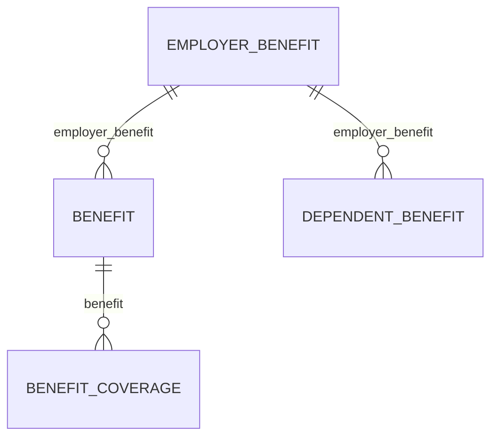

# Bindbee docs style

The docs follow **Diátaxis**. The nav has exactly four sections and no more:

| Section | Diátaxis quadrant | Serves someone who is… | Directory |
| --- | --- | --- | --- |
| Get Started | Tutorial | learning by doing, first time | `get-started/` |
| How-To | How-to guide | achieving a specific goal | `how-to/` |
| Explanation | Explanation | building a mental model | `explanation/` |
| API Reference | Reference | looking something up | `api-reference/`, `hris/`, `ats/`, `lms/`, `webhooks/` |

**The most common failure is a page drifting into a neighbouring quadrant** - an Explanation page that turns into field documentation, a How-To that starts explaining rationale. Each section below states what it must *not* contain. Enforce that first; it matters more than any formatting rule.

---

## Universal rules

### Verify before you assert

**Every path, parameter, field name, enum value and status code must be checked against `spec.json` before it ships.** This single practice has found more real defects in this repo than every other review technique combined - a DELETE that 404s, a missing benefits model, invented `expand` relations, a field documented on the wrong model.

```bash
python3 -c "
import json; s=json.load(open('spec.json'))
print(list(s['components']['schemas']['HrisEmployeeResponse']['properties']))"
```

Never write a field name from memory. If you cannot verify it, leave a `VERIFY` marker instead of guessing.

<!-- spec.json is a mirror of https://api.bindbee.dev/openapi.json, which is maintained
     manually upstream. It drives 137 API Reference pages. Do not edit it docs-side. -->

### Internal markers

Invisible in the rendered page (verified against served HTML). Use them instead of publishing a guess.

```mdx
{/* VERIFY: <what is unconfirmed, and why it matters if wrong> */}
{/* DIAGRAM (tier 2): <what the diagram should show> */}
```

Always say *why it matters* - a marker that only says "check this" cannot be triaged.

### Terminology is fixed

The same concept uses the same words on every page. If you rename something, grep the whole repo and rename it everywhere in the same commit. Inconsistent naming across pages is treated as a defect, not a style preference.

Check counts before changing a shared claim:

```bash
grep -rn "five benefits models" --include='*.mdx' .
```

### Links

- Internal links are root-relative and extensionless: `/explanation/hris-models`.
- Every link target must exist. Verify before commit.
- Moving a page requires: `git mv`, repoint **all** inbound links, update `docs.json`, add a `redirects` entry.

### Prose density

These apply everywhere, and are what separates a page that gets read from one that gets skimmed past.

**1. One bolded clause per paragraph, carrying the point.** Bold is the skim path - reading only the bold should yield the argument. Two bolds in a paragraph cancel each other out.

**2. Cap paragraphs at ~50 words or 3 sentences.** Split at the "so" or "therefore"; the consequence deserves its own beat.

**3. If a sentence is secretly a list, make it a list.** Three parallel facts welded together with commas become three bullets.

**4. Don't over-componentise.** A page running a table, a diagram, a `<Note>` and a `<Warning>` is at its limit. Reach for emphasis and paragraph breaks before reaching for another component.

### Spelling

British spelling throughout prose (`authorise`, `organisation`, `normalise`). Field names, enum values and code keep whatever the API uses.

> Unresolved: `behaviour`/`behavior` are currently mixed across the repo. Pick one before launch.

---

## Get Started (Tutorial)

A learner following along. It must succeed end to end. Optimise for **confidence**, not coverage.

**Title:** `"N. Sentence case"` - numbered, because order is mandatory. `"4. Run your first sync"`

**Anatomy** (all 7 tutorials follow this):

```
intro
## Context                     - why this step exists, what came before
## Step 1 - <sentence case>    - numbered H2s, NOT the <Steps> component
## Step 2 - …
## What you just did           - consolidates the mental model
## If this didn't work         - <AccordionGroup>
## Next                        - optional, points at the next tutorial
```

**Do:** state the expected result after each step; use one continuous worked example across the whole sequence.

**Don't:** branch ("if you're using X, instead…"), enumerate options, or explain design rationale. A tutorial that offers choices has become a how-to.

---

## How-To (How-to guide)

Someone with a goal and a real problem. Optimise for **getting unstuck**.

**Title:** `Title Case`, starts with a verb. Median 28 chars, max ~44. `"Check Which Writes an Integration Supports"`

**`sidebarTitle`:** required whenever the title exceeds ~28 chars. Must fit **one line** in the sidebar - max 28 chars, median 21. Shorten by dropping qualifiers, never by changing the verb:

| title | sidebarTitle |
| --- | --- |
| Resolve a Source-System Permission Error | Resolve a Permission Error |
| Trace an Unexpected or Duplicate Record | Trace a Duplicate Record |

**Anatomy** (61/61 pages):

```
intro - one paragraph on when you'd need this
<Info> **Before you start** - preconditions as bullets </Info>
## Steps
  <Steps><Step title="…">
    prose + a runnable request
    **Result:** <what you should now see>
  </Step></Steps>
## If this didn't work         - <AccordionGroup>, one <Accordion> per failure mode
## Related                     - bullet list, each with " - why you'd follow it"
```

**Every `<Step>` ends with a bold `**Result:**` line.** 60/61 pages do this; it is the strongest convention in the repo.

**Do:** show complete, runnable requests with real headers. Set timeouts. Handle `429` in every retry sample. Name the failure modes in the accordions honestly.

**Don't:** explain *why the platform works this way* - link to the Explanation page instead. `<CardGroup>` is not used here (1/61); use bullets.

---

## Explanation

Someone building a mental model, often after being surprised. Optimise for **the reader understanding why**, so they can reason about cases the docs don't cover.

**Title:** `Sentence case`, a noun phrase. `"Benefits models"`, `"Status & terminations"`, `"Webhooks vs polling"`. No verbs, no numbers, no `sidebarTitle` unless the title genuinely won't fit.

**Anatomy** (27/27 pages):

```
intro - name the surprise or the confusion this page resolves
## <argument section>          - as many as the argument needs, no template
## <argument section>
## Why it works this way       - the design rationale. The core of the quadrant.
## What this means for you     - 4-6 bullets, each an imperative
## Related                     - bullet list
```

`## Why it works this way` and `## What this means for you` are mandatory and always last before `## Related`. **Everything above them is free-form** - let the argument set the section count and the headings.

### Headings are the "On this page" nav

The right-hand TOC renders from H2s, so headings must *name their section*, not describe its format or tease it. Keep them short, parallel noun-phrases.

| Bad | Why | Good |
| --- | --- | --- |
| Four models, one sentence each | Describes the format | The four models |
| Contributions are per period, not per month | A sentence, not a label | — (cut; it was how-to content) |
| Where deductions live | Reads as benefits; it's the payroll boundary | Where benefits end and payroll begins |

### Visual devices: what belongs here

| Device | Use when | |
| --- | --- | --- |
| **Comparison table** | the page's job *is* a distinction (which model, which strategy, which value) | ✅ |
| **Mermaid diagram** | there is a lifecycle, a hierarchy, or a set of relations | ✅ |
| **Illustrative code** | a fragment makes a concept, a design decision, or under-the-hood behaviour legible | ✅ |
| **Worked number inline** | the concept *is* the number (a 2× spread from one field) | ✅ |
| **Callout** (`Note`/`Info`/`Warning`) | max 2 per page, for the trap that costs real money | ✅ |
| **Runnable requests** | — | ❌ full `curl` with auth headers is a how-to |
| **Field-by-field tables / schema dumps** | — | ❌ that's reference, and it will drift from `spec.json` |
| **`<Steps>` / `**Result:**`** | — | ❌ 0/27 pages; it's a how-to shape |

### Code in Explanation: illustration, not instruction

Code is welcome here **when its job is to make an idea legible**. A shape you could not describe in a sentence, a design decision you can only see by looking at two structures side by side, what actually happens under the hood - all of these are better shown than asserted.

What disqualifies a snippet is its *purpose*, not its language. Three tests, in order:

| If the reader would… | it is | goes in |
| --- | --- | --- |
| **copy it and run it** | instruction | How-To |
| **look up what exists in it** | specification | API Reference |
| **understand something from it** | illustration | **Explanation ✅** |

Keep illustrative code minimal - the fields that carry the idea and nothing else. Elide the rest with a comment rather than pasting a full response. A fragment that has grown auth headers, a base URL, or every field of a model has stopped illustrating and started specifying.

```json
// ✅ illustration - shows why the two attach at different levels
{ "benefit_coverage": { "benefit": "…" } }          // hangs off the enrolment
{ "dependent_benefit": { "employer_benefit": "…" } } // hangs off the plan
```

The same line applies to tables: **a table that captures a distinction is explanation; a table that lists fields is reference.** If a section only makes sense with the endpoint open, it belongs in How-To.

**Don't:** give step-by-step procedures, or document field-level traps (a null check, a required header). Those go to the matching How-To page - and if there's no home for them there, say so rather than deleting the knowledge.

---

## API Reference

Someone looking up a specific fact. Optimise for **findability and accuracy**.

**Title:** `Title Case`. Operation pages match the spec's operation name: `"Get Connectors"`, `"Force Resync a Connector"`.

**Two page kinds:**

1. **Generated operation pages** - a frontmatter stub, no body. 137 of these.
   ```yaml
   ---
   openapi: "GET /api/hris/v1/employees"
   ---
   ```
   Content comes from `spec.json`. To fix wording, fix it upstream at `api.bindbee.dev/openapi.json` - never patch the page.

2. **Hand-written `basics/` pages** - Authentication, Pagination, Rate Limits, Sync Frequency. Prose plus tables, no `<Steps>`.

**BETA models** carry `tag: "BETA"` in frontmatter *and* on the nav group in `docs.json` - the page-level tag alone is invisible until the group is expanded.

---

## Mermaid house style

Plain mermaid, no custom `classDef` or colours - the default theme matches the site in both light and dark.

**Pick the diagram type from what you're showing:**

| Showing | Type |
| --- | --- |
| Model relations | `erDiagram` |
| A lifecycle with states | `stateDiagram-v2` |
| A before/after or a branching outcome | `flowchart TB` with `subgraph` |
| An exchange between parties | `sequenceDiagram` |

**Label `erDiagram` edges with the actual foreign-key field name.** It turns a shape into something checkable, and makes structural asymmetries legible without prose:



Keep diagrams under ~6 edges. If it needs more, the section is doing too much.

---

## Frontmatter

| Key | Get Started | How-To | Explanation | API Ref |
| --- | --- | --- | --- | --- |
| `title` | required | required | required | required |
| `description` | required | required | required | required |
| `sidebarTitle` | if long | if title > 28 chars | rare | rare |
| `tag: "BETA"` | — | if the model is beta | — | if the model is beta |
| `openapi` | — | — | — | operation pages |

`description` is a full sentence that says what the reader will be able to do or understand. It shows in search results and on nav cards.

---

## Before you commit

```bash
# 1. Every link resolves (no output = all good)
grep -rhoE '\]\(/[a-z0-9/-]+(#[a-z0-9-]+)?\)' --include='*.mdx' . \
  | sed -E 's/^\]\(//; s/\)$//; s/#.*$//' | sort -u \
  | while read l; do [ -f ".$l.mdx" ] || echo "BROKEN: $l"; done

# 2. Pages render
curl -s -o /dev/null -w '%{http_code}' http://localhost:3001/explanation/<page>

# 3. Markers didn't leak into the HTML
curl -s http://localhost:3001/explanation/<page> | grep -c 'VERIFY'   # must be 0

# 4. New pages are in docs.json, moved pages have a redirect
```

Then check the page against its own quadrant: **does it contain anything belonging to a different section?** That is the question this style guide exists to answer.
