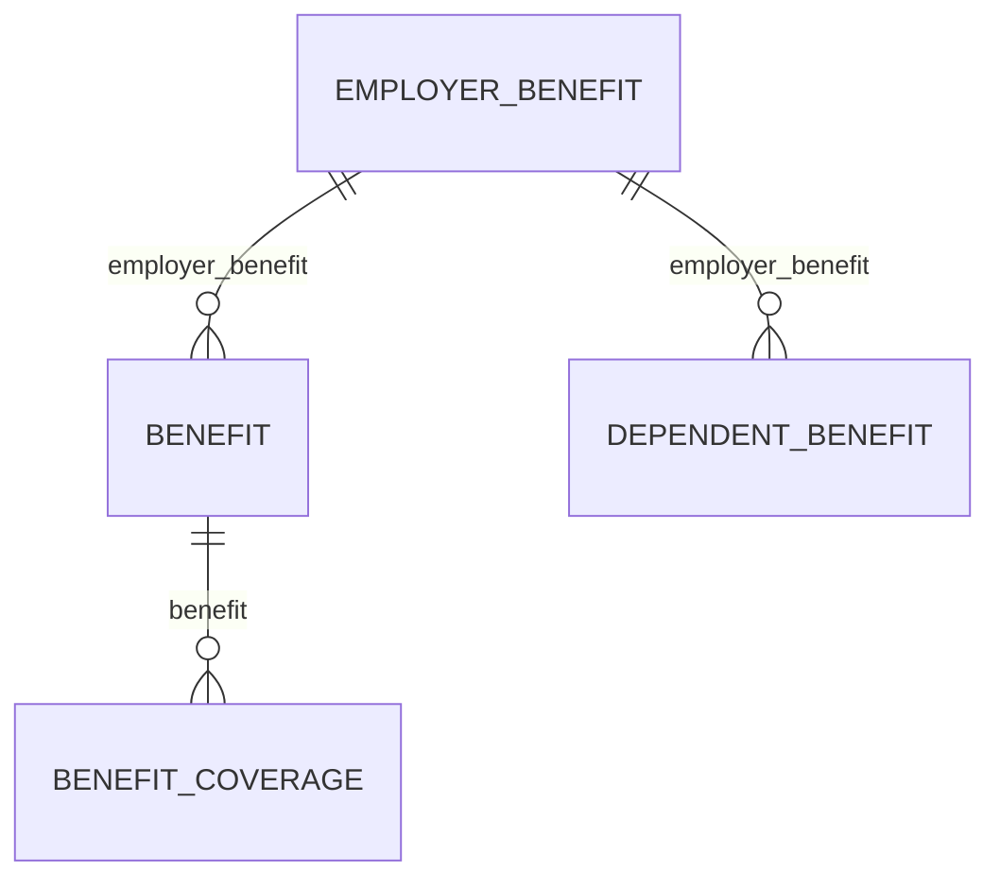

> **Position in the chain: 1 of 6.** Sequenced by `bindbee-docs-review`, which explains why.
>
> **This skill owns:** Page shape: quadrant, anatomy, headings, frontmatter.
> **It must not change:** sentence wording (humaniser), callout type (affordances), which page owns a fact (consistency). Flag those and hand them to the owner.
>
> **On finishing, run** `.claude/skills/bindbee-docs-checks.sh <section>`. A red line means this pass regressed an earlier one.

# Bindbee docs style

The docs follow **Diátaxis**. Three tabs hold pages; a fourth, Help Center, is an outbound link to `help.bindbee.dev` with no pages of its own.

| Tab | Directory | Pages | Holds |
| --- | --- | --- | --- |
| Get Started | `get-started/` | 16 | Introduction, Core Concepts, Integrations, Use Cases |
| Guide | `guides/` | 35 | Reading & Writing, Extending, SDK & MCP, Data Models, Workspace & Access, Checklist, Troubleshooting |
| API Reference | `api-reference/`, `hris/`, `ats/`, `lms/`, `webhooks/` | 139 generated + `basics/` | Operation pages and hand-written basics |

### The quadrant is the page's shape, not its directory

`how-to/` and `explanation/` no longer exist - both were folded into `guides/`, and 113 redirects in `docs.json` still point out of those retired trees. **One directory now carries two quadrants**, so you cannot read the quadrant off the path.

Read it off the shape instead:

| If the page… | it is | anatomy to follow |
| --- | --- | --- |
| carries `<Steps>` with `**Result:**` lines | **How-to** | [How-To](#how-to-how-to-guide) |
| carries neither | **Explanation** | [Explanation](#explanation) |

Measured in `guides/`: 15 how-to shaped, 20 explanation shaped. `**Result:**` appears only on pages that also carry `<Steps>`, so the two markers agree - if they ever disagree on a page, that page is the defect.

**The most common failure is a page drifting into a neighbouring quadrant** - an Explanation page that turns into field documentation, a How-To that starts explaining rationale. Each section below states what it must *not* contain. Enforce that first; it matters more than any formatting rule.

---

## Universal rules

### Verify before you assert

**Every path, parameter, field name, enum value and status code must be checked against `spec.json` before it ships.** This single practice has found more real defects in this repo than every other review technique combined - a DELETE that 404s, a missing benefits model, invented `expand` relations, a field documented on the wrong model.

```bash
python3 -c "
import json; s=json.load(open('spec.json'))
print(list(s['components']['schemas']['HrisEmployeeResponse']['properties']))"
```

Never write a field name from memory. If you cannot verify it, leave a `VERIFY` marker instead of guessing.

<!-- spec.json is a mirror of https://api.bindbee.dev/openapi.json, which is maintained
     manually upstream. It drives 137 API Reference pages. Do not edit it docs-side. -->

### Internal markers

Invisible in the rendered page (verified against served HTML). Use them instead of publishing a guess.

```mdx
{/* VERIFY: <what is unconfirmed, and why it matters if wrong> */}
{/* DIAGRAM (tier 2): <what the diagram should show> */}
```

Always say *why it matters* - a marker that only says "check this" cannot be triaged.

### Terminology is fixed

The same concept uses the same words on every page. If you rename something, grep the whole repo and rename it everywhere in the same commit. Inconsistent naming across pages is treated as a defect, not a style preference.

Check counts before changing a shared claim:

```bash
grep -rn "five benefits models" --include='*.mdx' .
```

### Links

- Internal links are root-relative and extensionless: `/guides/data-models/employee-and-org`.
- Every link target must exist. Verify before commit.
- Moving a page requires: `git mv`, repoint **all** inbound links, update `docs.json`, add a `redirects` entry.

### Voice

Benchmarked against Stripe's docs, which are the reference for this section. **Lead with the action.**

**1. Imperative mood, second person.** The reader is doing something; address them directly.

| Instead of | Write |
| --- | --- |
| The connector's sync history can be found under Syncs. | Open the connector and go to **Syncs**. |
| It is recommended that you resync after the permission is granted. | Resync after the permission is granted. |
| A relink is generated by clicking Relink Connector. | Click **Relink Connector**. |

**2. Purpose first, then the instruction.** Stripe's most common construction, and it lets a reader skip the whole sentence once they know it isn't their goal:

> To customise the colour scheme and logo of the invoice template, go to the **Brand settings** page.
> To accept payments online without building a website, create a payment link.

**3. `(Optional)` prefixes an optional step.** Literal, parenthesised, at the front. Never "you may wish to" mid-sentence.

**4. Define in one sentence, then move.** No preamble about why the concept matters:

> Payment Links are reusable links that take your customers to a pre-built checkout page.

**5. State limits flatly.** No apology, no hedge:

> You can't add any other line items and the quantity can only be 1.

**6. Pick the verb with one reading.** Leading with a verb is only half the job. Where a verb carries a common second sense, the reader resolves the ambiguity before they get the point - and on a description or a link label there is no context to resolve it with.

| Ambiguous | Reads as | Use |
| --- | --- | --- |
| **Tell** a Bindbee failure from an origin-system one | *tell* = inform, before *tell* = distinguish | **Differentiate** |
| **Address** a permission gap | *address* = write to, speak to | Fix, resolve |
| **Handle** a failed sync | vague; handle how? | Retry, report, escalate |
| **Check** the connector | check = inspect, or check = tick | Fine when the object is a thing you read: *Check sync status* |

The test: read the verb with its most common meaning first. If that reading makes sense and is wrong, choose another verb.

### Bold means one thing per page

**On How-To pages, bold does two jobs and no others:**

1. **UI labels and controls** - what the reader clicks, selects, or opens.
2. **The label opening a definition-style list item or paragraph.** Stripe uses this heavily: `- **Products or subscriptions**: Best for e-commerce…`, `- **Analyse failed payments**: Go to the revenue recovery dashboard.`

What it never does on a procedural page is emphasise an argument mid-sentence. Mixing "click this" with "this is important" makes a reader following steps stop to work out which one they're looking at.

```
✅  Click **Create link**.                       (control)
✅  **Deleting** removes the connector and its data.   (list label)
❌  …and **every record comes back with a new id**, breaking any foreign key.
```

**On Explanation pages, bold carries the argument** - one clause per paragraph, and reading only the bold should yield the point.

`**Result:**` is structural rather than emphasis, and is exempt on both.

### Prose density

**1. Cap paragraphs at 3 sentences.** One or two on How-To pages. Split at the "so" or "therefore"; the consequence deserves its own beat.

**2. If a sentence is secretly a list, make it a list.** Three parallel facts welded together with commas become three bullets.

**3. Don't over-componentise.** A page running a table, a diagram, a `<Note>` and a `<Warning>` is at its limit. Reach for emphasis and paragraph breaks before reaching for another component.

### Task headings are verb phrases

On How-To pages the heading names the task, starting with a verb: `Recover failed payments`, `Turn a quote into an invoice`, `Customise the button`. Explanation headings stay noun phrases - see below.

### Spelling

British spelling throughout prose (`authorise`, `organisation`, `normalise`). Field names, enum values and code keep whatever the API uses.

`behaviour`/`behavior` remain mixed - 16 British to 8 American at last count. British wins by usage and by the rule above; normalise the 8 when you next touch those pages.

```bash
grep -rn '\bbehavior\b' --include='*.mdx' .
```

---

## Get Started

Four groups, and **they are not all tutorials.** Check which group a page sits in before applying an anatomy.

| Group | Quadrant | Notes |
| --- | --- | --- |
| Introduction, Core Concepts, Integrations | Explanation, plus `Quickstart` as the one true tutorial | Titles are `Sentence case` noun phrases - `"Core concepts"`, `"What is Bindbee?"` |
| Use Cases | How-to | `Title Case`, verb-first - `"Create an Employee"` |

**Titles are no longer numbered.** The `"N. Sentence case"` convention is gone; nothing in `get-started/` uses it.

**Tutorial anatomy** (`Quickstart`, and any sequenced walkthrough added later):

```
intro
## Context                     - why this step exists, what came before
## Step 1 - <sentence case>    - numbered H2s, NOT the <Steps> component
## Step 2 - …
## What you just did           - consolidates the mental model
## If this didn't work         - <AccordionGroup>
## Next                        - optional, points at the next tutorial
```

**Do:** state the expected result after each step; use one continuous worked example across the whole sequence.

**Don't:** branch ("if you're using X, instead…"), enumerate options, or explain design rationale. A tutorial that offers choices has become a how-to.

---

## How-To (How-to guide)

Lives in `guides/` and in `get-started/use-cases/` - **identified by carrying `<Steps>`**, not by its path.

Someone with a goal and a real problem. Optimise for **getting unstuck**.

**Title:** `Title Case`, starts with a verb. Median 28 chars, max ~44. `"Check Which Writes an Integration Supports"`

**`sidebarTitle`:** required whenever the title exceeds ~28 chars. Must fit **one line** in the sidebar - max 28 chars, median 21. Shorten by dropping qualifiers, never by changing the verb:

| title | sidebarTitle |
| --- | --- |
| Resolve a Source-System Permission Error | Resolve a Permission Error |
| Trace an Unexpected or Duplicate Record | Trace a Duplicate Record |

**Anatomy:**

```
intro - one paragraph on when you'd need this
<Info> **Before you start** - preconditions as bullets </Info>
## Steps
  <Steps><Step title="…">
    prose + a runnable request
    **Result:** <what you should now see>
  </Step></Steps>
## Frequently Asked Questions  - <AccordionGroup>, one <Accordion> per failure mode
## Related                     - bullet list, each with " - why you'd follow it"
```

**Every `<Step>` ends with a bold `**Result:**` line.** It is the strongest convention in the repo, and the marker that identifies the quadrant.

<Note>
The closing accordion heading has drifted. `## Frequently Asked Questions` now leads
21 pages against 9 for `## If this didn't work`. Prefer FAQ on new pages; leave
existing headings alone unless you are already editing that section.
</Note>

**Do:** show complete, runnable requests with real headers. Set timeouts. Handle `429` in every retry sample. Name the failure modes in the accordions honestly.

**Don't:** explain *why the platform works this way* - link to the Explanation page instead. `<CardGroup>` is not used here (1/61); use bullets.

---

## Explanation

Lives in `guides/` alongside the how-tos - **identified by carrying no `<Steps>`**. 20 of the 35 `guides/` pages are this shape.

Someone building a mental model, often after being surprised. Optimise for **the reader understanding why**, so they can reason about cases the docs don't cover.

**Title:** `Sentence case`, a noun phrase. `"Benefits models"`, `"Status & terminations"`, `"Webhooks vs polling"`. No verbs, no numbers, no `sidebarTitle` unless the title genuinely won't fit.

**Anatomy:**

```
intro - name the surprise or the confusion this page resolves
## <argument section>          - as many as the argument needs, no template
## <argument section>
## Why it works this way       - the design rationale. The core of the quadrant.
## What this means for you     - 4-6 bullets, each an imperative
## Related                     - bullet list
```

`## Why it works this way` and `## What this means for you` are mandatory and always last before `## Related`. **Everything above them is free-form** - let the argument set the section count and the headings.

<Note>
Both headings currently appear on 10 pages, against 55 carrying `## Related`. The pair
is the weakest-held convention in this guide - treat it as the target for new
Explanation pages rather than a description of what is already there.
</Note>

### Headings are the "On this page" nav

The right-hand TOC renders from H2s, so headings must *name their section*, not describe its format or tease it. Keep them short, parallel noun-phrases.

| Bad | Why | Good |
| --- | --- | --- |
| Four models, one sentence each | Describes the format | The four models |
| Contributions are per period, not per month | A sentence, not a label | — (cut; it was how-to content) |
| Where deductions live | Reads as benefits; it's the payroll boundary | Where benefits end and payroll begins |

### Visual devices: what belongs here

| Device | Use when | |
| --- | --- | --- |
| **Comparison table** | the page's job *is* a distinction (which model, which strategy, which value) | ✅ |
| **Mermaid diagram** | there is a lifecycle, a hierarchy, or a set of relations | ✅ |
| **Illustrative code** | a fragment makes a concept, a design decision, or under-the-hood behaviour legible | ✅ |
| **Worked number inline** | the concept *is* the number (a 2× spread from one field) | ✅ |
| **Callout** (`Note`/`Info`/`Warning`) | max 2 per page, for the trap that costs real money | ✅ |
| **Runnable requests** | — | ❌ full `curl` with auth headers is a how-to |
| **Field-by-field tables / schema dumps** | — | ❌ that's reference, and it will drift from `spec.json` |
| **`<Steps>` / `**Result:**`** | — | ❌ these two markers *define* the how-to quadrant; adding them reclassifies the page |

### Code in Explanation: illustration, not instruction

Code is welcome here **when its job is to make an idea legible**. A shape you could not describe in a sentence, a design decision you can only see by looking at two structures side by side, what actually happens under the hood - all of these are better shown than asserted.

What disqualifies a snippet is its *purpose*, not its language. Three tests, in order:

| If the reader would… | it is | goes in |
| --- | --- | --- |
| **copy it and run it** | instruction | How-To |
| **look up what exists in it** | specification | API Reference |
| **understand something from it** | illustration | **Explanation ✅** |

Keep illustrative code minimal - the fields that carry the idea and nothing else. Elide the rest with a comment rather than pasting a full response. A fragment that has grown auth headers, a base URL, or every field of a model has stopped illustrating and started specifying.

```json
// ✅ illustration - shows why the two attach at different levels
{ "benefit_coverage": { "benefit": "…" } }          // hangs off the enrolment
{ "dependent_benefit": { "employer_benefit": "…" } } // hangs off the plan
```

The same line applies to tables: **a table that captures a distinction is explanation; a table that lists fields is reference.** If a section only makes sense with the endpoint open, it belongs in How-To.

**Don't:** give step-by-step procedures, or document field-level traps (a null check, a required header). Those go to the matching How-To page - and if there's no home for them there, say so rather than deleting the knowledge.

---

## API Reference

Someone looking up a specific fact. Optimise for **findability and accuracy**.

**Title:** `Title Case`. Operation pages match the spec's operation name: `"Get Connectors"`, `"Force Resync a Connector"`.

**Two page kinds:**

1. **Generated operation pages** - a frontmatter stub, no body. 139 of these.
   ```yaml
   ---
   openapi: "GET /api/hris/v1/employees"
   ---
   ```
   Content comes from `spec.json`. To fix wording, fix it upstream at `api.bindbee.dev/openapi.json` - never patch the page.

2. **Hand-written `basics/` pages** - Authentication, Pagination, Rate Limits, Sync Frequency. Prose plus tables, no `<Steps>`.

**BETA models** carry `tag: "BETA"` in frontmatter *and* on the nav group in `docs.json` - the page-level tag alone is invisible until the group is expanded.

---

## Mermaid house style

Plain mermaid, no custom `classDef` or colours - the default theme matches the site in both light and dark.

**Pick the diagram type from what you're showing:**

| Showing | Type |
| --- | --- |
| Model relations | `erDiagram` |
| A lifecycle with states | `stateDiagram-v2` |
| A before/after or a branching outcome | `flowchart TB` with `subgraph` |
| An exchange between parties | `sequenceDiagram` |

**Label `erDiagram` edges with the actual foreign-key field name.** It turns a shape into something checkable, and makes structural asymmetries legible without prose:



Keep diagrams under ~6 edges. If it needs more, the section is doing too much.

---

## Frontmatter

Keyed by quadrant, which you read off the page's shape rather than its directory.

| Key | Tutorial | How-to (`<Steps>`) | Explanation (no `<Steps>`) | API Ref |
| --- | --- | --- | --- | --- |
| `title` | required | required | required | required |
| `description` | required | required | required | required |
| `sidebarTitle` | if long | if title > 28 chars | rare | rare |
| `icon` | common | common | common | - |
| `tag: "BETA"` | - | if the model is beta | - | if the model is beta |
| `openapi` | - | - | - | operation pages |

`description` is one sentence saying what the reader will be able to do or understand. It shows in search results and on nav cards.

### Description length

<!-- MIRROR:description-cap START -->
**Target 60-90 characters. Hard cap 110.** Measured across the repo: median 108, p75 129 - the long tail is the defect, not the norm. Nav cards and search results truncate, so a description that needs a second clause has stopped being a description.
<!-- MIRROR:description-cap END -->

Mirrored verbatim in `bindbee-docs-humaniser` fingerprint 10. `bindbee-docs-checks.sh` fails if the two copies drift.


| | Chars | |
| --- | --- | --- |
| The two workspace roles, and what a Member cannot do. | 53 | ✅ |
| How often a Production connector syncs, and how to change it. | 61 | ✅ |
| Fetch the exact request schema a connector expects before you write to it. | 74 | ✅ |
| Credentials expire, get rotated, or lose permissions and the connector stops syncing. Detect that state, regenerate the link, and get your customer to re-authorise without breaking stored IDs. | 192 | ❌ |

### Shape: verb first, one clause

Length was never the whole problem. **Start with a verb and stop at one clause.** Stripe's header is the model:

> **Design a no-code integration**
> Learn which no-code solutions can help your business.

Title is a verb phrase; the description opens on a verb (`Learn`) and ends after one clause. It doesn't try to preview the whole page.

| | |
| --- | --- |
| ❌ | Where to start when a connector misbehaves, and which page to open next. |
| ✅ | Identify where to start when a connector misbehaves. |

Two failures in that one line, and both are the same instinct - **covering everything**:

1. **A noun-phrase opening.** *Where to start…*, *The per-request audit of…*, *How to…* Lead with the verb the reader performs: identify, read, spot, explain.
2. **A second clause after `and` / `or` / a full stop.** The description names one job. The nav, the headings and the page body cover the rest.

Five tells, each meaning cut:

- **A comma before `and` or `or`.** Keep the first clause.
- **Two sentences.** Keep the first.
- **A dash or semicolon joining independent clauses.** Keep the first.
- **A noun-phrase opening** - `The`, `A`, `Where`, `What`, `How`, `Why`.
- **Restating the title.** `title: "Logs"` with a description opening *Logs are…*

Check the whole section:

```bash
for f in guides/troubleshooting/*.mdx; do
  d=$(awk '/^description:/{sub(/^description: *"?/,""); sub(/"$/,""); print; exit}' "$f")
  echo "$d" | grep -qE '^(The|A|An|Where|What|How|Why) ' && echo "NOUN-OPENING  $f"
  echo "$d" | grep -qE ', (and|or) |\. .' && echo "COMPOUND      $f"
done
```

Check a section before commit:

```bash
for f in guides/troubleshooting/*.mdx; do
  d=$(awk '/^description:/{sub(/^description: *"?/,""); sub(/"$/,""); print; exit}' "$f")
  [ ${#d} -gt 110 ] && printf "%3d  %s\n" "${#d}" "$f"
done
```

---

## Before you commit

The mechanical checks live in one script, shared with the other docs skills so a later pass cannot undo an earlier one:

```bash
.claude/skills/bindbee-docs-checks.sh guides/troubleshooting
```

It covers link resolution, description length, and the invariants the other skills own. Then, by hand:

```bash
# Pages render, and internal markers stay out of the HTML
curl -s -o /dev/null -w '%{http_code}' http://localhost:3000/guides/<page>
curl -s http://localhost:3000/guides/<page> | grep -c 'VERIFY'   # must be 0

# New pages are in docs.json; moved pages have a redirect
```

Then check the page against its own quadrant: **does it contain anything belonging to a different section?** That is the question this style guide exists to answer.
