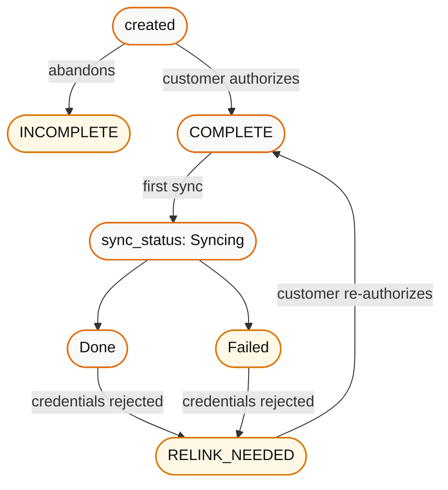

A connector is the link between one customer and one third-party system. It has a life: created, linked, syncing, healthy, degraded, recovered or dead. Modelling that life correctly is the difference between a product that quietly serves stale data and one that tells the customer to reconnect.

## The two status fields

Bindbee reports connector health along two independent axes. Reading only one of them is the root of most confusion.

```
status       →  Are the credentials valid?     COMPLETE | INCOMPLETE | RELINK_NEEDED
sync_status  →  Is the data current?           Syncing  | Done       | Failed
```

They move independently. All nine combinations are reachable.

## `status` - credential health

| Value | Meaning | Data readable? | Your action |
| --- | --- | --- | --- |
| `INCOMPLETE` | Linking started but never finished | No | Prompt the customer to complete the connection |
| `COMPLETE` | Credentials valid and working | Yes | Normal operation |
| `RELINK_NEEDED` | Credentials were rejected | Yes, but frozen | Prompt the customer to reconnect |

### `INCOMPLETE`

A `link_token` was issued, or a Magic Link was opened, but the customer never finished authorizing. There are no credentials, so nothing will ever sync.

This is a common and undramatic state - people close tabs. It usually means your onboarding flow needs a nudge, not that anything failed.

### `COMPLETE`

The steady state. Credentials work, syncs run on schedule.

`completed_at` records when linking finished.

### `RELINK_NEEDED`

Bindbee attempted to use the stored credentials and the third-party system rejected them. `relink_needed_at` records when this was detected.

Common causes:

- OAuth refresh token expired or was revoked
- The customer's admin removed or deactivated the integration user
- API credentials rotated on the customer's side
- The customer's subscription tier changed and revoked API access
- Permissions narrowed so the integration user can no longer read required scopes

<Warning>
  `RELINK_NEEDED` is not self-healing. No amount of waiting or resyncing fixes
  it. Only the customer re-authorizing does. Every hour you don't tell them is an
  hour of data drift.
</Warning>

Data from the last successful sync remains readable. This is a feature - your product doesn't go blank - but it is also a trap: without surfacing the state, your customer sees plausible data that is silently frozen.

## `sync_status` - data currency

| Value | Meaning |
| --- | --- |
| `Syncing` | A sync is running now. `sync_progress` holds 0–100 |
| `Done` | Last sync completed successfully |
| `Failed` | Last sync did not complete |

`Failed` with `status: COMPLETE` means the credentials are fine but this particular run broke - a vendor outage, a timeout, a transient error. These often recover on the next scheduled run without any intervention.

## The lifecycle



Re-linking updates the **existing** connector. The `connector_token` you already stored continues to work - you do not need to re-exchange tokens or re-key your database.

<Tip>
  Because re-linking preserves the connector, your recovery flow is simply:
  create a new `link_token` for the same `origin_id` and integration, and send
  the customer through the same connect UI they used originally.
</Tip>

## `is_active`

Separate from `status`. A connector can be deactivated - for example when the customer churns or you delete the connection via
`DELETE /api/{category}/v1/connectors/{connector_id}/delete`.

Treat `is_active: false` as terminal. Don't try to recover it; create a new connection.

## `is_test_connector`

Flags a connector created for testing. Useful for excluding test connections from customer-facing counts, billing, and health dashboards.

## What your product should do

Map states to user-visible outcomes explicitly:

| State | Show the customer | Alert your team? |
| --- | --- | --- |
| `INCOMPLETE` | "Finish connecting your HRIS" + resume link | No |
| `COMPLETE` + `Syncing`, first sync | "Importing your data…" with progress | No |
| `COMPLETE` + `Done` | "Connected · last synced *X* ago" | No |
| `COMPLETE` + `Failed`, once | Nothing - likely transient | No |
| `COMPLETE` + `Failed`, repeatedly | "We're having trouble syncing" | Yes |
| `RELINK_NEEDED` | "Reconnect your HRIS" - prominent, blocking | Yes |
| `is_active: false` | Connection removed | No |

<Warning>
  Do not treat a single `Failed` as an incident. Transient vendor errors are
  normal and usually clear on the next scheduled run. Alert on *consecutive*
  failures or on data age exceeding a threshold, not on a single event.
</Warning>

## Detecting state changes

Two ways, and you want both:

**Webhooks** - `connector_sync_error` fires on failure with an `error` object explaining what happened. React immediately.

**Polling the connector list** - `GET /api/{category}/v1/connectors` returns current `status`, `sync_status`, `sync_progress`, `last_sync_start_time` and `next_sync_start_time` for every connector. Run this on a schedule as a reconciliation sweep; it is the only reliable way to catch a `RELINK_NEEDED` that was detected while your webhook endpoint was down.

See [Monitor sync status](/how-to/troubleshooting/monitor-sync-status).

## Related

<CardGroup cols={2}>
  <Card title="Monitor Sync Status" icon="gauge" href="/how-to/troubleshooting/monitor-sync-status">
    Building the health surface.
  </Card>
  <Card title="How Syncing Works" icon="rotate-cw" href="/concepts/how-syncing-works">
    What happens between trigger and stored data.
  </Card>
</CardGroup>
