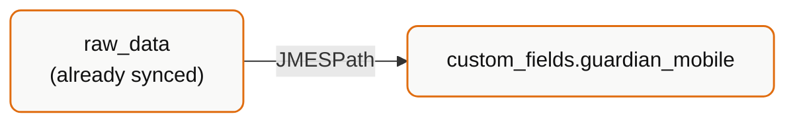
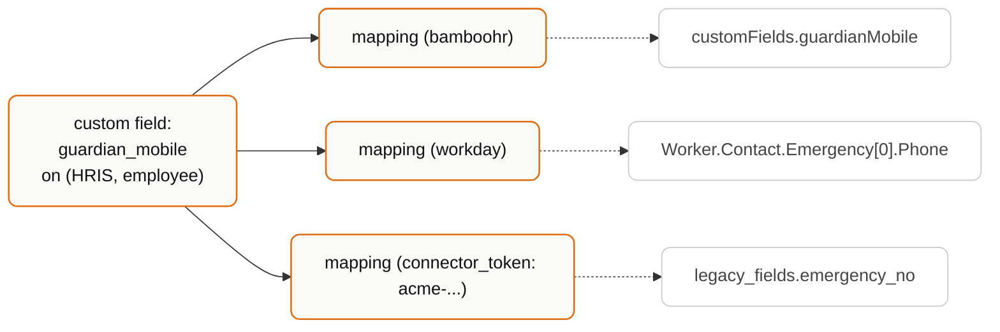

## The one idea

A custom field does **not** cause Bindbee to fetch anything extra. Bindbee already stores the full upstream payload as `raw_data`. A custom field is a **saved JMESPath expression** that plucks a value out of that stored payload and presents it as a named field on the unified model.



Consequences that follow directly from this:

- **No extra API calls, no extra latency.** The data was already there.
- **Freshness equals sync freshness.** A custom field is never fresher than the last sync.
- **If it isn't in `raw_data`, no custom field can produce it.** No expression conjures data the vendor never sent.
- **Changing a mapping is instant** - it re-reads stored data. It is not a re-sync.

<Warning>
  If the value you want is not present in `raw_data`, custom fields are the wrong
  tool. You need [passthrough](/concepts/passthrough-when-and-why) - a live
  call to an endpoint Bindbee isn't syncing.
</Warning>

## Two objects, not one

This is the part people get wrong.

| Object | Is | Scope |
| --- | --- | --- |
| **Custom field** | The *declaration* - a named field on a `(category, model)` pair | Your organization |
| **Mapping** | The *rule* - where to read it from, for a given integration or connector | An integration, or one connector |

One custom field, many mappings. `guardian_mobile` on `(HRIS, employee)` is declared once. It then needs a mapping per integration, because BambooHR and Workday put that value in completely different places in their payloads.



<Warning>
  A custom field with no mapping for a given connector returns nothing on that
  connector. Declaring the field is half the job.
</Warning>

## Two scopes, and which wins

| Scope | Set via | Applies to |
| --- | --- | --- |
| **Integration** | `integration_slug` | Every connector of that integration in your org |
| **Connector** | `connector_token` | One specific connector |

When both exist for the same field on the same connector, **connector-level wins**.

The intended pattern: define an integration-level mapping that works for the typical customer on that integration, and add connector-level overrides for the customers who configured their HRIS unusually. That is common - HRIS deployments are heavily customized, and two BambooHR customers can store "emergency contact" in different custom-field slots.

## Fields are opt-in on read

Custom fields do not appear in responses unless you ask:

```http
GET /api/hris/v1/employees?include_custom_fields=true
```

They arrive under a `custom_fields` object, never mixed into the top-level unified schema:

```json
{
  "id": "01931edf-04b6-7391-8a5c-93ac4b395316",
  "first_name": "Jane",
  "work_email": "jane@acme.com",
  "custom_fields": {
    "guardian_mobile": "+1-555-0148",
    "cost_centre": "CC-4417"
  }
}
```

<Tip>
  Keeping them namespaced means Bindbee can add unified fields later without
  colliding with your custom ones. Read them from `custom_fields`, not from the
  root.
</Tip>

## `source: API` vs `source: DASHBOARD`

Fields created through the API are tagged `source: "API"`; those created in the dashboard, `"DASHBOARD"`. They behave identically and coexist.

The tag matters for one reason: if you manage custom fields as code, a teammate creating one in the dashboard has created state your code doesn't know about. Decide which is the source of truth - and if it's the API, treat dashboard-created fields as drift.

## Failure modes

**`INVALID_JSON_PATH`.** The expression doesn't parse, or doesn't resolve against that connector's payload. Validate before saving - the preview endpoint dry-runs an expression against real connector data without persisting anything.

**Silent nulls.** A syntactically valid expression that matches nothing returns nothing. This looks identical to "the vendor didn't send the value". Preview against a real payload rather than assuming.

**Mapping drift.** The customer's HRIS admin renames a custom field upstream; your JMESPath stops resolving; the field quietly goes null. Nothing errors. Monitor for custom fields that were populated and stopped.

**Array assumptions.** `contacts[0].phone` assumes ordering the vendor never promised. Prefer filtered expressions - `contacts[?type=='emergency'].phone | [0]` - over positional indexing.

<Warning>
  Positional array access is the most fragile thing you can write in a mapping,
  and it fails silently by returning the wrong person's phone number rather than
  an error.
</Warning>

## When *not* to use custom fields

| Instead of a custom field | Use |
| --- | --- |
| Value has a unified field that is `null` | [Diagnose the null](/concepts/field-semantics) - a mapping won't fix a permissions problem |
| You need a whole vendor endpoint | [Passthrough](/concepts/passthrough-when-and-why) |
| You want to *write* the value | Custom fields are read-only - see Write Data Back |
| Every connector has the field and it's genuinely universal | Ask Bindbee to add it to the unified model |

## Related

<CardGroup cols={2}>
  <Card title="Custom Fields" icon="book" href="/concepts/custom-fields-mental-model">
    Where to configure fields, and best practices for naming and scope.
  </Card>
</CardGroup>
