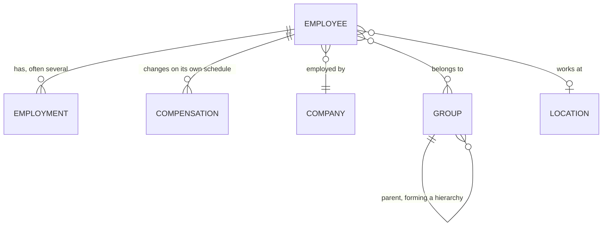

The field you are looking for is probably not on the employee. Job title, department, salary, cost centre, office - all of these feel like employee attributes and none of them are stored that way.

The reason is that they change independently of the person, and often more than once.

## The person and their employments

**Employee** holds what is true of the human: name, contact details, date of birth, dependants, identifiers.

**Employment** holds what is true of a period of work: job title, employment type, effective dates, and the reporting relationship. A person can have several, and this is normal rather than exceptional.

Multiple employments arise from promotions recorded as new positions, transfers between departments or legal entities, moves between full-time and part-time, and rehires. Each is a segment of a career, and the history is often exactly what an HR system exists to preserve.

{/* VERIFY: HrisEmployment in spec.json has no termination_date - only effective_date. termination_date and termination_reason are on HrisEmployeeResponse. Either the spec omits the field on employment, or termination is employee-level only and the current-employment selection rule below needs rewriting around effective_date. Confirm with engineering before this ships. */}

<Warning>
Do not read the first employment in the array and treat it as current. Ordering is not guaranteed to mean anything. The current employment is the one without a termination date, or where several are open, the one with the latest effective start.
</Warning>

Compensation follows the same logic in a separate model, because pay changes on its own schedule - a raise without a title change produces a new compensation record and no new employment.

## Groups absorb several concepts

**Group** is the model where departments, teams, divisions, business units, and cost centres all live. Each carries a type distinguishing which it is, and a parent reference so hierarchies can be reconstructed.

This is one of the more aggressive collapses in the unified model, and it surprises people looking for a dedicated department or cost-centre model. There isn't one. Filter groups by type instead.

The reason is that source systems disagree profoundly about organisational structure. Some have exactly one hierarchy. Some have separate, independent trees for reporting lines, cost allocation, and legal entity. Some let customers define arbitrary grouping dimensions. A model per concept would be right for one HRIS and wrong for the next; a typed, self-referencing model holds all of them.

**Location** is separate, because a physical workplace is not an organisational unit - people from several departments share an office, and a department spans several sites.

## Company is the legal entity

**Company** holds legal and display names and tax identifiers. Customers with several legal entities have several companies, and the distinction between a company and a group is the distinction between a legal fact and an organisational one.

A customer running multiple entities may have them as several companies under one connector, or as separate connectors entirely, depending on how their HR system is configured. Both arrangements occur and neither is wrong.

## Sensitive models sync separately

**Bank info** carries payment details, masked. **Documents** carries files and is currently Beta, so its contract may change.

Both are worth scoping deliberately. They are the models most likely to fall outside what your use case genuinely needs, and the most costly to hold without a reason.

## Why it works this way

Separating employment and compensation from employee is what makes history representable at all.

If job title and salary were employee fields, each change would overwrite the last, and the record would only ever show the present. Effective dates would be meaningless, a promotion would be indistinguishable from a correction, and anything requiring a point-in-time view - payroll reconciliation, benefits eligibility on a past date, audit - would be impossible.

Modelling them as separate records with their own dates costs you a join and a decision about which record is current. In exchange, the data can answer questions about the past, which is a substantial share of what HR data is for.

The Group collapse is the opposite trade. Here the unified model gives up expressiveness to gain consistency: one typed model that every source system can map into, rather than a set of specific models that fit some systems and not others. You pay for it with a filter on every read.

## What this means for you

- **Select the current employment explicitly**, by termination date. Never by array position.
- **Filter groups by type** rather than looking for a department or cost-centre model.
- **Expect compensation to change without employment changing.** They are independent.
- **Treat location as orthogonal to organisational structure.**
- **Scope bank info and documents deliberately.** Most use cases do not need them.

## Related

- [Read employee data](/get-started/tutorials/read-employee-data-from-the-api) - the employee and employment shapes
- [Get Employments](/hris/employments/get-employments) - employment fields and dates
- [Status & terminations](/concepts/status-and-terminations) - which employment is current
