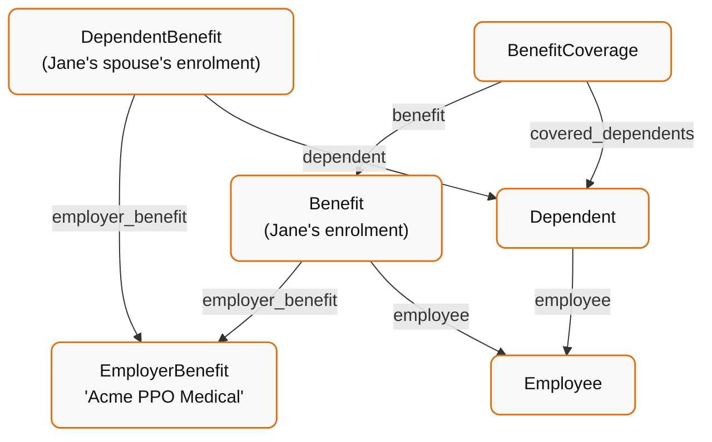

Bindbee exposes five benefits models. Their names are similar enough that picking the wrong one is easy, and the failure mode is not an error — it is a number that looks reasonable and is wrong.

## One sentence each

| Model | One sentence |
| --- | --- |
| `EmployerBenefit` | A plan the employer **offers**. |
| `Benefit` | An employee is **enrolled** in a plan, and this is what they pay. |
| `Dependent` | A person **attached** to an employee — spouse, child. |
| `DependentBenefit` | A dependent is **enrolled** in a plan. |
| `BenefitCoverage` | The **amount** of cover on an enrolment, and who it applies to. |

The distinction that matters most: **`EmployerBenefit` is a catalogue entry. `Benefit` is an enrolment.** One `EmployerBenefit` has many `Benefit` rows pointing at it — one per enrolled employee.

## The graph



<Warning>
  `DependentBenefit.employer_benefit` points at the **plan**, not at the
  employee's `Benefit` row. There is no direct link from a dependent's enrolment
  to the employee's enrolment. To group them, join both on `employer_benefit`
  and resolve the employee through `Dependent.employee`.
</Warning>

## `EmployerBenefit` — the catalogue

```json
{
  "id": "0192aa10-1c07-7b2e-8f00-5a1b3d7e9c42",
  "plan_name": "Acme PPO Medical",
  "provider_name": "Blue Shield",
  "benefit_plan_type": "MEDICAL",
  "benefit_plan_category": "HEALTH",
  "deduction_code": "MED-PPO",
  "description": "PPO medical plan, national network",
  "coverage_tiers": ["EMPLOYEE_ONLY", "EMPLOYEE_AND_SPOUSE", "FAMILY"],
  "start_date": "2026-01-01",
  "end_date": null
}
```

There is **no `employee` field** — that is the tell. This model describes the plan itself.

Two fields do real work:

- **`coverage_tiers`** (plural) — the tiers the plan *offers*. Compare with `Benefit.coverage_tier` (singular) — the tier one employee *chose*.
- **`deduction_code`** — the payroll code. This is your join key from a benefit to a payroll deduction line item. Not every system populates it.

Use it for: plan pickers, open-enrolment UIs, "what does this employer offer?".

## `Benefit` — the enrolment

```json
{
  "id": "0192aa11-3f21-7c40-9e11-6b2d4c8f1a03",
  "employee": "01931edf-04b6-7391-8a5c-93ac4b395316",
  "employer_benefit": "0192aa10-1c07-7b2e-8f00-5a1b3d7e9c42",
  "plan_name": "Acme PPO Medical",
  "provider_name": "Blue Shield",
  "benefit_plan_type": "MEDICAL",
  "benefit_plan_category": "HEALTH",
  "coverage_tier": "EMPLOYEE_AND_SPOUSE",
  "employee_contribution": 142.50,
  "company_contribution": 517.00,
  "frequency": "MONTHLY",
  "start_date": "2026-01-01",
  "effective_date": "2026-01-01",
  "end_date": null
}
```

`plan_name` and `provider_name` are denormalized onto `Benefit` so simple reads don't need a join. They should match the linked `EmployerBenefit`.

<Warning>
  **`frequency` governs the contribution amounts, and it is not always monthly.**

  `employee_contribution: 142.50` with `frequency: "BIWEEKLY"` is ~$3,705/year,
  not $1,710. Normalize by `frequency` before annualizing, comparing plans, or
  showing a cost. If `frequency` is `null` or unrecognised, show "unavailable"
  rather than assuming monthly.
</Warning>

Three date fields, three meanings:

| Field | Meaning |
| --- | --- |
| `start_date` | When the enrolment record begins |
| `effective_date` | When coverage actually takes effect |
| `end_date` | When it ended. `null` = currently active |

`start_date` and `effective_date` diverge with waiting periods — enrolled on hire, effective the first of the following month. Use `effective_date` for "is this person covered today".

Filter `end_date IS NULL` for current coverage, or you will show lapsed plans alongside active ones.

<Warning>
  `company_contribution` is `null` on many connectors. Plenty of systems expose
  only the employee-side deduction. Do not compute total cost as
  `employee + company` without checking for `null` — you will silently
  understate it.
</Warning>

## `Dependent` — the person

```json
{
  "id": "0192aa13-0e55-7f21-a4b1-7d8e3f6c9a02",
  "employee": "01931edf-04b6-7391-8a5c-93ac4b395316",
  "first_name": "Alex",
  "last_name": "Doe",
  "relationship": "SPOUSE",
  "date_of_birth": "1989-03-14",
  "gender": "MALE",
  "is_student": false,
  "ssn": "***-**-1234",
  "phone_number": "+1-555-0148",
  "home_location": { ... }
}
```

Existing as a `Dependent` does **not** mean enrolled in anything. Dependents can be on file without coverage. Enrolment lives in `DependentBenefit`.

`relationship`, `date_of_birth` and `is_student` are the fields eligibility rules are typically written against — age-out thresholds, student status extensions.

<Warning>
  `ssn` and `date_of_birth` are sensitive personal data covered by HIPAA and
  GDPR obligations. Request them only when you need them, and handle them
  accordingly. See [Security & Compliance](/explanation/security-and-compliance).
</Warning>

## `DependentBenefit` — the dependent's enrolment

```json
{
  "id": "0192aa14-9b66-7a32-c5d2-8e9f4a7b0c13",
  "dependent": "0192aa13-0e55-7f21-a4b1-7d8e3f6c9a02",
  "employer_benefit": "0192aa10-1c07-7b2e-8f00-5a1b3d7e9c42",
  "start_date": "2026-01-01",
  "effective_date": "2026-01-01",
  "end_date": null
}
```

Deliberately thin. No contribution amounts — the dependent's cost is folded into the employee's `Benefit.employee_contribution` via the `coverage_tier`, not itemized here.

<Warning>
  Do not sum dependent costs separately and add them to the employee's
  contribution. You will double-count. The employee's contribution at
  `EMPLOYEE_AND_SPOUSE` already includes the spouse.
</Warning>

## `BenefitCoverage` — the amount

```json
{
  "id": "0192aa12-7d44-7e10-b3a0-9c6f2e5b8d71",
  "benefit": "0192aa11-3f21-7c40-9e11-6b2d4c8f1a03",
  "currency": "USD",
  "amount": 50000.00,
  "is_employee_covered": true,
  "covered_dependents": ["0192aa13-0e55-7f21-a4b1-7d8e3f6c9a02"]
}
```

This is "how much cover", not "how much it costs" — the benefit sum assured. Most relevant for life, AD&D and disability plans.

`is_employee_covered` and `covered_dependents` together answer "who does this amount apply to". A plan can cover dependents without covering the employee.

Availability varies significantly by connector — check [Integrations & Coverage](/integrations).

## Which model answers which question

| Question | Model |
| --- | --- |
| What plans does this employer offer? | `EmployerBenefit` |
| Which tiers can an employee pick? | `EmployerBenefit.coverage_tiers` |
| What is this employee enrolled in? | `Benefit`, filtered `end_date IS NULL` |
| What does the employee pay per period? | `Benefit.employee_contribution` + `frequency` |
| What does the employer pay? | `Benefit.company_contribution` — often `null` |
| Who are this employee's dependents? | `Dependent` |
| Which dependents have coverage? | `DependentBenefit` |
| How much life cover does someone have? | `BenefitCoverage.amount` |
| Which payroll deduction is this plan? | `EmployerBenefit.deduction_code` |

## Three mistakes that produce wrong numbers

**Counting `EmployerBenefit` rows as enrolments.** Three plans offered ≠ three people enrolled. Count `Benefit` rows.

**Annualizing without `frequency`.** The most common source of costs that are 2x or 2.17x off.

**Including lapsed enrolments.** Always filter on `end_date`, and use `effective_date` for point-in-time questions.

## Related

<CardGroup cols={2}>
  <Card title="Read Benefits & Payroll Data" icon="hand-coins" href="/get-started/tutorials/read-benefits-and-payroll-data">
    Working code that assembles the full picture.
  </Card>
  <Card title="Field Semantics" icon="circle-help" href="/explanation/field-semantics">
    Why enum values sometimes come back as raw vendor strings.
  </Card>
</CardGroup>
