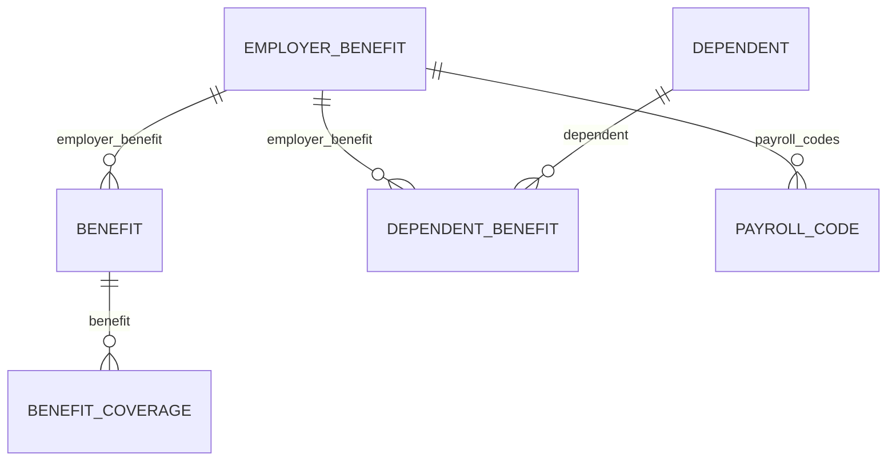

Four models carry benefits data, and their names are close enough that picking the wrong one is easy. The failure mode is not an error - it is a number that looks reasonable and is wrong.

The distinction that matters is not what the benefit is. It is whose fact it is.

## The four models

| Model | Whose fact | Answers |
| --- | --- | --- |
| **Employer benefit** | The employer's | What plans are offered? |
| **Benefit** | One employee's | Who enrolled, and what do they pay? |
| **Dependent benefit** | A dependant's | Which plans is that person covered under? |
| **Benefit coverage** | A covered party's | How much is each person insured for? |

An employer benefit is a catalogue entry - it exists whether or not anyone enrols. A benefit is one employee's enrolment in it, so an employee on medical, dental and vision has three.

<Note>
Dependants themselves are not a benefits model. A dependant is a person attached to an employee, and exists whether or not they are covered by anything. Coverage is the dependent benefit; the person is [an employee relation](/explanation/employee-and-org-models).
</Note>

## How they link

The asymmetry is the point, and the names hide it. **Benefit coverage attaches to the enrolment. Dependent benefit attaches to the plan.**

<Warning>
There is no link from a dependant's coverage to the employee's enrolment in the same plan. To group them, join both on `employer_benefit` and resolve the person through the dependant's own employee relation.
</Warning>

Note also that **dependent benefit carries no money at all** - no contribution fields, only dates and which plan covers whom. Benefits are paid by the employee, so the contribution sits on their enrolment, and a dependant's coverage extends it rather than forming a separate financial relationship.

That asymmetry also explains where amounts live. Some plans insure different sums for the employee, the spouse and each child - life insurance is the usual case - and **an amount that varies per person cannot be a field on the enrolment** without capping how many people a plan can cover.

So it becomes one benefit coverage record per covered party instead. Read only the enrolment and you get the contribution and the tier but no sums assured, with nothing in the response to signal the gap.

## Plan years bound everything

Benefits are the most time-bound data in an HR system. A plan year opens, enrolments run against it, contributions are deducted during it, and the whole structure is replaced at renewal.

Two consequences follow, and both break naive reads.

**Enrolments accumulate rather than update.** An employee in their third year has three medical enrolments, not one that was edited twice. An unfiltered read returns benefits history, and treating it as current state overstates coverage.

**Renewal changes identity.** Most systems create new plan records at renewal instead of editing existing ones, so plans that look identical across years are distinct objects. Any plan identifier you stored last year will not resolve this year.

The same time-boundedness shows up inside a single enrolment. An employee elects during open enrolment, but coverage begins at the plan year boundary - so **an enrolment's start date and its effective date are a waiting period apart**, not the same day.

## The payroll code is the join

**Benefits data describes an intent** - who is enrolled in what, and what they agreed to contribute. **Payroll data describes money that moved** - what was withheld from a paycheque, as deductions on an employee payroll run.

The employer benefit carries the link between them:

- **`payroll_codes`** - references to the payroll code records associated with this plan.
- **`deduction_code`** - the customer's own code string for it, such as `MEDPPO`.

So the plan tells you which codes represent it in payroll, and a deduction line resolves back to a plan through them.

<Warning>
Both fields are nullable and not every integration populates them. Where they are empty, the mapping genuinely is yours to hold - **check before assuming the join is available** on a given connector.
</Warning>

What the codes still cannot give you is the **plan year**. Attributing a deduction to one needs the payment date, since a January deduction may belong to either year depending on how the customer's calendar falls.

## Why it works this way

**Splitting the plan from the enrolment is what makes the data usable at scale.** Folding them together would copy the plan's name, carrier and terms onto every enrolled employee's record - inconsistent the moment one copy is updated and another is not.

Stating the plan once means a correction to it is a correction everywhere.

**The separate coverage model exists because coverage genuinely isn't an attribute of the enrolment.** On a life insurance plan, a model with its own covered party is the only shape that holds every case without capping how many people a plan can cover.

**Keeping dependants outside the benefits cluster follows the same principle.** A dependant is a person who exists independently of coverage - enrolled in some plans and not others, added mid-year, or recorded without being covered at all.

## What this means for you

- **Read benefit coverages when amounts matter**, not just enrolments.
- **Join dependants to employees through the plan**, not through the employee's benefit row.
- **Filter enrolments by plan year.** Unfiltered reads return history.
- **Do not expect plan identifiers to survive renewal.** Match on plan attributes, not identity.
- **Read `payroll_codes` on the plan before building your own mapping.** Fall back to your own only where it is null.

## Related

- [Read benefits data](/how-to/reading-data/read-benefits-data) - enrolments, coverages, and dependants
- [Employee & org models](/explanation/employee-and-org-models) - where dependants sit, as an employee relation
- [Payroll & time models](/explanation/payroll-and-time-models) - where deductions live
