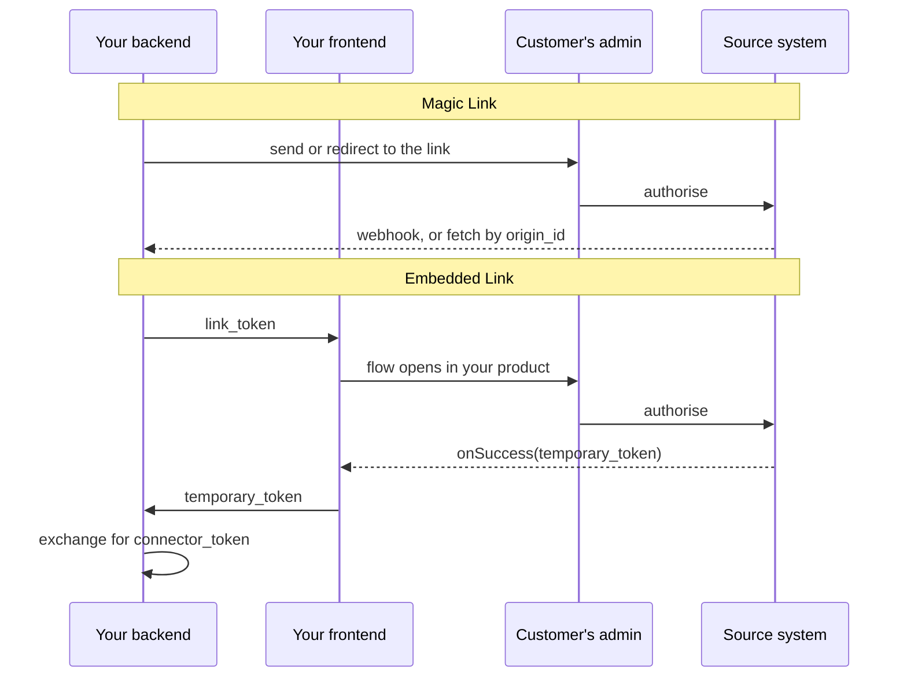
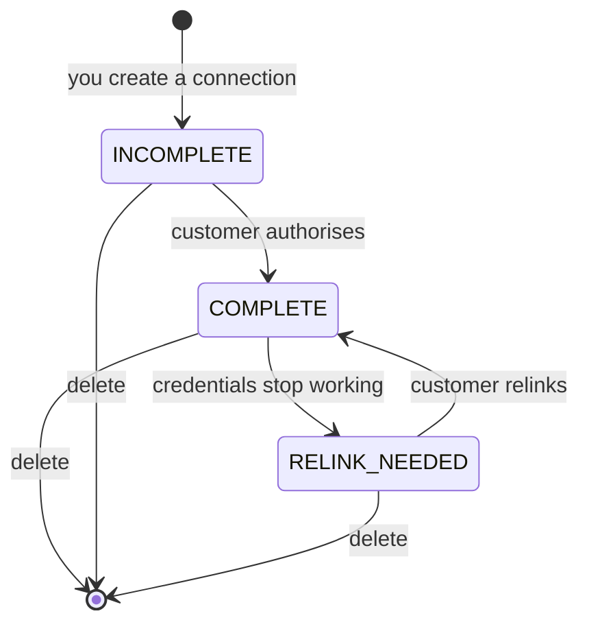

You are not the one who connects to your customer's HR system. They are.

That inversion shapes a surprising amount - where credentials live, who to contact when a connection breaks, and **why you cannot simply fix a permissions problem yourself.** A connector is also the only object in Bindbee with a lifecycle you have to manage: it can break without anything on your side changing, and one of the two recovery actions destroys data.

## Authorisation belongs to the customer

Reaching a company's HR data requires credentials from that company. Only someone with administrative access to their HRIS can grant them, and in almost every case they cannot delegate that to a third party even if they wanted to.

So the flow puts your customer's administrator in the middle. You initiate a connection for a named customer, they authorise it against their own system, and Bindbee holds the resulting credentials. **Those credentials never pass through your infrastructure and are never yours to store.**

<Info>
A connection problem is therefore usually not yours to fix. Expired credentials, insufficient permissions and revoked access all resolve on the customer's side. Your job is to detect the condition and prompt the right person.
</Info>

## Two ways to connect

The same authorisation flow reaches your customer through two surfaces, and the choice is independent of how the link was created.

**[Magic Link](/explanation/magic-link)** opens in the customer's browser at a Bindbee URL. You send it to them or redirect them to it. No front-end code either way.

**[Embedded Link](/how-to/connections/embed-the-connection-flow)** runs the same flow inside your own product, so the customer never leaves it.

Both produce a connector, both put the administrator in control, and **neither lets the end user choose which system to connect** - the link token requires the integration slug, so the target is fixed before the session exists.

They differ in the thing that shapes your code: **how you learn the connection succeeded.**

| | Magic Link | Embedded Link |
| --- | --- | --- |
| Front-end code | None | React hook or CDN script |
| Link created by | Dashboard, or `create-link-token` | `create-link-token` |
| Completion signal | Webhook, or fetch by `origin_id` | `onSuccess` fires in the browser |
| Getting the token | Read `connector_token` from the connector | Exchange the `temporary_token` from your backend |

The embedded flow reacts the moment your customer finishes; the hosted page learns about it asynchronously.

Note the second row: **hosted does not mean manual.** Creating links by hand suits human-led implementation, but you can generate them from `create-link-token` and still redirect to the hosted page - self-serve onboarding with no front-end at all.

A third route skips the end-user surface entirely, for systems where you already hold what authorisation needs - see [Create programmatically](/how-to/connections/create-a-connector-programmatically).

## The states

**Relinking is the only edge that returns a connector to health, and deletion is the only one that cannot be walked back.**

**Pending (`INCOMPLETE`).** Created when you initiate a connection, before your customer has authorised it. No credentials, no data, no syncs.

**Active (`COMPLETE`).** Authorised and syncing on schedule. The normal steady state.

**Broken (`RELINK_NEEDED`).** Credentials that no longer work - an expired OAuth token, a rotated API key, a deactivated integration user, narrowed permissions. All behave identically from your side.

A broken connector keeps the data it already synced - it just stops acquiring more, and what you hold goes stale in place. `relink_needed_at` records when the credentials were deemed invalid, so you can measure how long.

## Two fields, two questions

`status` is not the whole picture. A connector carries a second, independent field, and **a healthy `status` does not mean data is arriving.**

| Field | Values | Answers | The bad value |
| --- | --- | --- | --- |
| `status` | `INCOMPLETE`, `COMPLETE`, `RELINK_NEEDED` | Are the credentials good? | `RELINK_NEEDED` - only your customer can fix it |
| `sync_status` | `Syncing`, `Done`, `Failed` | Did the last run succeed? | `Failed` - usually permissions or an upstream outage |

A connector sitting at `COMPLETE` with `sync_status: Failed` has working credentials and is still not updating. That is a different problem with a different fix, and monitoring only `status` misses it entirely.

<Warning>
There is no error on the data endpoints in either case. Your application keeps reading successfully from a connector that stopped syncing weeks ago. **These two fields and the sync-status webhooks are the only reliable signals.**
</Warning>

{/* VERIFY: what does is_active mean, and how does it relate to status? The spec describes it only as "Flag to indicate if connector is active or not". If it can be false while status is COMPLETE, it is a third signal this page should cover. */}

## Relinking versus deleting

When a connector breaks, both actions available to you look like they mean "fix it". They do not.

**Relinking** sends your customer back through authorisation. The connector keeps its identity, history, records and `connector_token`, so nothing you stored needs updating. Data reconciles and syncing resumes.

This is the correct response to essentially every broken connector.

**Deleting** removes the connector *and its data* - identifiers, records, sync history. Recovery means a new connector and a fresh initial sync, and **every record returns with a new Bindbee `id`**, breaking any foreign key you stored.

Deletion is right when a customer churns or a connection was created in error, and it is your data-removal mechanism. But the same operation that satisfies a removal request destroys a recoverable integration - so it is the wrong reflex for a broken one.

<Note>
Because relinking preserves the token, a `connector_token` that stops working after a customer "reconnects" is worth investigating rather than refetching. Only deletion and re-creation replace it.
</Note>

## Credential rotation is routine

Customers rotate API keys, cycle service accounts, and offboard the administrator who originally authorised the connection. Each breaks a connector through nobody's fault.

The last one deserves planning. **When authorisation is tied to an individual's account rather than a dedicated integration user, that person leaving takes the connection with them** - a common cause of a connector breaking months after a clean setup, found late because nothing announces it.

## Why it works this way

The alternative to delegated authorisation - collecting your customers' HRIS credentials yourself and passing them to Bindbee - is simpler to build and worse in every other respect.

**It makes you the custodian of credentials that open an entire company's employee records**, including compensation and bank details - a security liability you have no reason to accept. It also fails on its own terms: OAuth-based systems will not issue credentials to anyone but the authorising administrator, so a credential-collection flow cannot support them at all.

**Keeping data through a broken state** is what produces the silent-staleness problem, and it is still the right call. Making data unavailable the moment credentials fail is louder, but it converts a degradation into an outage: your application stops working for that customer because their IT department rotated a key, while the data you hold is minutes old and perfectly usable. For most applications, slightly stale data is enormously better than no data.

Preserving data through relink also makes recovery cheap. The connector keeps its identity, so a customer who fixes their credentials gets continuity rather than new identifiers and a broken join in your database.

The trade on both counts is that failure is quiet, which **puts the burden on monitoring rather than error handling.**

## What this means for you

- **Connection failures are customer-side.** Detect and prompt; do not expect to fix them yourself.
- **Choose the surface by where onboarding happens**, not by whether you want to automate. Hosted links can be generated programmatically too.
- **Monitor both fields, not read success.** Reads succeed regardless; `RELINK_NEEDED` and `sync_status: Failed` are different problems.
- **Use `relink_needed_at` to measure staleness**, not just to detect it. How long it has been broken decides how urgent it is.
- **Relink to fix; delete to remove.** They are not interchangeable, and deletion is not reversible.
- **Encourage dedicated integration users at setup** rather than authorisation tied to an individual's account.
- **Surface stale connectors to whoever manages the customer relationship**, since the fix is on their side.

## Related

- [Magic Link](/explanation/magic-link) - the hosted flow, and what your customer sees
- [Embedded Link](/how-to/connections/embed-the-connection-flow) - the same flow inside your product
- [Update credentials](/how-to/connections/update-credentials) - walk a customer through re-authorisation
- [Sync status](/how-to/troubleshooting/monitor-sync-status) - building the health surface
