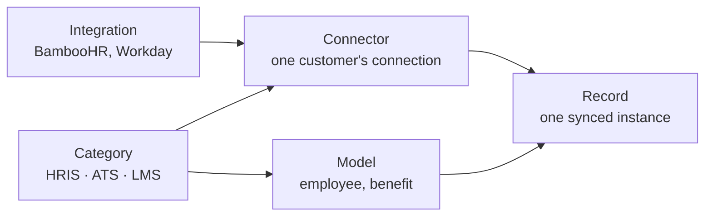

Five words carry most of the weight in Bindbee's API, and three of them sound interchangeable. The one that matters most: **an integration is a vendor system, a connector is one customer's connection to it.** That difference decides whether a change affects one customer or all of them.

## The five levels

- **Category** - the kind of system. Determines which models exist, and appears in every endpoint path.
- **Integration** - a vendor system, identified by a slug.
- **Connector** - one customer's connection to one integration, in one category. Holds their credentials and owns their sync schedule.
- **Model** - a unified object type, identical across every integration in its category.
- **Record** - one instance of a model, synced from one connector.

If 40 of your customers use BambooHR, you have **1** BambooHR integration and **40** BambooHR connectors.

<Note>
A vendor can be offered in more than one category, so a connector is pinned to a category as well as an integration. A customer using SAP SuccessFactors for both HR and recruiting has **two** connectors, not one - see [Integrations](/integrations).
</Note>

## Where settings live

Above all of this sits your **organisation** - your company's account. It has two **environments**, Development and Production, holding separate connectors, keys and logs.

Every setting sits at exactly one level, and that level is its blast radius.

| Set at | What lives there | Changing it affects |
| --- | --- | --- |
| **Organisation** | Scope, custom field definitions | Every customer, both environments |
| **Integration** | Custom field mappings, usually | Every customer on that vendor system |
| **Connector** | Credentials, sync schedule | One customer |
| **Environment** | Connectors, API keys, logs | That side only - **not** configuration |

<Warning>
Environments separate *data*, not *configuration*. Scope and custom fields are organisation-level, so **a change made while testing in Development is a change in Production too.** Decide your scope before you start testing, not after.
</Warning>

A connector's environment is set at creation but can be switched later, without the end user reconnecting - though not from the dashboard. See [Environments](/explanation/environments).

## Two tokens

Requests carry two credentials, answering different questions.

- **API key** - identifies your organisation. Secret, server-side, never in a browser.
- **Connector token** - names whose data you want. Issued per connector, and distinct from the connector's `id`, which is how you refer to the connector itself in a URL.

Anything that touches one customer's data needs **both** - one for authority, one for subject. Without the token, Bindbee knows who is asking but not whose employees you want.

A few endpoints need only the key, because there is no subject to name: listing connectors, listing integrations, configuring custom fields, reading webhook logs. See [Authenticate a Request](/how-to/setup/authenticate-a-request).

## Why it works this way

**A setting lives at the level where it stays true.** Scope does not vary by customer, so storing it per connector would just be hundreds of copies to keep in step. Credentials differ for every customer, so there is nowhere else they could sit.

Collapsing the levels would force a bad trade: configure once and be wrong for every exception, or configure per customer and drown in it.

**The two tokens are a security boundary.** A connector token reaches one customer's data; an API key reaches all of it. Splitting them keeps the credential that travels most widely as the one with the least authority.

## What this means for you

- **Before changing a custom field mapping, check whether it is set on the integration or the connector.** The first changes every customer on that vendor; the second changes one.
- **Set your scope before you start testing.** Scope is organisation-level, so narrowing it in Development narrows Production at the same moment.
- **Keep the API key on your server, never in a browser.** It reaches every customer's data - a connector token reaches only one.
- **When something breaks, ask which level it sits at.** One customer failing is a connector problem; every customer on BambooHR failing is an integration problem.

## Related

- [Set up your environment](/get-started/quickstart) - keys, environments, and your first request
- [Authentication](/api-reference/basics/authentication) - how the two tokens are supplied
- [Scope & permissions](/explanation/scope-and-permissions) - what organisation-level scope controls
