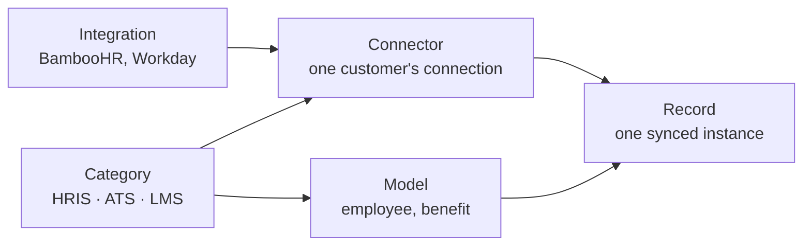
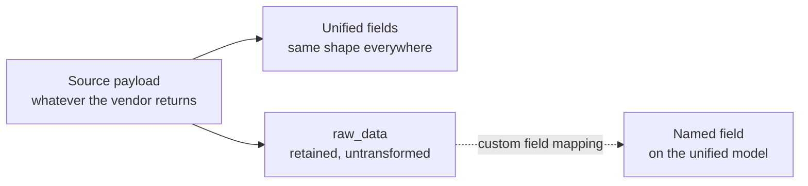

{/* CONTENT PASS: merged from explanation/core-concepts + explanation/unified-model. Structure settled; trim overlap between "Two tokens" and Authentication, and between "Coverage varies" and Model availability, in the content pass. */}

Five words carry most of the weight in Bindbee's API, and three of them sound interchangeable. The one that matters most: **an integration is a vendor system, a connector is one customer's connection to it.** That difference decides whether a change affects one customer or all of them.

## The five levels

If 40 of your customers use BambooHR, you have **1** BambooHR integration and **40** BambooHR connectors.

## Glossary

Every term Bindbee's docs use with a specific meaning. This table is the single definition of each - other pages use the words without redefining them.

| Term | Means |
| --- | --- |
| **Category** | The kind of system - `hris`, `ats` or `lms`. Determines which models exist, and appears in every endpoint path |
| **Integration** | A vendor system, identified by a slug such as `bamboohr`. One integration, however many customers use it |
| **Connector** | One customer's connection to one integration, in one category. Holds their credentials and owns their sync schedule |
| **Model** | A unified object type - employee, benefit, candidate. Identical across every integration in its category |
| **Record** | One instance of a model, synced from one connector |
| **Organisation** | Your Bindbee account. Scope and custom fields are configured at this level |
| **Environment** | Development or Production. Separate connectors, keys and logs; **shared** scope and custom field configuration |
| **API key** | Authenticates your organisation. Sent as `Authorization: Bearer`. Every endpoint requires it |
| **Connector token** | Names which customer's connection a request acts on. Sent as `X-Connector-Token`. Required wherever the request reaches one customer's data |
| **Scope** | The models and fields Bindbee requests from a connected system. Set once per organisation; a field outside scope is absent from responses, not `null` |
| **Sync** | The job that pulls scoped data from the source system and normalizes it. Scheduled in Production, manual in Development |
| **Custom field** | A value the unified model does not carry, mapped out of the raw payload with a JMESPath expression and returned alongside the record |
| **Magic Link** | A hosted URL where your customer authorizes their own system, with no front-end code on your side |
| **Passthrough** | A request forwarded to the source system's own API using the credentials already held on a connector |
| **Issue** | A failure automatically raised against a connector, carrying the request and response behind it |
| **Meta API** | Returns the request schema a write endpoint expects for a given connector, since required fields differ by system |
| **`id`** vs **`remote_id`** | `id` is Bindbee's identifier - stable, same shape everywhere, the one to store. `remote_id` is the source system's own, useful for reconciliation |

<Note>
A vendor can be offered in more than one category, so a connector is pinned to a category as well as an integration. A customer using SAP SuccessFactors for both HR and recruiting has **two** connectors, not one - see [Integration & Coverage](/integrations).
</Note>

## Where settings live

Above all of this sits your **organisation** - your company's account. It has two **environments**, Development and Production, holding separate connectors, keys and logs.

Every setting sits at exactly one level, and that level is its blast radius.

| Set at | What lives there | Changing it affects |
| --- | --- | --- |
| **Organisation** | Scope, custom field definitions | Every customer, both environments |
| **Integration** | Custom field mappings, usually | Every customer on that vendor system |
| **Connector** | Credentials, sync schedule | One customer |
| **Environment** | Connectors, API keys, logs | That side only - **not** configuration |

<Warning>
Environments separate *data*, not *configuration*. Scope and custom fields are organisation-level, so **a change made while testing in Development is a change in Production too.** Decide your scope before you start testing, not after - see [Environments](/explanation/environments).
</Warning>

## Two tokens

Requests carry two credentials, answering different questions.

- **API key** - identifies your organisation. Secret, server-side, never in a browser.
- **Connector token** - names whose data you want. Issued per connector, and distinct from the connector's `id`, which is how you refer to the connector itself in a URL.

Anything that touches one customer's data needs **both** - one for authority, one for subject. Without the token, Bindbee knows who is asking but not whose employees you want.

A few endpoints need only the key, because there is no subject to name: listing connectors, listing integrations, configuring custom fields, reading webhook logs. See [Authentication](/api-reference/basics/authentication).

## Normalisation is opinionated

Bindbee returns the same employee shape whether your customer runs Workday, BambooHR, or a nightly SFTP drop. That consistency is the point of a unified API, and it is only achievable by making decisions on your behalf. **Every one of those decisions loses something.**

Source systems disagree about almost everything. One HRIS has a single `name` field. Another has legal, preferred and display names, each optional. A third stores names only inside a nested profile object that is present for some employees and absent for others.

Bindbee's employee model has one set of name fields, so populating them means choosing which source field maps to which unified field - and what to do when the preferred choice is missing.

These resolutions are usually **fallback chains**: preferred name if present, otherwise legal name, otherwise whatever the profile object holds. The chain is a judgement about what most applications want, and it will occasionally be wrong for yours.

Mappings are defined **per integration**, not per customer. If the Workday name chain changes, it changes for every Workday connector at once.

## Nothing is discarded, but not everything is returned

Normalisation sets the original aside rather than throwing it away.

That gives you three ways to reach a value, and they differ in more than convenience:

| Route | What you get | In default response | Request with |
| --- | --- | --- | --- |
| **Unified field** | The normalised value, same shape everywhere | Yes | — |
| **Custom field** | A value you named, stable once mapped | No | `include_custom_fields=true` |
| **Raw data** | The vendor's own payload, shape follows them | No | `include_raw_data=true` |

<Warning>
Both `raw_data` and `custom_fields` default to **off**. A mapped custom field does not appear in a response until you ask for it, which is the usual reason a mapping looks like it silently failed. See [Raw Data](/how-to/reading-data/include-raw-data-and-custom-fields).
</Warning>

Raw data is where you go when a unified field is empty, when the fallback chain picked the wrong source, or when the value has no unified equivalent at all. But it is deliberately not normalised - its shape is whatever that integration returns, and it changes when the vendor changes their API. **Reading it directly in application code means writing integration-specific handling** - the thing you adopted a unified API to avoid. Promote what you need into a [custom field](/explanation/how-custom-fields-work) instead.

## Coverage varies by integration

Two things limit what the unified model can give you for a particular customer.

**Not every integration supports every model.** Coverage follows what the source system exposes, and it differs integration by integration even within one category - see [Model availability](/integrations-coverage/model-availability).

**Some models are still settling.** Any model carrying a **BETA** badge in the API reference works, but its field names and shapes are not yet frozen.

{/* VERIFY: does Beta carry a stated notice period or deprecation policy before a contract change? */}

## Why it works this way

**A setting lives at the level where it stays true.** Scope does not vary by customer, so storing it per connector would just be hundreds of copies to keep in step. Credentials differ for every customer, so there is nowhere else they could sit.

**The two tokens are a security boundary.** A connector token reaches one customer's data; an API key reaches all of it. Splitting them keeps the credential that travels most widely as the one with the least authority.

**The unified model is narrow on purpose.** The alternative is a union of every field every source system offers, everything optional - which never loses information and never delivers the benefit either. Your code would branch on which integration a connector uses, which is precisely the work a unified API exists to remove. Raw data exists so the margins are recoverable rather than terminal.

## What this means for you

- **Before changing a custom field mapping, check whether it is set on the integration or the connector.** The first changes every customer on that vendor; the second changes one.
- **Set your scope before you start testing.** Scope is organisation-level, so narrowing it in Development narrows Production at the same moment.
- **Keep the API key on your server, never in a browser.** It reaches every customer's data - a connector token reaches only one.
- **Pass `include_custom_fields=true` to see a custom field.** Mapping it is only half the job.
- **When a unified field is empty, check raw data before concluding the source has no value.**
- **Do not read raw data directly in application code.** Promote what you need into a custom field.
- **When something breaks, ask which level it sits at.** One customer failing is a connector problem; every customer on BambooHR failing is an integration problem.

## Related

- [Environments](/explanation/environments) - what the two environments separate, and what they share
- [How to connect](/explanation/magic-link) - the three ways a connector is created
- [Scoping](/explanation/scope-and-permissions) - what organisation-level scope controls
- [Authentication](/api-reference/basics/authentication) - how the two tokens are supplied
