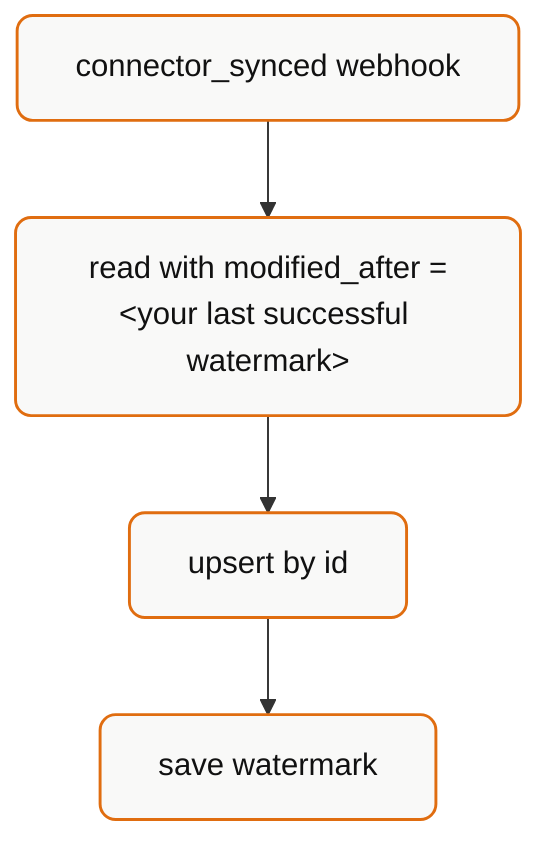

## The honest answer

Bindbee data is as fresh as the **last successful sync**. In Production, syncs run **once every 24 hours by default**.

So in the worst case, a value you read is nearly 24 hours behind the source system.

<Warning>
  Webhooks do not make data fresher. They tell you promptly *that a sync
  happened*. If the sync runs daily, you learn about yesterday's changes
  promptly - but you still learn about them a day late.
</Warning>

If your product needs sub-daily freshness, that is a **sync frequency** conversation, not a delivery-mechanism one. Sync frequency is adjustable - contact `support@bindbee.dev` or your account manager.

## What determines freshness

Four things, in order of impact:

1. **Sync schedule** - 24 hours by default in Production; adjustable.
2. **Sync duration** - a large first sync can take a long time. `avg_sync_duration` on the connector tells you the typical figure for that specific connection.
3. **Source-system latency** - the HRIS itself may not expose a change immediately. A payroll run can be finalized internally hours before it appears on the vendor's API.
4. **Your ingest lag** - if you mirror into your own store, add however long your pipeline takes.

Total staleness is the sum, not the maximum, of these. A "24-hour" figure is realistically "24 hours plus the tail".

## Knowing how stale you are

Every connector reports its own timing:

```json
{
  "sync_status": "Done",
  "last_sync_start_time": "2026-07-22T09:49:30.478384+00:00",
  "next_sync_start_time": "2026-07-23T09:49:30.478384+00:00",
  "avg_sync_duration": "15 min 30 sec"
}
```

| Field | Use it for |
| --- | --- |
| `last_sync_start_time` | "Last updated *X* ago" in your UI |
| `next_sync_start_time` | "Next update in *Y*" - sets expectations |
| `avg_sync_duration` | Estimating how long a triggered sync will take |

<Tip>
  Showing data age is the highest-leverage thing you can do here. A user who can
  see "synced 6 hours ago" does not file a ticket asking why yesterday's new hire
  is missing. A user who sees an undated list does.
</Tip>

Per-record, `modified_at` tells you when **Bindbee** last wrote that record - not when the HRIS changed it. It is a sync timestamp, not a business-event timestamp. See [Field semantics](/explanation/field-semantics).

## Choosing a strategy

| Requirement | Strategy |
| --- | --- |
| Display data on demand in a UI | Read through on request; cache briefly; show data age |
| Mirror into your own database | `connector_synced` webhook → `modified_after` read → upsert |
| React to joiners/leavers | `employee_data_changed` webhook → fetch by ID |
| Nightly batch (payroll, billing, reporting) | Scheduled `modified_after` sweep; no webhooks needed |
| User clicked "Refresh now" | Trigger a resync, show progress, then re-read |
| Sub-hourly freshness | Talk to Bindbee about sync frequency first - no client-side pattern fixes this |

### The recommended default

For most integrations:



Plus a **daily reconciliation sweep** with the same `modified_after` logic, to cover events lost while your endpoint was down. Webhook retries stop after 4 attempts in 60 seconds - anything longer than a one-minute outage needs the sweep.

## Anti-patterns

**Polling the data endpoints on a short timer.** Calling `/employees` every five minutes cannot produce data that syncs every 24 hours have not yet fetched. You burn rate limit and get identical responses.

**Resyncing on a schedule.** A resync does not bypass the vendor's own limits, and hammering it can get the connector throttled upstream. Trigger resyncs in response to user intent, not on a cron. See [Force a resync](/how-to/force-a-resync).

**Treating `modified_at` as a business timestamp.** It answers "when did Bindbee write this?", not "when did this change in the HRIS?".

**Assuming a webhook means the data is different.** A sync that rewrites unchanged records can still produce change events. Diff before acting on anything expensive - notifications, provisioning, emails.

**Gating onboarding on rows existing.** Gate on `sync_status`. An empty directory mid-first-sync is indistinguishable from a genuinely empty one otherwise.

## Cache guidance

If you cache Bindbee responses:

| Data | Reasonable TTL | Why |
| --- | --- | --- |
| Employee directory | Until next `connector_synced` | It cannot change in between |
| Connector status | 1–5 minutes | Changes independently of syncs |
| Integrations list | Hours | Rarely changes |
| Payroll runs | Until next sync | Historical and immutable once paid |

Invalidate on `connector_synced` rather than on a timer. It is both fresher and cheaper.

## Related

<CardGroup cols={2}>
  <Card title="Webhooks vs Polling" icon="scale" href="/explanation/webhooks-vs-polling">
    Picking a delivery mechanism.
  </Card>
  <Card title="Filtering with modified_after" icon="filter" href="/how-to/filter-with-modified-after">
    The incremental read pattern in detail.
  </Card>
</CardGroup>
