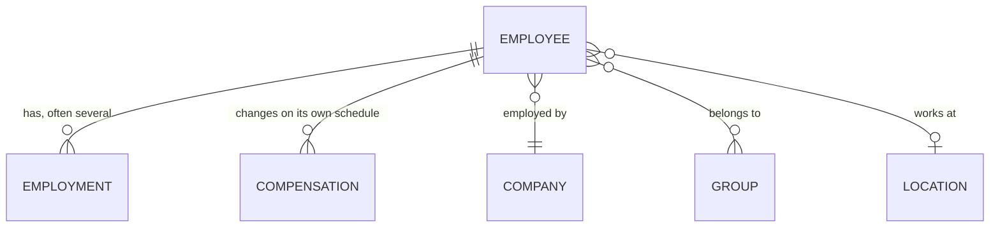
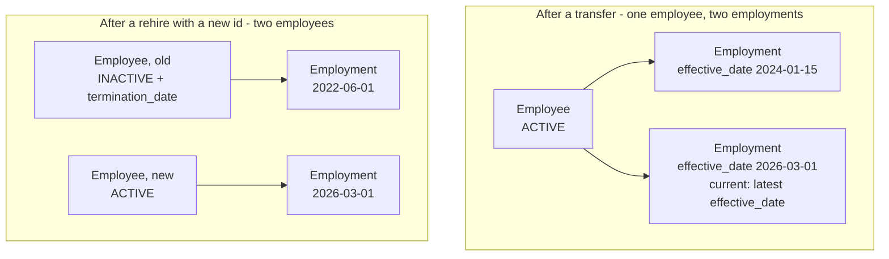

{/* CONTENT PASS: merged from explanation/employee-and-org-models, explanation/status-and-terminations, how-to/reading-data/read-employee-data, how-to/reading-data/read-employee-documents. The expand parameter and the "terminated employees do not disappear" point each appear twice. */}


The field you are looking for is probably not on the employee. Job title, department, salary, cost centre, office - all of these feel like employee attributes and **none of them are stored that way.**

The reason is that they change independently of the person, and often more than once.

## Where each field lives

| Looking for | It is on | Because |
| --- | --- | --- |
| Job title, department, division | **Employment** | Changes independently, and there can be several |
| Salary, pay frequency, FLSA status | **Compensation** | Changes on its own schedule |
| Cost centre, team, business unit | **Group**, filtered by `type` | One typed model, not one per concept |
| Office, address | **Location** | A workplace is not an organisational unit |
| Legal name, EINs | **Company** | A legal fact, not an organisational one |
| Employment status, termination date | **Employee** | Whether they still work there is person-level |

## The person and their employments



**Employee** holds what is true of the human: name, contact details, date of birth, identifiers.

**Employment** holds what is true of a period of work: job title, employment type, effective date, department and division.

A person can have several, and that is normal - promotions recorded as new positions, transfers between departments or entities, moves between full-time and part-time, rehires.

<Warning>
Do not read the first employment in the array and treat it as current. Ordering means nothing. Employment carries `effective_date` and **no end date of its own**, so the current one is the one with the latest `effective_date`.

Whether the person still works there is a separate, employee-level question: `employment_status`, `termination_date` and `termination_reason` all sit on the employee.
</Warning>

**Compensation** follows the same logic in its own model, because pay changes on its own schedule - a raise without a title change produces a new compensation record and no new employment.

It carries `start_date` and, like employment, no end date.

## Groups absorb several concepts

**Group** is where departments, teams, divisions, business units and cost centres all live. Its `type` field is one of `DEPARTMENT`, `TEAM`, `DIVISION`, `BUSINESS_UNIT` or `COST_CENTER`, and `parent_group` lets hierarchies be reconstructed.

This is one of the more aggressive collapses in the unified model, and it surprises people looking for a dedicated department or cost-centre model. **There isn't one.** Filter by `type` instead.

Source systems disagree profoundly about organisational structure. Some have one hierarchy; some run separate trees for reporting lines, cost allocation and legal entity; some let customers define arbitrary dimensions.

A model per concept would be right for one HRIS and wrong for the next.

**Location** is separate, because a physical workplace is not an organisational unit - people from several departments share an office, and a department spans several sites.

## Company is the legal entity

**Company** holds legal and display names and `eins`. The distinction between a company and a group is the distinction between a legal fact and an organisational one.

A customer running multiple entities may have them as several companies under one connector, or as separate connectors entirely, depending on how their HR system is configured. Both occur and neither is wrong.

## Two models worth scoping out

**Bank info** carries the employee's full account and routing numbers - `account_number` is the actual value, not a masked one. **Documents** carries files, including tax forms.

Nothing about these syncs differently. Scope decides whether they sync at all, and once in scope and permitted they arrive like any other model. What sets them apart is what they cost you to hold.

<Warning>
Bank info is the most sensitive model in the API. Syncing it materially expands what you store, what you must protect, and what you answer for in a security review. **Scope it out unless you have a specific reason to hold it** - see [Scope & permissions](/explanation/scope-and-permissions).
</Warning>

## Why it works this way

Separating employment and compensation from employee is **what makes history representable at all.**

If job title and salary were employee fields, each change would overwrite the last and the record would only ever show the present.

A promotion would be indistinguishable from a correction, and anything needing a point-in-time view - payroll reconciliation, benefits eligibility on a past date, audit - would be impossible.

Modelling them as separate dated records costs a join and a decision about which is current. In exchange the data can answer questions about the past - a substantial share of what HR data is for.

**The Group collapse is the opposite trade.** Here the unified model gives up expressiveness to gain consistency: one typed model every source system can map into, rather than specific models that fit some systems and not others. You pay for it with a filter on every read.

## What this means for you

- **Select the current employment by the latest `effective_date`.** Never by array position, and never by a termination date - employment does not carry one.
- **Filter groups by `type`** rather than looking for a department or cost-centre model.
- **Expect compensation to change without employment changing.** They are independent.
- **Treat location as orthogonal to organisational structure.**
- **Scope bank info out unless you need it.** The numbers are real, not masked.

## Status & terminations

You expected the employee list to shrink when someone left. It did not. Or it shrank without anyone leaving.

Employment status is where the difference between **how HR systems actually work and how applications assume they work** shows up most sharply.

### Terminated employees do not disappear

HR systems almost never delete people. A termination sets a status and a date; the record stays, because payroll, benefits continuation, tax reporting and rehire eligibility all depend on it continuing to exist.

Bindbee follows that. A terminated employee remains in your results with an inactive `employment_status` and `termination_date` populated. **Filtering to current staff is your application's decision**, not something the API does for you.

<Info>
The corollary matters more than it sounds: an unfiltered employee count is a **lifetime** count, not a headcount. If your billing, seat allocation or reporting is keyed to employee count, it needs to filter on status or it will drift upward permanently.
</Info>

### "Active" is not one value

`employment_status` carries nine values, and treating it as a boolean is the most common way to get headcount wrong.

| Value | Means | Currently staff? |
| --- | --- | --- |
| `ACTIVE` | Employed and working | Yes |
| `LEAVE` | Employed, currently on leave | **Yes** - still employed |
| `PENDING` | Accepted, not yet started | Usually not |
| `INACTIVE` | No longer employed | No |
| `RETIRED` | Left via retirement | No |
| `DECEASED` | Died in service | No |
| `ACTIVE_EXTERNAL` | Active, not a direct employee | Depends what you are counting |
| `INACTIVE_EXTERNAL` | Former non-direct worker | No |
| `-` | The source value had no equivalent | **Unknown** - check `raw_data` |

<Warning>
`employment_status == "ACTIVE"` silently excludes everyone on parental, medical or sabbatical leave. They are still employed, still accruing benefits, still on payroll. For headcount, seat billing or provisioning, the set you almost always want is `ACTIVE` **and** `LEAVE`.
</Warning>

The other trap is `-`. It is not "no status" - it is a real status in the source system with no unified equivalent, so it means *unknown*, not *inactive*. **Defaulting it to inactive can deprovision a working employee.** See [Enum values](/explanation/enum-values).

A tenant that distinguishes full-time from part-time *through status* loses that here - both arrive as `ACTIVE`. Look on the employment instead, where `employment_type` carries `FULL_TIME`, `PART_TIME`, `CONTRACTOR` and the rest.

### Transfers and rehires create new records

Two lifecycle events routinely produce a second record for someone who never left.

A **transfer** between positions, departments or legal entities is implemented in several systems as terminating the existing employment and creating a new one. Both are real - the history is genuinely two segments.

A **rehire** is similar and inconsistent between systems. Some reactivate the original record and clear the termination date. Others create a new record entirely, sometimes with a new identifier - and that produces a duplicate at the *employee* level, not just the employment level.



Where an employee has several employments, **the current one is the one with the latest `effective_date`.** Do not assume the first element of the array, and do not look for an end date on the employment - there isn't one.

The employee carries `termination_date` and `termination_reason`; employments carry only when each began.

The rehire case is the one to design for. Two employee records for one human is not something the API can fix - see [Record identity](/explanation/record-identity).

### Why it works this way

Bindbee reports status rather than filtering on it, and that generates most of the surprise here.

Filtering by default would make the common case effortless and silently break every other one. Benefits administration needs terminated employees for continuation. Payroll needs them for final pay and year-end reporting. Compliance needs them for retention periods measured in years.

**A platform that hid them by default would be unusable for a large share of what it exists to support**, and the workaround would be worse than the filter.

The enum collapse is the same trade seen elsewhere. A status field reproducing every customer's local vocabulary would not be a unified field at all - your code would branch per tenant.

Mapping to a fixed set is what makes one code path work, and raw data is what makes the loss recoverable.

### What this means for you

- **Treat current staff as `ACTIVE` + `LEAVE`.** Filtering on `ACTIVE` alone drops people who are still employed.
- **Never default `-` to inactive.** It means unknown, and guessing can deprovision a real person.
- **Do not key headcount or billing to raw record count.** An unfiltered list is everyone who ever worked there.
- **Expect multiple employments per person**, and select the current one by latest `effective_date`.
- **Check `employment_type` before reaching for raw data** when you need full-time versus part-time.
- **An employee who vanishes entirely is a different problem.** Check in this order: [scope or permissions narrowed](/explanation/scope-and-permissions), [the upstream identifier changed](/explanation/record-identity), or [a file connector stopped listing them](/explanation/sftp-and-file-connectors).

## Reading employee data

The employee model is the entry point for most integrations. This page covers what's specific to it - for the general techniques, see [Pagination](/api-reference/basics/pagination) and [Filtering](/how-to/reading-data/filter-and-narrow-a-collection).

<Info>
  **Before you start**

  - The connector has completed at least one sync.
</Info>

### Steps

<Steps>
  <Step title="Fetch employees">
    ```bash
    curl --request GET \
      --url 'https://api.bindbee.dev/api/hris/v1/employees?page_size=200&employment_status=ACTIVE' \
      --header 'Authorization: Bearer <BINDBEE_API_KEY>' \
      --header 'X-Connector-Token: <CONNECTOR_TOKEN>'
    ```

    **Result:** A paginated list of employees.
  </Step>

  <Step title="Expand related models instead of fetching them separately">
    `expand` returns related records inline. Comma-separate multiple relations with no spaces, and restrict fields with square brackets.

    ```
    ?expand=groups
    ?expand=manager[first_name,last_name]
    ?expand=groups,work_locations
    ```

    One expanded request beats N+1 follow-up calls, which is what exhausts the per-connector rate limit on large populations.

    `work_locations` expands into the [Location](/hris/locations/get-locations) model - name, street, city, state, postal code and country - which is what you need for tax jurisdiction or eligibility by state. The model is currently **BETA** - it works, but field names and shapes are not yet frozen, so pin what you depend on and expect to revisit it. See [Unified model & raw data](/explanation/core-concepts).

    **Result:** Related data inline, at the cost of a larger response - lower `page_size` when expanding.
  </Step>

  <Step title="Understand employee versus employment">
    These are separate models and conflating them causes most employee-data confusion.

    An **employee** is a person. An **employment** is a job - role, pay, dates. One employee can have several employments: a rehire, a transfer, a promotion, or a part-time and full-time role held at once.

    Systems that terminate-and-recreate on transfer produce several employment records for one continuous tenure. If you read compensation or job title from the employee model alone, you'll silently pick one of them.

    Read [Get Employments](/hris/employments/get-employments) when you need current job details, and select deliberately rather than taking the first record.

    **Result:** You're reading the right record for the question you're asking.
  </Step>

  <Step title="Ask for raw data or custom fields explicitly">
    Both are omitted unless requested.

    | Parameter | Returns |
    | --- | --- |
    | `include_raw_data=true` | The untransformed upstream payload per record |
    | `include_custom_fields=true` | Your mapped custom fields |

    `include_raw_data` is a debugging tool. Leaving it on in production inflates every response substantially - see [Inspect raw data](/how-to/reading-data/include-raw-data-and-custom-fields) for the targeted alternative.

    **Result:** The extra fields, only where you need them.
  </Step>
</Steps>

### Fields that behave differently than expected

| Field | What to know |
| --- | --- |
| `employment_status` | Mapping from upstream values varies by integration. `-` means the source supplied nothing. |
| `work_email` | Frequently null where the HRIS holds only a personal address, or where a work domain isn't configured. |
| `department` | Not populated on every integration - some expose it only as a group. Check `groups`. |
| `date_of_birth` | Commonly gated behind a separate sensitive-data permission. Null for all records usually means permission, not absence. |
| `manager` | Only as reliable as the reporting structure upstream; often null in test tenants. |
| `remote_id` | The source system's identifier. See below. |

<Warning>
  Key your own records on the Bindbee `id`, not on `remote_id` or `employee_number`. Some source systems reissue or change their identifiers - on rehire, transfer, or record merge - and keying on them causes duplicates. `employee_number` is not unique on every system.
</Warning>

### If this didn't work

<AccordionGroup>
  <Accordion title="A field is null for every employee">
    Almost always permission, not absence - several platforms return records with sensitive fields stripped rather than refusing the request. Check `raw_data` for one employee: present there but null in the unified response means mapping; absent from both means permission or upstream configuration.

    See [Permission errors](/how-to/troubleshooting/resolve-a-permission-error).
  </Accordion>

  <Accordion title="One person appears twice">
    Usually two employment records rather than two employees, or a genuine duplicate from an upstream identifier change. See [Unexpected records](/how-to/troubleshooting/trace-a-missing-record).
  </Accordion>

  <Accordion title="Terminated employees are still returned">
    Expected - records persist after termination and carry a terminal status. Filter on `employment_status` for the population you want, and read `termination_date` from the employee record.
  </Accordion>

  <Accordion title="The population is larger than the customer's headcount">
    Contingent workers and contractors are usually the difference. They commonly carry `ACTIVE_EXTERNAL`. See [Record counts](/how-to/troubleshooting/reconcile-record-counts).
  </Accordion>

  <Accordion title="You need a field the model doesn't expose">
    If it's in `raw_data`, map it as a [custom field](/explanation/how-custom-fields-work).
  </Accordion>
</AccordionGroup>

## Documents

Documents carries files held against an employee - tax forms, signed agreements, whatever the source system stores. Two things make it different from every other read: the file itself comes from a separate, short-lived URL, and for some documents Bindbee returns the *parsed contents* as structured fields rather than only the file.

<Warning>
  Documents is **BETA**. It works, but field names and shapes are not yet frozen - see [Unified model & raw data](/explanation/core-concepts).
</Warning>

<Info>
  **Before you start**

  - The model is in scope for your organisation - see [Restrict what syncs](/explanation/scope-and-permissions). Documents holds personal tax data, so it is worth an explicit decision rather than a default.
</Info>

### Steps

<Steps>
  <Step title="List documents for an employee">
    ```bash
    curl --request GET \
      --url 'https://api.bindbee.dev/api/hris/v1/documents?employee_id=<EMPLOYEE_ID>&page_size=200' \
      --header 'Authorization: Bearer <BINDBEE_API_KEY>' \
      --header 'X-Connector-Token: <CONNECTOR_TOKEN>'
    ```

    | Filter | Matches |
    | --- | --- |
    | `employee_id` | One employee's documents. Comma-separate for several |
    | `type` | `W4`, `I9`, `OTHER` or `-`. Comma-separate for several |
    | `data_status` | `AVAILABLE`, `PENDING`, `UNSUPPORTED`, `FAILED` |
    | `ids`, `remote_id` | Specific records |
    | `modified_after` | Sync recency - see [Filter with modified_after](/how-to/reading-data/filter-and-narrow-a-collection) |

    `type` is normalised. Where you need the source system's own category, `remote_type` carries it verbatim.

    **Result:** The document records, without file contents.
  </Step>

  <Step title="Check data_status before reading anything">
    This field decides what you do next, and it is returned on both the list and the detail endpoint so you can branch before fetching.

    | `data_status` | What to do |
    | --- | --- |
    | `AVAILABLE` | Read `data` from the detail endpoint |
    | `PENDING` | Extraction is still running - wait for the `document.data.available` webhook rather than polling |
    | `UNSUPPORTED` | Bindbee does not parse this type. Download the file |
    | `FAILED` | Extraction was attempted and did not succeed. Download the file |

    Only `AVAILABLE` gives you structured values. The other three all end with the file.

    **Result:** You know whether to expect parsed fields or a download.
  </Step>

  <Step title="Read parsed values from the detail endpoint">
    ```bash
    curl --request GET \
      --url 'https://api.bindbee.dev/api/hris/v1/documents/<DOCUMENT_ID>' \
      --header 'Authorization: Bearer <BINDBEE_API_KEY>' \
      --header 'X-Connector-Token: <CONNECTOR_TOKEN>'
    ```

    `data` is **only** returned here, not on the list endpoint, and only when `data_status` is `AVAILABLE`. It is discriminated on `type`, and `W4` is the only type with a schema today.

    ```json
    {
      "type": "W4",
      "data_status": "AVAILABLE",
      "data": {
        "source": "FORM_FIELDS",
        "form_version": "2020",
        "form_year": 2025,
        "filing_status": "MARRIED_FILING_JOINTLY",
        "multiple_jobs": false,
        "dependents_total_amount": 4000,
        "extra_withholding": 50,
        "is_exempt": false
      }
    }
    ```

    <Warning>
      Check `source` before feeding any of this into a withholding calculation. `FORM_FIELDS` means the values were read deterministically off the PDF's own form fields. `OCR` means they were inferred from a scan, and should be treated as a suggestion to confirm rather than a figure to compute with.
    </Warning>

    **Result:** Structured values, with their provenance.
  </Step>

  <Step title="Handle both W-4 eras">
    `form_version` is `2020` or `PRE_2020`, and they are not the same form.

    The redesigned 2020 form populates Step 3 and Step 4 fields - `qualifying_children_amount`, `other_dependents_amount`, `other_income`, `deductions`, `extra_withholding`. The pre-2020 form has none of those and instead carries `allowances`. Fields belonging to the other era come back null.

    `dependents_total_amount` is the Step 3 total, and is **not** always the sum of 3(a) and 3(b) - employees write a total that does not reconcile more often than you would expect. Read the total rather than computing it.

    **Result:** Logic that does not silently produce nulls on half the population.
  </Step>

  <Step title="Download the file">
    ```bash
    curl --request GET \
      --url 'https://api.bindbee.dev/api/hris/v1/documents/<DOCUMENT_ID>/download?ttl_seconds=300' \
      --header 'Authorization: Bearer <BINDBEE_API_KEY>' \
      --header 'X-Connector-Token: <CONNECTOR_TOKEN>'
    ```

    Returns a signed URL plus `expires_at`, `filename`, `content_type` and `size_bytes` - not the file itself.

    ```json
    {
      "url": "https://...",
      "expires_at": "2026-08-18T12:05:00Z",
      "filename": "w4-2025.pdf",
      "content_type": "application/pdf",
      "size_bytes": 184320
    }
    ```

    `ttl_seconds` defaults to 300 and accepts 60 to 3600. Fetch the file before `expires_at`, and don't store or forward the URL - anyone holding it can retrieve the document until it expires. Request a fresh one instead.

    **Result:** The file, via a URL that stops working shortly afterwards.
  </Step>

  <Step title="Handle deletions">
    Documents removed upstream are tombstoned rather than dropped: the record stays with `is_deleted` set, so an incremental read can observe the deletion.

    Filter them out of anything user-facing, and treat the transition as a signal where retention matters - a document that has disappeared from the source system is one you may no longer be entitled to hold a copy of.

    **Result:** Deletions you can see rather than infer from absence.
  </Step>
</Steps>

### If this didn't work

<AccordionGroup>
  <Accordion title="data is null even though data_status is AVAILABLE">
    `data` is returned only by the detail endpoint. The list endpoint carries `data_status` so you can decide what to fetch, but never the parsed values.
  </Accordion>

  <Accordion title="data_status has been PENDING for a long time">
    Extraction runs after the document syncs. Subscribe to `document.data.available` rather than polling the record - see [Choose Webhook Events](/webhooks/overview). If it never resolves, download the file; the document is usable regardless of whether parsing succeeded.
  </Accordion>

  <Accordion title="The download URL returns 403">
    It expired. `ttl_seconds` defaults to 300, and the URL is single-purpose - request a fresh one rather than caching it.
  </Accordion>

  <Accordion title="W-4 fields are null for some employees">
    Usually the other form era. A pre-2020 form has no Step 3 or Step 4 fields and carries `allowances` instead; a 2020 form has no `allowances`. Branch on `form_version`.
  </Accordion>

  <Accordion title="Documents returns nothing for a connector that has them">
    Check the model is in scope, then check permissions - document access is frequently a separate grant from general employee read, and several platforms return an empty set rather than an error. See [Permission errors](/how-to/troubleshooting/resolve-a-permission-error).
  </Accordion>

  <Accordion title="type is a value not in the enum">
    Unmapped provider categories pass through verbatim, as they do on every enum - see [Enum values](/explanation/enum-values). `remote_type` always carries the source system's own category.
  </Accordion>
</AccordionGroup>

## Related

- [Employee endpoints](/hris/employee/get-employees) - the API reference
- [Querying the data](/how-to/reading-data/filter-and-narrow-a-collection) - filters and modified_after
- [Scoping](/explanation/scope-and-permissions) - why a field can be absent
