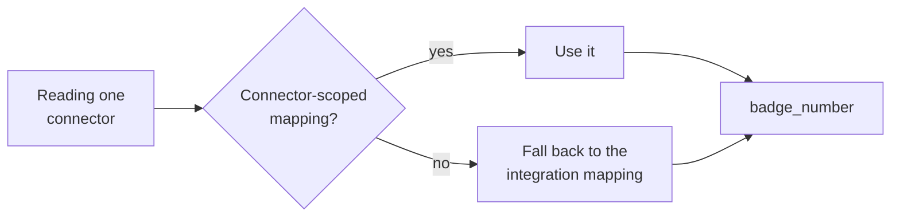

{/* CONTENT PASS: merged from explanation/how-custom-fields-work, how-to/data-model/map-a-custom-field-from-the-dashboard, how-to/data-model/map-custom-fields-with-the-api, how-to/data-model/test-a-jmespath, how-to/data-model/scope-a-mapping. The INVALID_JSON_PATH warning and the integration-vs-connector scope table each appear three times. */}


A custom field is a named slot you add to a unified model, filled from somewhere in the source system's raw payload.

It is how a value the standard model does not carry - a cost centre code, a badge number, a local employment classification - becomes a stable field on your records instead of something your code digs out of raw data.

<Warning>
Custom fields are **not returned by default.** A mapped field appears only when you pass `include_custom_fields=true`, which is the usual reason a mapping that is working looks like it failed - see [Add raw_data & Custom Fields](/how-to/reading-data/include-raw-data-and-custom-fields).
</Warning>

The mechanism has two halves, and keeping them separate explains most of its behaviour.

## Fields and mappings are separate things

A **custom field** is registered against a category and model - say `badge_number` on HRIS employees. The name **must be snake_case**.

Registering it does nothing on its own: no source, no value, no effect on responses until you attach a mapping.

A **mapping** says where that field's value comes from, for one particular scope, using a JMESPath expression evaluated against the raw payload.

This split is why one field carries several mappings. A badge number sits at one path in BambooHR, another in Workday, and somewhere else again in one customer's oddly-configured tenant.

**One field, three mappings, one stable name in your code.**

## Two scopes, and which one wins

Every mapping is scoped to exactly one of two things.

**Organisation scope** attaches to an integration. The mapping applies to every connector in your organisation using that integration - every BambooHR connector, for instance. This is the default you want: configure once, applies to all customers on that system.

**Connector scope** attaches to a single connector. It applies to that one customer only.

When both exist for the same field, **connector scope wins**. The organisation mapping is the baseline; the connector mapping is the exception for a customer whose tenant is configured differently.



To see what is in effect, read the configuration for a connector and model. It returns each field's resolved `json_path` plus `mapping_id` - the handle you edit through, `null` when unmapped.

That null distinguishes **"not configured" from "configured and returning nothing"**, which are different problems.

<Warning>
Two different fields are called `source`, and they mean unrelated things.

| Where | `source` means |
| --- | --- |
| On the **custom field** | Where it was created - `DASHBOARD` or `API` |
| On the **effective configuration** | Which mapping won - `connector` or the organisation one |

Reading the first when you wanted the second tells you who made the field, not which mapping is running.
</Warning>

## JMESPath is the contract

The mapping is an expression, not a field name. It is evaluated against the raw payload each time a record syncs, and its result becomes the field's value.

So the expression is a contract with a payload shape you do not control. If the source restructures its response, or a tenant nests things differently, **the expression stops resolving and the field goes quiet** - no error, just an empty value.

Two endpoints exist because of this. Raw data retrieval lets you see the actual payload shape before writing an expression. Preview evaluates an expression against a connector's data without saving it, so you can confirm it resolves before committing.

Writing an expression against a payload you have not looked at is the most common way to end up with a silently empty custom field.

## What deleting removes

Deleting a mapping removes that one mapping. The field survives, and any other mappings on it are untouched.

Deleting the **field** cascades - every mapping attached to it goes too, across every integration and connector. There is no partial state and no recovery of the mappings.

One further constraint: on an existing mapping, only the path is editable. Scope is fixed at creation. Moving a mapping from organisation scope to connector scope means deleting it and creating a new one.

## Why it works this way

The separation of field from mapping is what makes the unified model hold under pressure.

The obvious alternative is a per-connector schema, where the fields available depend on who you are reading.

That gives everyone exactly what they want and destroys the property that makes a unified API useful - one code path for every customer. You would be back to integration-specific branching, with extra configuration on top.

Registering the field centrally and varying only its source keeps the schema stable while the plumbing differs underneath. Your code reads `badge_number` and never learns it came from three paths.

The precedence rule follows from the same logic. Most customers on an integration are configured alike, so the integration mapping carries the load.

Per-connector mappings exist for the minority that are not, and they have to win or they would be pointless - **but keeping them the exception is what stops the configuration becoming unmanageable.**

## What this means for you

- **Look at the raw payload before writing an expression**, and preview it before saving. A wrong path fails silently.
- **Prefer organisation scope.** Reach for connector scope only when a specific customer's tenant genuinely differs.
- **Pass `include_custom_fields=true`.** Mapping the field is only half the job.
- **A null `mapping_id` means unconfigured**, not empty. Different problems, different fixes.
- **Deleting a field is destructive across every connector.** Delete the mapping if you only meant to change one integration.
- **Expressions can break when a source system changes.** A field that has gone quiet is worth checking against the current payload shape.

## Configuring from the dashboard

Custom fields extend a unified model with extra attributes, populated by a [JMESPath](https://jmespath.org/) expression pointed at the raw payload. This is the visual flow - for automation or version-controlled configuration, use the [API](/explanation/how-custom-fields-work) instead.

<Info>
  **Before you start**

  - You know the value exists upstream - see [Inspect raw data](/how-to/reading-data/include-raw-data-and-custom-fields).
  - You know the model it belongs to, and whether it should apply to one connector or every connector on an integration.
</Info>

### Steps

<Steps>
  <Step title="Create the field">
    In **Custom Fields**, click **New Field** and fill in the dialog.

    Names must be unique and snake_case. Use something descriptive - `cost_center_name`, not `custom_1`. The name becomes a key in your API responses and is awkward to change later.

    **Result:** The field exists with no mapping yet, and you're taken to the mapping screen.
  </Step>

  <Step title="Choose the scope">
    | Scope | Applies to | Use when |
    | --- | --- | --- |
    | Connector Level | One connector | Payload shape varies by customer, or you're overriding an org-level mapping |
    | Organization Level | Every connector on that integration | The field is reliably in the same place for all customers on that platform |

    Where both exist for the same field, the connector-level mapping wins for that connector.

    Prefer Organization Level where the shape is genuinely consistent - one mapping then covers every new connector on that integration without further setup. Payload shape varies with the customer's plan tier and enabled modules, so verify against more than one connector before assuming consistency.

    **Result:** You've chosen a scope and selected the connector or integration.
  </Step>

  <Step title="Point the field at a value">
    Three ways to fill the data field box:

    - Pick from the suggested mappings
    - Click `</>` to open the raw JSON response and click the value you want
    - Type the JMESPath expression directly

    Clicking the value in the raw JSON view is the most reliable - it builds the expression for you and avoids quoting mistakes on nested paths.

    **Result:** The field has an expression attached.
  </Step>

  <Step title="Find fields that only some employees have">
    A field may appear in `raw_data` for some employees and not others, so the default record may not show it.

    Use the employee search at the top of the data panel: search by name or email, select the employee, and review their raw data in the right-hand panel. Then select the field and click **Map Field**.

    **Result:** You've mapped against a record that actually contains the value.
  </Step>

  <Step title="Retrieve it">
    Add `include_custom_fields=true` to your request.

    ```bash
    curl --request GET \
      --url 'https://api.bindbee.dev/api/hris/v1/employees?include_custom_fields=true' \
      --header 'Authorization: Bearer <BINDBEE_API_KEY>' \
      --header 'X-Connector-Token: <CONNECTOR_TOKEN>'
    ```

    ```json
    {
      "id": "emp_123",
      "name": "John Doe",
      "custom_fields": {
        "cost_center_name": "Engineering-NA"
      }
    }
    ```

    **Result:** The value appears under `custom_fields`.
  </Step>
</Steps>

### If this didn't work

<AccordionGroup>
  <Accordion title="The field returns INVALID_JSON_PATH">
    The expression didn't resolve. An invalid path does not raise an error - it returns `"INVALID_JSON_PATH"` as the value, so this only surfaces at read time.

    Usually an array needing an index or filter, or a quoting error inside a filter. Preview the expression before saving to catch it - see [Test an expression](/explanation/how-custom-fields-work).
  </Accordion>

  <Accordion title="The field is empty for some employees and populated for others">
    Often correct - not every employee has every value. Confirm with employee search: look at a record where you expect the value and one where you don't.

    If it's empty for employees who should have it, the value may sit at a different path for those records, or be gated by permission. See [Permission errors](/how-to/troubleshooting/resolve-a-permission-error).
  </Accordion>

  <Accordion title="The mapping works on one connector but not another on the same integration">
    Payload shape varies by customer configuration, plan tier, and enabled modules. Add a connector-level mapping for the ones that differ; it overrides the organization-level mapping for that connector only.
  </Accordion>

  <Accordion title="The field doesn't appear in the response at all">
    Check `include_custom_fields=true` is on the request - custom fields are omitted by default. If it's present and the key is still missing, the field has no mapping that resolves on this connector.
  </Accordion>

  <Accordion title="You need the same fields in both environments">
    Configuration doesn't cross environments. Recreating it by hand is error-prone at any scale - define it through the API instead so the same definitions can be applied to both. See [Map with the API](/explanation/how-custom-fields-work).
  </Accordion>
</AccordionGroup>

## Configuring with the API

The Custom Fields API does everything the dashboard does. Use it when configuration needs to be repeatable - onboarding automation, replicating setup across environments, or driving Bindbee from your own admin tooling.

<Info>
  **Before you start**

  - You have an API key. These endpoints are organization-scoped and need only `Authorization` - no connector token, except where a request names one.
</Info>

### Steps

<Steps>
  <Step title="Discover valid slugs">
    ```bash
    GET /api/v1/lookup/models?category=HRIS
    GET /api/v1/lookup/integrations?category=HRIS
    ```

    Both are filtered to what your organization can actually use, so they're the authoritative source for `model` and `integration_slug` values.

    <Note>
      Connector tokens are not returned by any lookup endpoint. They're issued when a connector is created - read them from the connector flow or the dashboard.
    </Note>

    **Result:** Valid `category`, `model`, and `integration_slug` values.
  </Step>

  <Step title="Inspect the raw payload">
    ```bash
    GET /api/v1/custom-fields/raw-data?category=HRIS&model=employee&connector_token=<CONNECTOR_TOKEN>
    ```

    See [Inspect raw data](/how-to/reading-data/include-raw-data-and-custom-fields) for reading the response and building an expression.

    **Result:** A candidate JMESPath.
  </Step>

  <Step title="Validate before persisting">
    Dry-run the expression - see [Test an expression](/explanation/how-custom-fields-work). Skipping this is how `INVALID_JSON_PATH` reaches production responses.

    **Result:** A confirmed expression.
  </Step>

  <Step title="Create the field">
    ```bash
    POST /api/v1/custom-fields
    ```

    ```json
    {
      "name": "guardian_mobile",
      "description": "Employee's guardian mobile number",
      "category": "HRIS",
      "model": "employee"
    }
    ```

    `name` must be snake_case, 2-128 characters, and unique within the `(category, model)` pair. Fields created here are tagged `source: "API"`; dashboard-created fields are tagged `source: "DASHBOARD"`. Both behave identically once created.

    The field is a typed slot with no mapping yet - creating it populates nothing.

    **Result:** A `custom_field_id`.
  </Step>

  <Step title="Attach a mapping">
    ```bash
    POST /api/v1/custom-fields/mapping
    ```

    Organization-scoped, applying to every connector on that integration:

    ```json
    {
      "custom_field_id": "018e586b-7d0b-7bc9-be65-a8fdbc82d734",
      "integration_slug": "workday",
      "json_path": "data.employee.guardian_mobile"
    }
    ```

    Connector-scoped, overriding the org mapping for one connector:

    ```json
    {
      "custom_field_id": "018e586b-7d0b-7bc9-be65-a8fdbc82d734",
      "connector_token": "<CONNECTOR_TOKEN>",
      "json_path": "data.employee.guardian_mobile"
    }
    ```

    <Warning>
      Send exactly one of `integration_slug` or `connector_token`. Scope is immutable - `PATCH` updates only `json_path`. To change scope, delete the mapping and create a new one.
    </Warning>

    **Result:** The field resolves on matching connectors.
  </Step>

  <Step title="Verify what's actually in effect">
    ```bash
    GET /api/v1/custom-fields/configuration?connector_token=<CONNECTOR_TOKEN>&category=HRIS&model=employee
    ```

    This returns every field for that connector and model with the **winning** mapping, which is what you want after any change - it resolves precedence rather than making you reason about it.

    | `source` | Meaning |
    | --- | --- |
    | `"connector"` | A connector-scoped mapping is in effect |
    | `"organization"` | Inheriting the org-scoped mapping |
    | `null` | No mapping configured for this field on this connector |

    Unmapped fields are included with `json_path: null`, so this doubles as a checklist of what's left to configure.

    **Result:** Confirmation of what will resolve.
  </Step>
</Steps>

### Managing fields and mappings

| Action | Endpoint | Notes |
| --- | --- | --- |
| List fields | `GET /api/v1/custom-fields` | Filters: `category`, `model`, `source` |
| Get one with mappings | `GET /api/v1/custom-fields/{id}` | Field plus all its mappings |
| Delete a field | `DELETE /api/v1/custom-fields/{id}` | Cascades - removes all its mappings |
| Update a mapping | `PATCH /api/v1/custom-fields/mapping/{id}` | `json_path` only |
| Delete a mapping | `DELETE /api/v1/custom-fields/mapping/{id}` | Field itself unaffected |

### Replicating configuration across environments

Configuration doesn't cross environments, and rebuilding it by hand is where drift starts - a field mapped in Development and forgotten in Production surfaces as `null` in production responses only.

Define the configuration as data in your own repository, then apply it per environment with the same script. `GET /api/v1/custom-fields?source=API` gives you the current state to diff against.

### If this didn't work

<AccordionGroup>
  <Accordion title="Field creation is rejected">
    Names must be snake_case, 2-128 characters, and unique within the `(category, model)` pair. The same name can exist on different models.
  </Accordion>

  <Accordion title="The mapping was accepted but values don't appear">
    Check the configuration endpoint for that connector. A `source` of `null` means no mapping applies - usually the org-scoped mapping was created against a different `integration_slug` than the connector actually uses.

    Also confirm `include_custom_fields=true` is on your read request.
  </Accordion>

  <Accordion title="You need to change a mapping's scope">
    Not possible in place. Delete and recreate - only `json_path` is mutable.
  </Accordion>

  <Accordion title="A connector-scoped mapping isn't overriding the org one">
    Confirm both target the same `custom_field_id`, and check the configuration endpoint's `source`. Two fields with similar names on the same model are a common cause.
  </Accordion>

  <Accordion title="You deleted a field by mistake">
    Deletion cascades to every mapping. Recreate the field and its mappings - which is fast if the configuration lives in your repository, and manual archaeology if it doesn't.
  </Accordion>
</AccordionGroup>

## Testing an expression

An invalid JMESPath doesn't raise an error. It returns `"INVALID_JSON_PATH"` as the field's value, which means a broken mapping is only discovered by whoever consumes the response - often after it's been wrong for a while.

The preview endpoint evaluates an expression without persisting anything.

<Info>
  **Before you start**

  - You have a candidate expression - see [Inspect raw data](/how-to/reading-data/include-raw-data-and-custom-fields).
</Info>

### Steps

<Steps>
  <Step title="Send the expression">
    ```bash
    curl --request POST \
      --url 'https://api.bindbee.dev/api/v1/custom-fields/preview' \
      --header 'Authorization: Bearer <BINDBEE_API_KEY>' \
      --header 'Content-Type: application/json' \
      --data '{
        "connector_token": "<CONNECTOR_TOKEN>",
        "category": "HRIS",
        "model": "employee",
        "json_path": "data.employee.guardian_mobile"
      }'
    ```

    ```json
    {
      "json_path": "data.employee.guardian_mobile",
      "resolved_value": "+1-555-123-4567",
      "resolved_value_type": "string",
      "raw_data_source": "connector_sync"
    }
    ```

    **Result:** The value the expression resolves to.
  </Step>

  <Step title="Check what it evaluated against">
    `raw_data_source` tells you where the data came from, and it changes how much the result proves.

    | Value | Meaning |
    | --- | --- |
    | `connector_sync` | The connector's latest synced row - the strongest signal |
    | `integration_sample` | The connector hasn't synced; a canned sample was used |
    | `inline` | A payload you supplied in the request |

    An expression validated against `integration_sample` confirms the syntax but not that it matches this customer's actual data. Re-check against `connector_sync` once the connector has synced.

    **Result:** You know how much to trust the result.
  </Step>

  <Step title="Check the resolved type">
    `resolved_value_type` is one of `string`, `number`, `boolean`, `object`, `array`, or `null`.

    An `object` or `array` usually means the expression stopped short - you've selected a container rather than a value. Add an index or a filter.

    A `null` means it resolved but found nothing there.

    **Result:** A scalar of the type you expected.
  </Step>

  <Step title="Test against a record that has the value">
    A field present for some employees and absent for others resolves to `null` on the wrong sample record.

    Preview against a connector where you know the value exists. In the dashboard, employee search lets you pick a specific person's record for the same purpose - see [Map from the dashboard](/explanation/how-custom-fields-work).

    **Result:** Confirmation the expression works where the data exists.
  </Step>

  <Step title="Save it">
    Attach the validated expression as a mapping - see [Map with the API](/explanation/how-custom-fields-work).

    **Result:** A mapping you've confirmed resolves.
  </Step>
</Steps>

### Expressions worth testing carefully

| Shape | Expression | Why it needs testing |
| --- | --- | --- |
| Value in an array | `fields[?name=='Cost Center'].value \| [0]` | Quoting inside filters is easy to get wrong, and without `[0]` you get an array |
| Deeply nested | `data.employee.address.postal.code` | Any missing intermediate level yields `null`, not an error |
| Name with special characters | `"custom-field-1"` | Hyphens and spaces need quoting |
| Value that may be absent | any | Distinguishes "wrong path" from "absent for this record" |

### If this didn't work

<AccordionGroup>
  <Accordion title="resolved_value is null but you can see the value in the payload">
    Compare the path against the payload level by level. The most common cause is a missing root - expressions are evaluated against the full response, so `employee.first_name` fails where `data.employee.first_name` works.
  </Accordion>

  <Accordion title="resolved_value_type is array when you expected a string">
    A filter returns a list even when it matches one element. Append `| [0]`.
  </Accordion>

  <Accordion title="raw_data_source keeps returning integration_sample">
    The connector hasn't synced. Trigger one - see [Force a resync](/explanation/how-syncing-works) - then preview again. On a Development connector nothing syncs until you trigger it.
  </Accordion>

  <Accordion title="It previews correctly but the live field returns INVALID_JSON_PATH">
    Check the saved mapping matches what you previewed, and that it's scoped to the connector you're reading from. An org-scoped mapping created against the wrong `integration_slug` won't apply - verify with the configuration endpoint.
  </Accordion>

  <Accordion title="It works on one connector and fails on another">
    Payload shape varies with the customer's configuration and plan tier. Preview against each connector that matters and add connector-scoped overrides where they differ.
  </Accordion>
</AccordionGroup>

## Choosing the scope of a mapping

A mapping is scoped either to an integration - applying to every connector on that platform - or to a single connector. Connector-scoped mappings override organization-scoped ones for that connector.

Getting this wrong is rarely visible at save time. It surfaces as a field that resolves for some customers and not others.

<Info>
  **Before you start**

  - You have a custom field created - see [Map with the API](/explanation/how-custom-fields-work).
</Info>

### Steps

<Steps>
  <Step title="Default to organization scope">
    An organization-scoped mapping applies to every connector on that integration, including ones created later. That's the property that matters - a new customer on the same platform works with no configuration step.

    ```json
    {
      "custom_field_id": "<FIELD_ID>",
      "integration_slug": "workday",
      "json_path": "data.employee.guardian_mobile"
    }
    ```

    **Result:** The field resolves for every connector on that integration.
  </Step>

  <Step title="Verify against more than one connector">
    Payload shape varies with the customer's plan tier, enabled modules, and configuration - two connectors on the same platform genuinely differ.

    Preview the expression against several connectors before assuming an org mapping holds - see [Test an expression](/explanation/how-custom-fields-work).

    **Result:** Evidence the mapping generalises, rather than an assumption.
  </Step>

  <Step title="Add connector overrides where they differ">
    ```json
    {
      "custom_field_id": "<FIELD_ID>",
      "connector_token": "<CONNECTOR_TOKEN>",
      "json_path": "custom_attributes.guardian_mobile"
    }
    ```

    The org mapping stays in place for everyone else. This is the intended pattern: one mapping for the common case, overrides for the exceptions.

    <Warning>
      Send exactly one of `integration_slug` or `connector_token`. Scope is immutable after creation - `PATCH` changes only `json_path`. To move a mapping between scopes, delete it and create a new one.
    </Warning>

    **Result:** Correct resolution on both the common and divergent connectors.
  </Step>

  <Step title="Confirm which mapping is winning">
    ```bash
    GET /api/v1/custom-fields/configuration?connector_token=<CONNECTOR_TOKEN>&category=HRIS&model=employee
    ```

    `source` resolves the precedence for you:

    | `source` | Meaning |
    | --- | --- |
    | `"connector"` | A connector override is in effect |
    | `"organization"` | Inheriting the org mapping |
    | `null` | No mapping applies - the field won't resolve here |

    Check this after any scope change rather than reasoning about precedence from the mappings themselves.

    **Result:** Certainty about what resolves on this connector.
  </Step>
</Steps>

### Choosing scope

| Situation | Scope |
| --- | --- |
| The field is in the same place for every customer on the platform | Organization |
| You want new connectors to work without setup | Organization |
| One customer's payload differs | Connector override |
| The value comes from a customer-defined custom field upstream | Connector |
| You're testing a mapping before rolling it out | Connector, then promote |

Custom fields defined by the customer in their own HRIS are almost always connector-scoped - the field IDs are specific to their instance, so an org mapping would resolve to nothing for everyone else.

### If this didn't work

<AccordionGroup>
  <Accordion title="A connector override isn't taking effect">
    Confirm both mappings target the same `custom_field_id` - two similarly named fields on the same model is the usual cause. Then check `source` on the configuration endpoint.
  </Accordion>

  <Accordion title="The org mapping resolves for some connectors and not others">
    Working as designed, and the signal that those connectors need overrides. Preview against each to find where the value actually sits.
  </Accordion>

  <Accordion title="source is null on a connector you expected to be covered">
    The org mapping was created against a different `integration_slug` than this connector uses. Check the connector's actual slug rather than the display name.
  </Accordion>

  <Accordion title="You need to promote a connector mapping to organization scope">
    Create the org-scoped mapping first, verify `source` still reads `"connector"` for the original, then delete the connector mapping and confirm it flips to `"organization"`. Deleting first leaves a window where the field resolves to nothing.
  </Accordion>

  <Accordion title="Overrides are multiplying across connectors">
    Many overrides with the same expression suggests the org mapping targets the wrong path. Fix the org mapping to the common case and delete the redundant overrides.
  </Accordion>
</AccordionGroup>

## Related

- [Raw Data](/how-to/reading-data/include-raw-data-and-custom-fields) - finding the value to map
- [Passthrough](/explanation/passthrough) - when a custom field is not enough
- [Custom Fields API](/custom-fields/api/create-custom-field) - the endpoints
