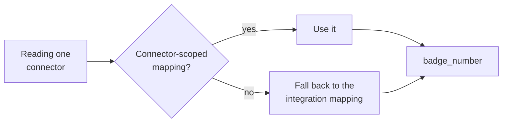

A custom field is a named slot you add to a unified model, filled from somewhere in the source system's raw payload.

It is how a value the standard model does not carry - a cost centre code, a badge number, a local employment classification - becomes a stable field on your records instead of something your code digs out of raw data.

<Warning>
Custom fields are **not returned by default.** A mapped field appears only when you pass `include_custom_fields=true`, which is the usual reason a mapping that is working looks like it failed - see [Add raw_data & Custom Fields](/how-to/reading-data/include-raw-data-and-custom-fields).
</Warning>

The mechanism has two halves, and keeping them separate explains most of its behaviour.

## Fields and mappings are separate things

A **custom field** is registered against a category and model - say `badge_number` on HRIS employees. The name **must be snake_case**.

Registering it does nothing on its own: no source, no value, no effect on responses until you attach a mapping.

A **mapping** says where that field's value comes from, for one particular scope, using a JMESPath expression evaluated against the raw payload.

This split is why one field carries several mappings. A badge number sits at one path in BambooHR, another in Workday, and somewhere else again in one customer's oddly-configured tenant.

**One field, three mappings, one stable name in your code.**

## Two scopes, and which one wins

Every mapping is scoped to exactly one of two things.

**Organisation scope** attaches to an integration. The mapping applies to every connector in your organisation using that integration - every BambooHR connector, for instance. This is the default you want: configure once, applies to all customers on that system.

**Connector scope** attaches to a single connector. It applies to that one customer only.

When both exist for the same field, **connector scope wins**. The organisation mapping is the baseline; the connector mapping is the exception for a customer whose tenant is configured differently.

To see what is in effect, read the configuration for a connector and model. It returns each field's resolved `json_path` plus `mapping_id` - the handle you edit through, `null` when unmapped.

That null distinguishes **"not configured" from "configured and returning nothing"**, which are different problems.

<Warning>
Two different fields are called `source`, and they mean unrelated things.

| Where | `source` means |
| --- | --- |
| On the **custom field** | Where it was created - `DASHBOARD` or `API` |
| On the **effective configuration** | Which mapping won - `connector` or the organisation one |

Reading the first when you wanted the second tells you who made the field, not which mapping is running.
</Warning>

## JMESPath is the contract

The mapping is an expression, not a field name. It is evaluated against the raw payload each time a record syncs, and its result becomes the field's value.

So the expression is a contract with a payload shape you do not control. If the source restructures its response, or a tenant nests things differently, **the expression stops resolving and the field goes quiet** - no error, just an empty value.

Two endpoints exist because of this. Raw data retrieval lets you see the actual payload shape before writing an expression. Preview evaluates an expression against a connector's data without saving it, so you can confirm it resolves before committing.

Writing an expression against a payload you have not looked at is the most common way to end up with a silently empty custom field.

## What deleting removes

Deleting a mapping removes that one mapping. The field survives, and any other mappings on it are untouched.

Deleting the **field** cascades - every mapping attached to it goes too, across every integration and connector. There is no partial state and no recovery of the mappings.

One further constraint: on an existing mapping, only the path is editable. Scope is fixed at creation. Moving a mapping from organisation scope to connector scope means deleting it and creating a new one.

## Why it works this way

The separation of field from mapping is what makes the unified model hold under pressure.

The obvious alternative is a per-connector schema, where the fields available depend on who you are reading.

That gives everyone exactly what they want and destroys the property that makes a unified API useful - one code path for every customer. You would be back to integration-specific branching, with extra configuration on top.

Registering the field centrally and varying only its source keeps the schema stable while the plumbing differs underneath. Your code reads `badge_number` and never learns it came from three paths.

The precedence rule follows from the same logic. Most customers on an integration are configured alike, so the integration mapping carries the load.

Per-connector mappings exist for the minority that are not, and they have to win or they would be pointless - **but keeping them the exception is what stops the configuration becoming unmanageable.**

## What this means for you

- **Look at the raw payload before writing an expression**, and preview it before saving. A wrong path fails silently.
- **Prefer organisation scope.** Reach for connector scope only when a specific customer's tenant genuinely differs.
- **Pass `include_custom_fields=true`.** Mapping the field is only half the job.
- **A null `mapping_id` means unconfigured**, not empty. Different problems, different fixes.
- **Deleting a field is destructive across every connector.** Delete the mapping if you only meant to change one integration.
- **Expressions can break when a source system changes.** A field that has gone quiet is worth checking against the current payload shape.

## Related

- [Map a custom field](/how-to/data-model/map-a-custom-field-from-the-dashboard) - create a field and attach a mapping
- [Preview](/custom-fields/api/preview) - dry-run an expression before saving
- [Unified model & raw data](/explanation/unified-model) - why the value is not in the standard model
