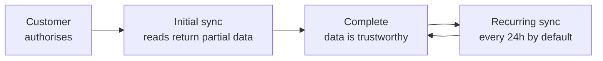

Bindbee does not proxy your requests to the source system. When you call `GET /api/hris/v1/employees`, **you are reading Bindbee's copy** of your customer's data, assembled by a background process on its own schedule.

Almost everything that surprises people about freshness, latency and timing follows from that one fact.

## The initial sync

A connector becomes usable the moment your customer authorises it, but it has no data yet. Bindbee immediately begins an initial sync: a full read of every model in your scope, paginated through the source system's API or assembled from a delivered file.

How long that takes depends on the integration and the size of the customer. A small BambooHR tenant may finish in under a minute; a large Workday tenant with several models enabled takes considerably longer.

<Warning>
Reads issued before the initial sync completes **return `200` with partial or empty results.** There is no error and nothing on the response body to distinguish them - an employee list that is still filling looks exactly like a customer with no employees.
</Warning>

The reliable signal is the webhook. Sync-status events carry a flag indicating whether the completed sync was the initial one, and that is what first-run logic should gate on - not polling until the count stops changing.

{/* VERIFY: exact field name and shape of the initial-sync flag on the webhook payload. Observed as `initial_sync` in a customer thread but not documented. */}

## The recurring schedule

Once the initial sync completes, the connector moves to a recurring schedule - **every 24 hours by default**, and adjustable.

{/* VERIFY: is sync frequency self-serve in the dashboard, or does it require a support request? Open item from the How-to spec. */}

Subsequent syncs are incremental where the source system supports it: Bindbee asks for records changed since the last run rather than re-reading everything. Where there is no reliable change marker upstream, the sync re-reads and reconciles against what it already holds.

You can also trigger a resync on demand. That is the right instrument after a customer fixes a permission problem or corrects data upstream and wants to see it now, rather than telling them to wait until tomorrow.

## Two different timestamps

Every record carries a `modified_at`, and it is tempting to read it as when the record changed in the HRIS. It is not.

| | `modified_at` | The source system's own timestamp |
| --- | --- | --- |
| Set by | Bindbee, when it persisted the record | The HRIS |
| Answers | "What has Bindbee touched since X?" | "What did the customer edit since X?" |
| Where | A top-level field | Inside `raw_data`, under whatever name that system uses |
| Filter with | `modified_after` | Not filterable |

The spec is explicit about this - `modified_at` is *"the datetime that this object was last updated by Bindbee"*, and `modified_after` returns *"objects synced by Bindbee after this date time"*.

So `modified_at` moves for reasons unrelated to the source system. A resync that reconciles a field advances it even though nothing changed upstream.

**That makes it the right filter for keeping a local copy in step, and the wrong one for "what did the customer change".** For that you need the source timestamp out of `raw_data`, whose availability and name vary by integration.

## Why it works this way

Storing a copy rather than proxying is the decision everything else hangs off, and **the trade is freshness for reliability.**

A proxying design would always return current data - and would inherit every property of the underlying system: its rate limits, latency, outages and pagination semantics.

Your read of an employee list would fail whenever the customer's HRIS was slow, and a page of a hundred employees would cost a hundred upstream calls.

Rate limits alone make that impractical - most HR systems allow far fewer requests per hour than a busy application makes.

Holding a synced copy makes your reads fast, consistent and unaffected by the source being down. The price is a staleness window, and a sync process whose state you occasionally need to reason about.

**The 24-hour default is a ceiling imposed by what source systems tolerate**, not a target Bindbee chose.

## What this means for you

- **Gate first-run logic on the sync-status webhook**, not on data appearing. An empty list during the initial sync is indistinguishable from an empty tenant.
- **Treat `modified_at` as "when Bindbee saw it"**, and reach into `raw_data` when you need "when the customer changed it".
- **Trigger a resync after a customer fixes something upstream** rather than waiting for the schedule.
- **Design for a staleness window.** Data can be up to a full sync interval behind, and no configuration removes that entirely.

## Related

- [Force a resync](/how-to/sync-control/force-a-resync) - trigger a sync outside the schedule
- [Webhooks vs polling](/explanation/webhooks-vs-polling) - which signal to build on
