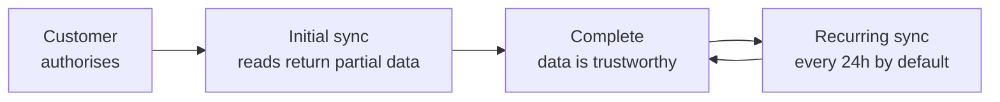

{/* CONTENT PASS: merged from explanation/how-syncing-works, how-to/sync-control/change-sync-frequency, how-to/sync-control/force-a-resync, how-to/sync-control/sync-a-development-connector, how-to/sync-control/trigger-a-job-on-sync-complete. Five sources: the 24-hour default and the "gate on the completion event" advice each appear three times. */}


Bindbee does not proxy your requests to the source system. When you call `GET /api/hris/v1/employees`, **you are reading Bindbee's copy** of your customer's data, assembled by a background process on its own schedule.

Almost everything that surprises people about freshness, latency and timing follows from that one fact.

## The initial sync



A connector becomes usable the moment your customer authorises it, but it has no data yet. Bindbee immediately begins an initial sync: a full read of every model in your scope, paginated through the source system's API or assembled from a delivered file.

How long that takes depends on the integration and the size of the customer. A small BambooHR tenant may finish in under a minute; a large Workday tenant with several models enabled takes considerably longer.

<Warning>
Reads issued before the initial sync completes **return `200` with partial or empty results.** There is no error and nothing on the response body to distinguish them - an employee list that is still filling looks exactly like a customer with no employees.
</Warning>

The reliable signal is the webhook. Sync-status events carry a flag indicating whether the completed sync was the initial one, and that is what first-run logic should gate on - not polling until the count stops changing.

{/* VERIFY: exact field name and shape of the initial-sync flag on the webhook payload. Observed as `initial_sync` in a customer thread but not documented. */}

## The recurring schedule

Once the initial sync completes, the connector moves to a recurring schedule - **every 24 hours by default**, and adjustable.

{/* VERIFY: is sync frequency self-serve in the dashboard, or does it require a support request? Open item from the How-to spec. */}

Subsequent syncs are incremental where the source system supports it: Bindbee asks for records changed since the last run rather than re-reading everything. Where there is no reliable change marker upstream, the sync re-reads and reconciles against what it already holds.

You can also trigger a resync on demand. That is the right instrument after a customer fixes a permission problem or corrects data upstream and wants to see it now, rather than telling them to wait until tomorrow.

## Two different timestamps

Every record carries a `modified_at`, and it is tempting to read it as when the record changed in the HRIS. It is not.

| | `modified_at` | The source system's own timestamp |
| --- | --- | --- |
| Set by | Bindbee, when it persisted the record | The HRIS |
| Answers | "What has Bindbee touched since X?" | "What did the customer edit since X?" |
| Where | A top-level field | Inside `raw_data`, under whatever name that system uses |
| Filter with | `modified_after` | Not filterable |

The spec is explicit about this - `modified_at` is *"the datetime that this object was last updated by Bindbee"*, and `modified_after` returns *"objects synced by Bindbee after this date time"*.

So `modified_at` moves for reasons unrelated to the source system. A resync that reconciles a field advances it even though nothing changed upstream.

**That makes it the right filter for keeping a local copy in step, and the wrong one for "what did the customer change".** For that you need the source timestamp out of `raw_data`, whose availability and name vary by integration.

## Why it works this way

Storing a copy rather than proxying is the decision everything else hangs off, and **the trade is freshness for reliability.**

A proxying design would always return current data - and would inherit every property of the underlying system: its rate limits, latency, outages and pagination semantics.

Your read of an employee list would fail whenever the customer's HRIS was slow, and a page of a hundred employees would cost a hundred upstream calls.

Rate limits alone make that impractical - most HR systems allow far fewer requests per hour than a busy application makes.

Holding a synced copy makes your reads fast, consistent and unaffected by the source being down. The price is a staleness window, and a sync process whose state you occasionally need to reason about.

**The 24-hour default is a ceiling imposed by what source systems tolerate**, not a target Bindbee chose.

## What this means for you

- **Gate first-run logic on the sync-status webhook**, not on data appearing. An empty list during the initial sync is indistinguishable from an empty tenant.
- **Treat `modified_at` as "when Bindbee saw it"**, and reach into `raw_data` when you need "when the customer changed it".
- **Trigger a resync after a customer fixes something upstream** rather than waiting for the schedule.
- **Design for a staleness window.** Data can be up to a full sync interval behind, and no configuration removes that entirely.

## Sync schedules

Production connectors sync every 24 hours by default. Two things are adjustable: **cadence** - how often a connector pulls - and **start time** - when in the day it runs. If your own processing runs on a schedule, both need to line up, because data that lands after your job runs is a day late.

<Warning>
  Both are currently support requests, not dashboard controls.

  {/* VERIFY: confirm whether self-serve cadence and start-time controls have shipped. If so, these become dashboard tasks and the request steps are cut. */}
</Warning>

<Info>
  **Before you start**

  - The connector is in Production. Development connectors have no schedule at all - see [Development connectors](/explanation/how-syncing-works).
  - For a start-time change, you know your own processing window.
</Info>

### Steps

<Steps>
  <Step title="Work out the cadence you need">
    | Cadence | Fits |
    | --- | --- |
    | 6 hours | Same-day propagation - eligibility, enrolment, onboarding |
    | 24 hours (default) | Most workflows |
    | Weekly | Reference data that changes rarely, or slow source systems |

    Six hours is the shortest available. Faster is not always better: each sync pulls the full in-scope dataset from the source system, and some platforms are slow or rate-limit aggressively enough that shorter cadences cause failures rather than fresher data.

    **Result:** A target cadence.
  </Step>

  <Step title="Work backwards from your processing window">
    Pick a start time that leaves room for the sync to finish before your job runs.

    Duration scales with population size and with how many upstream calls each record costs, so a large customer can take substantially longer than a small one on the same integration. Leave more margin than the current duration suggests - populations grow, and the margin is what absorbs it.

    **Result:** A target start time with headroom.
  </Step>

  <Step title="Check the current pattern">
    Open the connector's sync history and note the start times of several consecutive runs - see [Sync status](/how-to/troubleshooting/monitor-sync-status).

    **Result:** The current rhythm, and evidence if it's inconsistent.
  </Step>

  <Step title="Request the change">
    Send support the connector IDs, the cadence, and - if you're setting one - the desired start time with its timezone.

    Both are per connector, so different customers can run on different schedules. Include the specific connector IDs rather than asking for an account-wide change.

    **Result:** Support confirms once applied.
  </Step>

  <Step title="Verify across several runs">
    Check start times over a few days, not one. A single run landing on time doesn't confirm a stable schedule.

    **Result:** Runs are landing at the expected interval and hour.
  </Step>
</Steps>

### The schedule isn't the only lever

Aligning a sync to a fixed clock is inherently fragile. Sync duration changes as populations grow, source systems slow down under their own load, and a run that finishes comfortably today can overrun in six months. Tightening the schedule doesn't remove the race - it narrows it.

**React to changes instead of polling.** Gating your job on the sync-completed event removes the race entirely, and works regardless of when the sync starts or how long it takes - see [Trigger a job on completion](/explanation/how-syncing-works).

**Resync on demand.** When you need current data for one customer at a specific moment, [force a resync](/explanation/how-syncing-works) rather than raising the cadence for everyone.

Even if you keep a fixed schedule, recording the last completion timestamp per connector lets your job skip customers whose data hasn't refreshed - which is the failure that actually costs something.

### If this didn't work

<AccordionGroup>
  <Accordion title="Syncs are landing later each day">
    Historically, run start times could drift because each run was scheduled relative to the previous one's completion. That was fixed in August 2026 - start times are now stable, and a forced resync is the way to change them deliberately.

    If you're still seeing drift, report it with the connector ID and the start times of several consecutive runs - the pattern is what makes it diagnosable.
  </Accordion>

  <Accordion title="The sync starts on time but finishes after your job">
    A duration problem, not a start-time problem. Moving the start earlier buys margin now but not permanently. Gate on the completion event instead.
  </Accordion>

  <Accordion title="Your processing runs on a cron and the sync time no longer aligns">
    A cron job assumes the sync finished before your job starts, which stops being true as populations grow and sync duration changes.

    Even if you keep the cron schedule, gate the job on the sync-completed event so it skips or defers when data isn't ready. This is the single most common cause of processing incomplete data.
  </Accordion>

  <Accordion title="A shorter cadence made syncs start failing">
    Some source systems can't sustain a full extract every six hours, and failures increase rather than freshness. Move back to 24 hours and use forced resyncs for the cases that genuinely need same-day data.
  </Accordion>

  <Accordion title="You need data at a specific moment, not on a schedule">
    [Force a resync](/explanation/how-syncing-works) for one-off freshness rather than reshaping the schedule around an occasional need.
  </Accordion>
</AccordionGroup>

## Forcing a resync

A forced resync starts a sync now. Use it after a relink, after a permission change, after a transient failure, or whenever you need data before the next scheduled run.

<Info>
  **Before you start**

  - You have the connector's `connector_token`.
  - The connector isn't already syncing - check its sync history first.
</Info>

### Steps

<Steps>
  <Step title="Trigger the sync">
    `POST` to the resync endpoint with the connector token in the header. The connector is identified by the token, so there's no request body.

    <CodeGroup>
      ```bash cURL
      curl --request POST \
        --url 'https://api.bindbee.dev/api/embedded/v1/connectors/resync' \
        --header 'Authorization: Bearer <BINDBEE_API_KEY>' \
        --header 'X-Connector-Token: <CONNECTOR_TOKEN>'
      ```

      ```python Python
      import requests

      resp = requests.post(
          "https://api.bindbee.dev/api/embedded/v1/connectors/resync",
          headers={
              "Authorization": f"Bearer {BINDBEE_API_KEY}",
              "X-Connector-Token": CONNECTOR_TOKEN,
          },
          timeout=30,
      )
      resp.raise_for_status()
      ```
    </CodeGroup>

    **Result:** A `200` and a new run in the connector's sync history.

    <Tip>
      From the dashboard, the equivalent control is on the connector's page. The API is the better route when you're resyncing several connectors or reacting to an event automatically.
    </Tip>
  </Step>

  <Step title="Wait for it to finish before reading">
    A resync is asynchronous - the `200` means the run started, not that data is ready. Reads during a sync return a partially updated dataset.

    Gate downstream work on the sync-completed event rather than a fixed delay. See [Trigger a job on completion](/explanation/how-syncing-works).

    **Result:** Your pipeline reads a complete dataset.
  </Step>

  <Step title="Check the outcome">
    Confirm the run completed rather than failing or partially completing - see [Sync status](/how-to/troubleshooting/monitor-sync-status).

    **Result:** You know whether the resync fixed the problem.
  </Step>
</Steps>

### When to use this

| Situation | Resync? |
| --- | --- |
| After the end user relinks | Yes - don't wait for the schedule |
| After a permission is granted upstream | Yes - permission changes aren't retroactive |
| A transient or size-related sync failure | Yes, once |
| The same models fail every run | No - diagnose first, see [Partial syncs](/how-to/troubleshooting/diagnose-a-partial-sync) |
| A Development connector needs fresh data | Yes - this is the normal mechanism |
| You want data more often generally | No - change the cadence instead, see [Sync schedules](/explanation/how-syncing-works) |

### If this didn't work

<AccordionGroup>
  <Accordion title="401 or 403">
    `401` means the API key is missing or from the wrong environment. `403` means the token doesn't permit this operation. See [Authentication](/api-reference/basics/authentication).
  </Accordion>

  <Accordion title="The sync doesn't appear to start">
    Check whether one is already running - a connector syncs one run at a time. Large populations can take substantially longer than expected, so a run may still be in progress from earlier.
  </Accordion>

  <Accordion title="You're resyncing repeatedly to work around a failure">
    Repeated resyncing on a connector that fails the same way each time won't clear it and adds upstream load. Read the per-model breakdown instead - the failure is usually a permission gap or an extract-size limit, and neither is fixed by retrying.
  </Accordion>

  <Accordion title="You want to reset a connector rather than resync it">
    Resync is the reset. Deleting and recreating a connector discards its sync history and record identities, changing the IDs your system has already stored - see [Rename or delete](/platform/overview).
  </Accordion>
</AccordionGroup>

## Development connectors

Development connectors do not sync on a schedule. Their data is whatever the last triggered sync produced, so it stays frozen until you act.

This is the single most common source of "the data looks stale" during development.

<Info>
  **Before you start**

  - You have the connector's `connector_token`.
</Info>

### Steps

<Steps>
  <Step title="Trigger the sync">
    ```bash
    curl --request POST \
      --url 'https://api.bindbee.dev/api/embedded/v1/connectors/resync' \
      --header 'Authorization: Bearer <BINDBEE_DEV_API_KEY>' \
      --header 'X-Connector-Token: <CONNECTOR_TOKEN>'
    ```

    Use the Development API key. A Production key returns `401` against a Development connector.

    The dashboard control on the connector's page does the same thing.

    **Result:** A run appears in the connector's sync history.
  </Step>

  <Step title="Wait for it to finish">
    The response means the run started, not that data is ready. Check the sync history, or subscribe to sync events on a **Development** webhook - a Production webhook receives nothing for these connectors.

    **Result:** A completed run.
  </Step>

  <Step title="Read the refreshed data">
    Call with the Development key and the connector token.

    **Result:** Data as of the sync you just triggered.
  </Step>
</Steps>

### Making this less painful during development

**Sync after changing anything upstream.** Edit a record in the sandbox HRIS, then resync before checking. Without that step you're reading the previous state and will conclude the change didn't propagate.

**Sync after scope or mapping changes.** Neither applies retroactively. A new custom field returns nothing until a sync populates it - see [Map from the dashboard](/explanation/how-custom-fields-work).

**Script it.** A resync call at the start of an integration test suite removes a whole category of confusing failures.

**Don't emulate production cadence.** Repeatedly resyncing to simulate a schedule loads the source system's sandbox, which is usually rate-limited more aggressively than production.

### If this didn't work

<AccordionGroup>
  <Accordion title="401 on the resync call">
    Wrong environment key. Development connectors need the Development key - see [Authentication](/api-reference/basics/authentication).
  </Accordion>

  <Accordion title="The sync completes but data is unchanged">
    Confirm the change was saved in the source system, and that the field is in scope for this connector - see [Restrict what syncs](/explanation/scope-and-permissions).

    Some sandbox environments also lag their own UI, so a change can be visible in their interface before their API returns it.
  </Accordion>

  <Accordion title="No webhook fired for the sync">
    Check the webhook's type is Development. This is the most common webhook mistake during development - a Production webhook is silent for every Development connector.
  </Accordion>

  <Accordion title="You want a Development connector to sync automatically">
    Not available. Automatic syncing is a Production behaviour. If a connection needs unattended syncing it belongs in Production - see [Move between environments](/platform/overview).
  </Accordion>

  <Accordion title="Your test data is drifting from what production customers have">
    Sandbox tenants rarely mirror real configuration - missing modules, empty manager hierarchies, no dependents. Validate mappings against at least one real connector before relying on them.
  </Accordion>
</AccordionGroup>

## Triggering a job on completion

A scheduled job that reads on a clock either runs before the sync finishes - processing a half-loaded dataset - or waits longer than it needs to. Gating on the sync-completed event removes the guess.

<Info>
  **Before you start**

  - You have a webhook receiving deliveries - see [Create a Webhook](/webhooks/overview).
</Info>

### Steps

<Steps>
  <Step title="Subscribe to Sync completed">
    Select **Sync completed** on your webhook. Add **Sync error** too - you want to know when a run fails as well as when it succeeds. See [Choose Webhook Events](/webhooks/overview).

    **Result:** `connector_synced` arrives when a run finishes.
  </Step>

  <Step title="Acknowledge, then queue">
    Return `200` immediately and enqueue the work. Never process inline.

    Each delivery times out at 10 seconds, and a slow handler starts failing under exactly the load where a full sync just landed.

    ```python Flask
    @app.post("/bindbee/webhook")
    def bindbee_webhook():
        payload = request.get_json()

        if payload["webhook"]["event"] != "connector_synced":
            return "", 200

        # the sync_id makes the job idempotent - see the last step
        queue.enqueue(
            process_sync,
            connector_id=payload["connector"]["id"],
            sync_id=payload["sync"]["sync_id"],
        )
        return "", 200          # acknowledge before doing any work
    ```

    **Result:** Fast acknowledgement, work handed to a queue.
  </Step>

  <Step title="Resolve the connector to your customer">
    Read `connector.origin_id` from the payload - that's the identifier you set when generating the Magic Link.

    Use `sync.sync_type` to distinguish a scheduled run (`AUTOMATED`) from one you or support triggered (`MANUAL`), if your handling differs. `sync.sync_id` correlates this event with the earlier start event for the same run.

    **Result:** You know whose data is ready and how the run was initiated.
  </Step>

  <Step title="Read incrementally in the job">
    Combine the event with a stored watermark so you process only what changed - see [Filter with modified_after](/how-to/reading-data/filter-and-narrow-a-collection).

    The event tells you data has landed; the filter tells you what's new. Neither alone is sufficient.

    **Result:** A job that runs at the right time on the right subset.
  </Step>

  <Step title="Make the job idempotent">
    The same sync can be reprocessed - a retried delivery, a resync, a replay after an outage. A forced resync in particular makes every record match your incremental filter.

    Assume a job may run twice on overlapping data and design for it.

    **Result:** Reprocessing is safe.
  </Step>
</Steps>

### Keeping a cron and still fixing the problem

You don't have to move your processing onto events to get the main benefit.

Record the last `connector_synced` timestamp per connector when the event arrives. Have your existing cron job check that timestamp and skip or defer any customer whose data hasn't refreshed since the last run.

That's a small change that stops the most common failure: processing a customer whose sync stalled days ago and treating the stale result as current.

### If this didn't work

<AccordionGroup>
  <Accordion title="Events arrive but data still looks incomplete">
    Check whether the run was partial rather than clean - a partial sync loads some models and fails others, and reads against the succeeded ones look fine while relationships between them are incomplete. See [Partial syncs](/how-to/troubleshooting/diagnose-a-partial-sync).
  </Accordion>

  <Accordion title="Data-change events arrive before the sync completes">
    Expected - a sync writes as it goes, so change events can fire mid-run. Use those to know *which* records changed and the completion event to know *when* it's safe to act.
  </Accordion>

  <Accordion title="Your job never runs for some customers">
    Their sync isn't completing. A connector that has stopped syncing produces no completion event and your job silently skips them forever - which is why Sync error and Sync start matter alongside this. See [Connections needing relink](/how-to/reliability/detect-a-connection-that-needs-relinking).
  </Accordion>

  <Accordion title="Jobs pile up when many syncs finish together">
    Connectors on the same cadence complete in clusters. Queue the work rather than processing on the webhook thread, and remember rate limits are per connector token - parallelising across customers is fine, hammering one is not.
  </Accordion>
</AccordionGroup>

## Related

- [Sync Frequency](/api-reference/basics/sync-frequency) - the published cadences and limits
- [File & SFTP connectors](/explanation/sftp-and-file-connectors) - file connectors set their own cadence
- [Webhook](/webhooks/overview) - the push signal a sync emits
