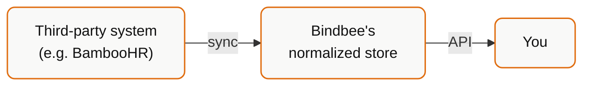

## Bindbee is not a proxy

The single most useful mental model:



When you call `GET /api/hris/v1/employees`, Bindbee does **not** call BambooHR. It reads from a normalized copy that a background sync job produced earlier.

This is a deliberate trade-off:

| You get | You give up |
| --- | --- |
| Consistent response shape across every connector | Real-time freshness |
| Predictable latency, independent of vendor performance | "The API always reflects the HRIS right now" |
| Your rate limits, not the vendor's | |
| Resilience when the vendor has an outage | |
| One pagination and filtering model | |

Almost every "why is Bindbee behaving strangely?" question resolves to a consequence of this one design decision.

## The lifecycle of a sync

<Steps>
  <Step title="Trigger">
    A sync starts on a schedule (Production), when the connector is first
    linked, or because something explicitly requested one — a
    `POST /api/embedded/v1/connectors/resync`, or a manual sync in the dashboard.
    The `sync_type` field on webhook payloads reports which: `AUTOMATED` or
    `MANUAL`.
  </Step>
  <Step title="Extract">
    Bindbee authenticates to the third-party system using the stored credentials
    and pulls the raw payloads for every model that connector supports. This is
    where vendor rate limits and outages bite, and it dominates sync duration.
  </Step>
  <Step title="Normalize">
    Raw payloads are mapped into unified models. Vendor-specific values are
    coerced into Bindbee's enums where they match, and preserved verbatim where
    they don't. Fields the vendor didn't return become `null`.
  </Step>
  <Step title="Persist">
    Records are written to the normalized store. Each record's `modified_at` is
    set to the time **Bindbee** wrote it.
  </Step>
  <Step title="Notify">
    Webhooks fire — `connector_synced` on success, `connector_sync_error` on
    failure, plus data-change events listing the affected record IDs.
  </Step>
</Steps>

## The first sync is different

The first sync after a customer links backfills their entire history. Later syncs have less to do.

Practical consequences:

- **An empty `items` array right after linking is normal**, not a bug. The sync has not finished.
- **The first sync takes materially longer.** Duration scales with headcount and history, and with how slow and how rate-limited the vendor's API is. For a large enterprise HRIS this can be a long wait.
- **Don't gate your onboarding UI on data being present.** Gate it on `sync_status`.

```json
{
  "status": "COMPLETE",
  "sync_status": "Syncing",
  "sync_progress": 62,
  "total_employees": null,
  "active_employees": null,
  "avg_sync_duration": null
}
```

`sync_progress` reports percentage while a sync runs, and is `null` when nothing is active. `total_employees`, `active_employees` and `avg_sync_duration` populate after the first successful sync — `avg_sync_duration` is the honest answer to "how long will this take next time?" for that specific connector.

## Two different status fields

They answer different questions and you need both:

| Field | Question | Values |
| --- | --- | --- |
| `status` | Are the credentials still good? | `COMPLETE`, `INCOMPLETE`, `RELINK_NEEDED` |
| `sync_status` | Is the data ready? | `Syncing`, `Done`, `Failed` |

A connector can be `status: COMPLETE` and `sync_status: Failed` — credentials fine, this particular sync broke. It can also be `status: RELINK_NEEDED` while old data remains readable — the last successful sync's results are still there; they are just going stale.

<Warning>
  Never infer connection health from whether a data endpoint returned rows. Read
  the connector's `status` and `sync_status`. See
  [Connector States & Lifecycle](/explanation/connector-lifecycle).
</Warning>

## Environment differences

| | Development | Production |
| --- | --- | --- |
| Automatic syncs | **No** | Yes — every 24 hours by default |
| Trigger | Manual or `resync` API | Scheduled, plus on link |
| Connector limit | Unlimited | Per plan |

The Development difference catches nearly everyone: you link a test connector, call `/employees`, get an empty array, and conclude something is broken. Nothing is broken — nothing has synced. Trigger one.

## What a sync writes

A sync rewrites the records it processed, whether or not their business values changed. That has one consequence worth stating plainly:

<Warning>
  `modified_at` moving does **not** guarantee that any field you care about
  changed. It records when Bindbee last wrote the record.
</Warning>

This is why `modified_after` is an *inclusive* filter — safe for correctness (you will not miss changes) but not a promise of minimality (you may receive records that look identical). Your ingest path must be an idempotent upsert.

See [Field semantics](/explanation/field-semantics) and [Filtering with `modified_after`](/how-to/filter-with-modified-after).

## When syncs fail

A failed sync fires `connector_sync_error` with a top-level `error` object:

```json
{
  "failed_at": "2026-07-07T11:21:35.837448+00:00",
  "message": "A runtime error occurred during the sync process. Bindbee team has been notified.",
  "detail": {}
}
```

`detail` is `{}` when there is nothing further to report.

A failed sync does **not** delete data. The last successful sync's results remain readable — they just stop advancing. This is usually what you want: degraded freshness beats an empty directory. But it means a customer can be looking at week-old data with no visible error unless you surface `sync_status` yourself.

## Design consequences

Things worth building deliberately:

1. **Show data age, not just data.** "Last synced 3 hours ago" prevents an entire class of support ticket.
2. **Upsert on `id`, never insert.** You will see the same record repeatedly.
3. **Keep a watermark, not a full re-import.** Store your last successful run time and pass it as `modified_after`.
4. **Handle "synced but empty" as a distinct state** from "not synced yet". A customer with genuinely zero employees and a customer mid-first-sync look identical if you only look at `items`.
5. **Don't resync on a timer.** It does not make data fresher than the vendor allows, and it burns rate limit. See [Force a resync](/how-to/force-a-resync).

## Related

<CardGroup cols={2}>
  <Card title="Data Freshness & Polling" icon="clock" href="/explanation/data-freshness">
    How current is the data, really?
  </Card>
  <Card title="Connector States & Lifecycle" icon="network" href="/explanation/connector-lifecycle">
    What each status means and how to recover.
  </Card>
</CardGroup>
