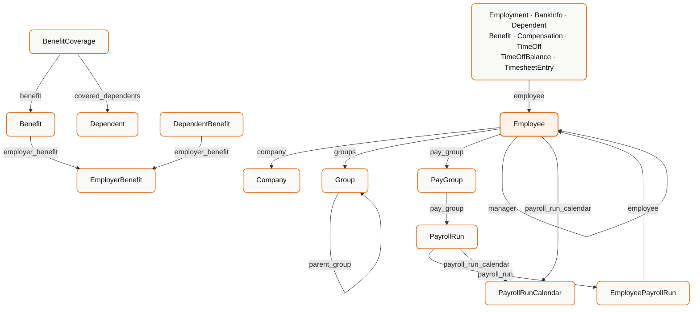
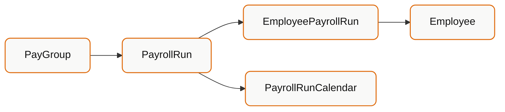
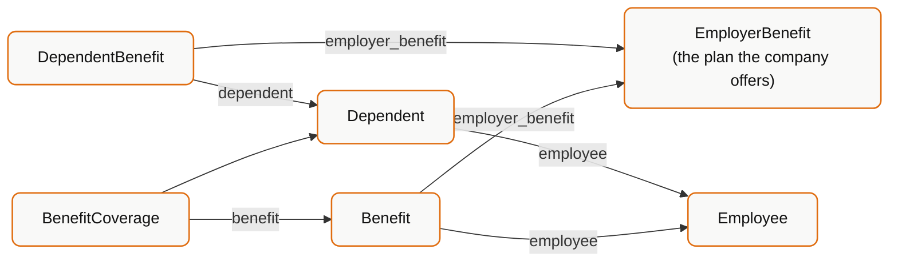

The API reference tells you what fields each model has. It does not tell you how they fit together. This page does.

## The map



## Employee is the hub

Almost everything hangs off `Employee`. These models carry an `employee` field pointing at it:

`Employment` · `Compensation` · `BankInfo` · `Benefit` · `Dependent` · `TimeOff` · `TimeOffBalance` · `TimesheetEntry` · `EmployeePayrollRun`

`Employee` in turn points **outward** at:

| Field | Points to | Notes |
| --- | --- | --- |
| `company` | `Company` | Which legal entity |
| `manager` | `Employee` | Self-referential; `null` at the top of the tree |
| `groups` | `Group[]` | Array of IDs |
| `pay_group` | `PayGroup` | |
| `payroll_run_calendar` | `PayrollRunCalendar` | Their pay schedule |

<Warning>
  `manager` is a self-reference and hierarchies from real HRIS systems are not
  always clean trees. Guard against cycles and orphans when you walk it -
  contractors, dotted-line reports and mid-transition records all produce
  surprises.
</Warning>

## Employee vs Employment vs Compensation

The most common modelling mistake is collapsing these three.

| Model | Answers | Cardinality |
| --- | --- | --- |
| `Employee` | Who is this person? | One per person |
| `Employment` | What position do they hold? | One or more per employee |
| `Compensation` | What are they paid for it? | One or more per employee |

`Employee` carries identity and current-state convenience fields (`designation`, `department`, `division`, `employment_status`).

`Employment` carries the **position**: `job_title`, `department`, `division`, `employment_type`, `effective_date`. A promotion creates a new `Employment` row - it does not overwrite the old one.

`Compensation` carries the **rate**: `pay_rate`, `pay_period`, `pay_frequency`, `pay_currency`, `flsa_status`, `start_date`.

<Tip>
  For "what is this person's job title *now*", `Employee.designation` is the
  convenient answer. For "what was their title in March", you need
  `Employment` sorted by `effective_date`. Both are correct; they answer
  different questions.
</Tip>

Not every connector returns history. Some expose only the current position, in which case you get one `Employment` row. Do not assume a full history exists.

## Group is recursive

`Group` has a `parent_group` field, so groups nest. `type` distinguishes what kind of grouping it is, and `is_commonly_used_as_team` flags groups the source system treats as teams.

<Warning>
  "Group" means different things in different systems - departments, cost
  centres, locations, teams, custom segments. Read `type` before assuming
  semantics, and expect the meaning to vary by connector.
</Warning>

`Employee.groups` is an array - an employee can be in several.

## The payroll chain



| Model | One row per |
| --- | --- |
| `PayGroup` | A population paid on the same cycle |
| `PayrollRunCalendar` | A pay schedule |
| `PayrollRun` | One company-wide payroll execution |
| `EmployeePayrollRun` | One employee within one run |

`EmployeePayrollRun` holds `gross_pay`, `net_pay`, and the line-item arrays `earnings`, `deductions` and `taxes`.

<Warning>
  `gross_pay − net_pay` will not equal the sum of `deductions`. Taxes are a
  separate array. Sum `deductions` **and** `taxes` when reconciling.
</Warning>

Use `check_date` - not `end_date` - for anything cash-flow related. `run_type` separates `REGULAR` runs from off-cycle bonus and correction runs; mixing them inflates any "typical pay" calculation.

## The benefits cluster

This one deserves its own page - see [Benefits vs Employer Benefits vs Dependent Benefits](/explanation/benefits-models).

The short version:



Note that `DependentBenefit` links to the **plan**, not to the employee's `Benefit` row.

## Time & attendance

| Model | Answers |
| --- | --- |
| `TimeOff` | Requests and absences - dates, type, status |
| `TimeOffBalance` | Accrued and remaining entitlement |
| `TimesheetEntry` | Hours worked |

All three point at `Employee`. `TimeOff` and `TimesheetEntry` are writable via the Meta API workflow.

## Universal fields

Every unified model carries the same envelope:

| Field | Meaning |
| --- | --- |
| `id` | Bindbee's stable UUID |
| `remote_id` | The source system's own ID |
| `modified_at` | When **Bindbee** last wrote this record |
| `raw_data` | Original upstream payload, with `include_raw_data=true` |
| `custom_fields` | Your mapped fields, with `include_custom_fields=true` |

Use `id` as your foreign key. `remote_id` is for reconciling against the customer's own system or supporting them in the vendor UI.

## Expanding relations

Relations are IDs by default. Fetching each separately is an N+1. Use `expand`:

```
?expand=manager,company,pay_group
?expand=manager[first_name,last_name,work_email]
```

Comma-separated, no spaces. Square brackets restrict which fields come back on the expanded object.

## What you cannot assume

<Warning>
  These vary by connector, and assuming them is a reliable way to ship a bug:

  - **That every relation is populated.** Any relation field can be `null` if the
    source system doesn't expose it.
  - **That history exists.** Some connectors return only current state.
  - **That `Group` means the same thing everywhere.**
  - **That every model is supported.** Model availability is per connector -
    see [Integrations & Coverage](/integrations).
  - **That IDs referenced actually resolve.** A `manager` ID can point at an
    employee filtered out of your query, or not synced.
</Warning>

## Related

<CardGroup cols={2}>
  <Card title="Benefits Models" icon="list-tree" href="/explanation/benefits-models">
    The benefits cluster in full.
  </Card>
  <Card title="Field Semantics" icon="circle-help" href="/explanation/field-semantics">
    Nulls, enums, and what modified_at really means.
  </Card>
</CardGroup>
