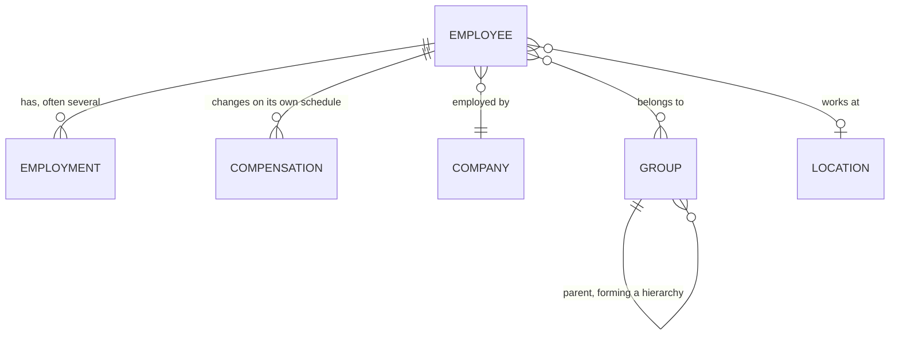

The field you are looking for is probably not on the employee. Job title, department, salary, cost centre, office - all of these feel like employee attributes and **none of them are stored that way.**

The reason is that they change independently of the person, and often more than once.

## Where each field lives

| Looking for | It is on | Because |
| --- | --- | --- |
| Job title, department, division | **Employment** | Changes independently, and there can be several |
| Salary, pay frequency, FLSA status | **Compensation** | Changes on its own schedule |
| Cost centre, team, business unit | **Group**, filtered by `type` | One typed model, not one per concept |
| Office, address | **Location** | A workplace is not an organisational unit |
| Legal name, EINs | **Company** | A legal fact, not an organisational one |
| Employment status, termination date | **Employee** | Whether they still work there is person-level |

## The person and their employments

**Employee** holds what is true of the human: name, contact details, date of birth, identifiers.

**Employment** holds what is true of a period of work: job title, employment type, effective date, department and division.

A person can have several, and that is normal - promotions recorded as new positions, transfers between departments or entities, moves between full-time and part-time, rehires.

<Warning>
Do not read the first employment in the array and treat it as current. Ordering means nothing. Employment carries `effective_date` and **no end date of its own**, so the current one is the one with the latest `effective_date`.

Whether the person still works there is a separate, employee-level question: `employment_status`, `termination_date` and `termination_reason` all sit on the employee.
</Warning>

**Compensation** follows the same logic in its own model, because pay changes on its own schedule - a raise without a title change produces a new compensation record and no new employment.

It carries `start_date` and, like employment, no end date.

## Groups absorb several concepts

**Group** is where departments, teams, divisions, business units and cost centres all live. Its `type` field is one of `DEPARTMENT`, `TEAM`, `DIVISION`, `BUSINESS_UNIT` or `COST_CENTER`, and `parent_group` lets hierarchies be reconstructed.

This is one of the more aggressive collapses in the unified model, and it surprises people looking for a dedicated department or cost-centre model. **There isn't one.** Filter by `type` instead.

Source systems disagree profoundly about organisational structure. Some have one hierarchy; some run separate trees for reporting lines, cost allocation and legal entity; some let customers define arbitrary dimensions.

A model per concept would be right for one HRIS and wrong for the next.

**Location** is separate, because a physical workplace is not an organisational unit - people from several departments share an office, and a department spans several sites.

## Company is the legal entity

**Company** holds legal and display names and `eins`. The distinction between a company and a group is the distinction between a legal fact and an organisational one.

A customer running multiple entities may have them as several companies under one connector, or as separate connectors entirely, depending on how their HR system is configured. Both occur and neither is wrong.

## Sensitive models sync separately

**Bank info** carries the employee's full account and routing numbers - `account_number` is the actual value, not a masked one. **Documents** carries files and is currently Beta.

<Warning>
Treat bank info as the most sensitive model in the API. Syncing it materially expands what you store, what you must protect, and what you have to answer for in a security review. Scope it out unless you have a specific reason to hold it - see [Scope & permissions](/explanation/scope-and-permissions).
</Warning>

## Why it works this way

Separating employment and compensation from employee is **what makes history representable at all.**

If job title and salary were employee fields, each change would overwrite the last and the record would only ever show the present.

A promotion would be indistinguishable from a correction, and anything needing a point-in-time view - payroll reconciliation, benefits eligibility on a past date, audit - would be impossible.

Modelling them as separate dated records costs a join and a decision about which is current. In exchange the data can answer questions about the past - a substantial share of what HR data is for.

**The Group collapse is the opposite trade.** Here the unified model gives up expressiveness to gain consistency: one typed model every source system can map into, rather than specific models that fit some systems and not others. You pay for it with a filter on every read.

## What this means for you

- **Select the current employment by the latest `effective_date`.** Never by array position, and never by a termination date - employment does not carry one.
- **Filter groups by `type`** rather than looking for a department or cost-centre model.
- **Expect compensation to change without employment changing.** They are independent.
- **Treat location as orthogonal to organisational structure.**
- **Scope bank info out unless you need it.** The numbers are real, not masked.

## Related

- [Read employee data](/get-started/tutorials/read-employee-data-from-the-api) - the employee and employment shapes
- [Get Employments](/hris/employments/get-employments) - employment fields and dates
- [Effective dating](/explanation/effective-dating) - choosing the record that applies today
- [Status & terminations](/explanation/status-and-terminations) - which employment is current
