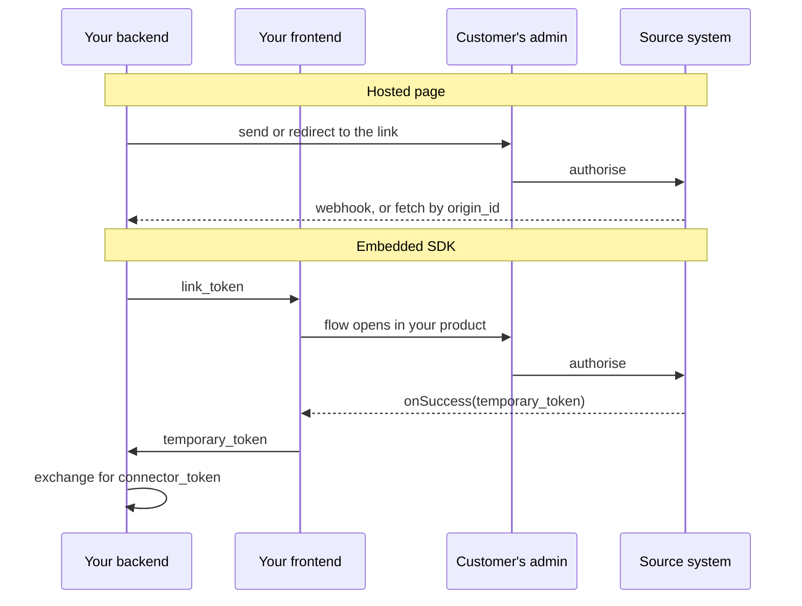

You are not the one who connects to your customer's HR system. They are.

That inversion is easy to skim past, and it shapes a surprising amount - where credentials live, who to contact when a connection breaks, and **why you cannot simply fix a permissions problem yourself.**

## Authorisation belongs to the customer

Reaching a company's HR data requires credentials from that company. Only someone with administrative access to their HRIS can grant them, and in almost every case they cannot delegate that to a third party even if they wanted to.

So the flow puts your customer's administrator in the middle. You initiate a connection for a named customer, they authorise it against their own system, and Bindbee holds the resulting credentials. **Those credentials never pass through your infrastructure and are never yours to store.**

<Info>
A connection problem is therefore usually not yours to fix. Expired credentials, insufficient permissions and revoked access all resolve on the customer's side. Your job is to detect the condition and prompt the right person.
</Info>

## Two ways to present it

The same authorisation flow reaches your customer through two surfaces, and the choice is independent of how the link was created.

**The hosted page** opens in the customer's browser at a Bindbee URL. You send it to them or redirect them to it. No front-end code either way.

**The embedded SDK** runs the same flow inside your own product, so the customer never leaves it.

Both produce a connector, both put the administrator in control, and **neither lets the end user choose which system to connect** - `create-link-token` requires the integration slug, so the target is fixed before the session exists.

They differ in the thing that shapes your code: **how you learn the connection succeeded.**

| | Hosted page | Embedded SDK |
| --- | --- | --- |
| Front-end code | None | React hook or CDN script |
| Link created by | Dashboard, or `create-link-token` | `create-link-token` |
| Completion signal | Webhook, or fetch by `origin_id` | `onSuccess` fires in the browser |
| Getting the token | Read `connector_token` from the connector | Exchange the `temporary_token` from your backend |

The embedded flow reacts the moment your customer finishes; the hosted page learns about it asynchronously.

Note the second row: **hosted does not mean manual.** Creating links by hand suits human-led implementation, but you can generate them from `create-link-token` and still redirect to the hosted page - self-serve onboarding with no front-end at all.

See [Create a Connector Programmatically](/how-to/connections/create-a-connector-programmatically) and [Embed the Connection Flow](/how-to/connections/embed-the-connection-flow).

{/* VERIFY: link lifetime and expiry behaviour. Confirm how long a generated Magic Link remains valid, what an end user sees after expiry, and whether a link is single-use or reusable. */}

## What the end user actually does

The person opening the link is your customer's HR or IT administrator, not a developer. They see their own system, are asked to authorise access, and are done.

What varies underneath is considerable. Some systems use OAuth and it takes seconds. Others need the administrator to generate an API key inside their HRIS first, create a dedicated integration user with specific role permissions, or configure a file delivery.

For those, **the flow guides them but cannot complete the work for them** - some of it happens in their HR system, not in Bindbee.

That is why per-system setup guides are written for an administrator rather than a developer, and why the harder integrations have a long tail between "link sent" and "connector active".

## Why it works this way

The alternative - collecting your customers' HRIS credentials yourself and passing them to Bindbee - is simpler to build and worse in every other respect.

**It makes you the custodian of credentials that open an entire company's employee records**, including compensation and bank details - a security liability you have no reason to accept.

It also fails on its own terms. OAuth-based systems will not issue credentials to anyone but the authorising administrator, so a credential-collection flow cannot support them at all.

Delegating authorisation means the credential exists only between the customer's system and Bindbee. You get normalised data without ever holding the keys to the source, and your customer can revoke access without involving you.

The cost is a dependency on someone outside your company, and a class of failure you can detect but not repair. **Noticing an inactive connector and prompting the right person quickly is most of what operationalising this well requires.**

## What this means for you

- **Connection failures are customer-side.** Detect and prompt; do not expect to fix them yourself.
- **Choose the surface by where onboarding happens**, not by whether you want to automate. Hosted links can be generated programmatically too.
- **Budget time between sending a link and data arriving.** Some systems need administrator work inside the HRIS first.
- **Point administrators at the per-system setup guides**, which are written for them rather than for developers.

## Related

- [Connect a test account](/get-started/quickstart) - walk the flow yourself
- [Magic Link](/how-to/connections/generate-a-magic-link) - generating and sending a link
- [Connector lifecycle](/explanation/connector-lifecycle) - what happens after authorisation
