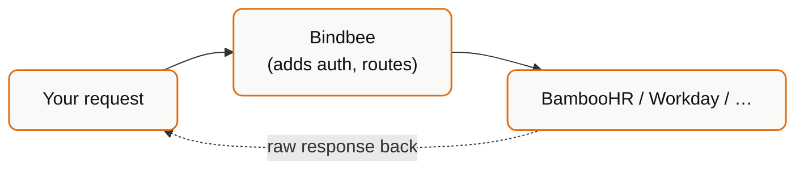

## What it is

Passthrough sends a request straight to the third-party API, using the credentials Bindbee already holds for that connector.



`POST /api/v1/passthrough`

You get: the vendor's endpoints, the vendor's request shape, the vendor's response shape, the vendor's error format.

You do not get: normalization, unified models, or portability across connectors.

## The trade-off, stated plainly

<Warning>
  Every passthrough call is per-vendor code. If you support ten connectors and
  use passthrough for a feature, you are writing and maintaining up to ten
  implementations of that feature - which is the problem Bindbee exists to
  remove.
</Warning>

That does not make it wrong. It makes it a decision with a cost, worth taking deliberately.

## When to reach for it

| Situation | Passthrough? |
| --- | --- |
| Vendor endpoint with no unified equivalent (custom reports, org-specific objects) | **Yes** |
| Write operation Bindbee doesn't support for that integration | **Yes** |
| Vendor-specific action - trigger a workflow, approve in-system | **Yes** |
| Data needed *right now*, cannot wait for a sync | **Yes**, carefully |
| One extra field on a model Bindbee already syncs | **No** - [custom field](/how-to/data-model/map-custom-fields) |
| Field exists but is `null` | **No** - [diagnose it first](/explanation/field-semantics) |
| "The unified API feels slow" | **No** - passthrough is slower; it hits the vendor live |
| Bulk reads | **No** - you inherit the vendor's rate limits |

## Passthrough vs custom fields

These get confused constantly, and picking wrong costs real effort.

| | Custom Fields | Passthrough |
| --- | --- | --- |
| Scope | An extra field on a model Bindbee syncs | Any vendor endpoint |
| Data source | The already-synced `raw_data` | A live call to the vendor |
| Freshness | Same as the sync | Real-time |
| Response shape | Unified model + `custom_fields` | Whatever the vendor returns |
| Per-vendor code | None - one JMESPath mapping | Yes, per vendor |
| Rate limit | Bindbee's (200/min/connector) | The vendor's |

**Decision rule:** if what you need is already inside `raw_data` on a synced model, use a custom field. If it requires a call Bindbee doesn't make, use passthrough.

Check first:

```bash
curl -G "https://api.bindbee.dev/api/hris/v1/employees" \
  -H "Authorization: Bearer $BINDBEE_API_KEY" \
  -H "X-Connector-Token: $CONNECTOR_TOKEN" \
  --data-urlencode "include_raw_data=true" \
  --data-urlencode "page_size=1"
```

If the value is in there, you do not need passthrough.

## What changes when you use it

**You inherit the vendor's rate limits.** Bindbee's 200/min/connector no longer protects you - you are calling the vendor directly, and their limits are often far tighter. A loop that is fine against the unified API can get a customer's integration throttled.

**You inherit vendor latency and downtime.** Unified reads serve from Bindbee's store and stay fast during a vendor outage. Passthrough does not.

**You inherit the vendor's error format.** No consistent status codes or error bodies. Handle each vendor's failures separately.

**Responses are not normalized.** Vendor field names, vendor types, vendor date formats, vendor enums. If you persist them, you are persisting a vendor-shaped record.

**Behaviour diverges silently across connectors.** The same code path produces different results per integration, and the difference only shows up in production with a customer you didn't test against.

## Using it responsibly

If you do use passthrough:

1. **Isolate it.** One adapter module per integration, behind an interface. Never sprinkle passthrough calls through business logic.
2. **Declare which connectors it supports.** Feature-flag by `integration_slug`. Degrade gracefully everywhere else - do not fail.
3. **Rate-limit yourself.** Assume the vendor's limits are tighter than Bindbee's, and back off aggressively.
4. **Cache.** If the data changes daily, don't fetch it per page view.
5. **Handle failure as expected, not exceptional.** Vendor endpoints change without notice.
6. **Log the `integration_slug` on every call.** When a vendor changes a response shape, this is how you find out which customers are affected.

```python
class HrisAdapter:
    """Per-vendor passthrough behind a stable interface."""
    supported = set()

    @classmethod
    def for_connector(cls, integration_slug):
        impl = REGISTRY.get(integration_slug)
        if impl is None:
            raise FeatureUnavailable(integration_slug)   # degrade, don't crash
        return impl()
```

## The long game

Passthrough is often the right *first* move and the wrong *permanent* one.

If you find yourself passthrough-ing the same concept across several connectors, that is a signal the concept belongs in the unified model. Tell Bindbee - `support@bindbee.dev`. Unified support means the per-vendor code goes away for you and for everyone else.

Treat a growing passthrough adapter layer as technical debt with a clear payoff path, not as architecture.

## Related

<CardGroup cols={2}>
  <Card title="Using Passthrough" icon="arrow-left-right" href="/how-to/writing-data-back/make-a-passthrough-request">
    The mechanics - request shape, auth, errors.
  </Card>
  <Card title="Custom Fields: The Mental Model" icon="git-fork" href="/explanation/custom-fields-mental-model">
    The cheaper option, when it applies.
  </Card>
</CardGroup>
