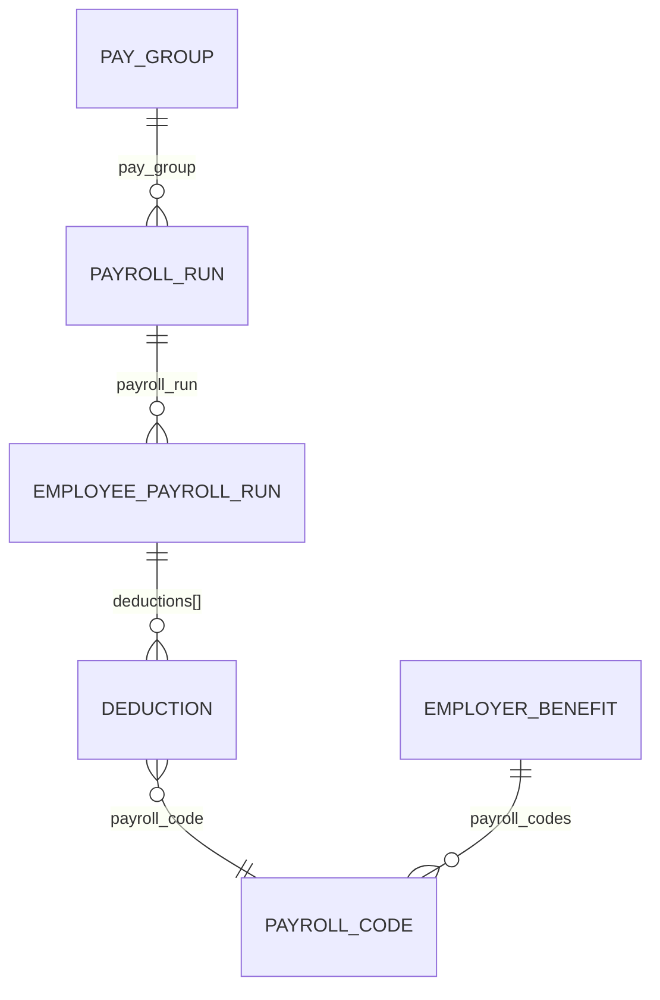

Eight models cover payroll and time, and they divide into two groups that are constantly confused: **what was paid, and what was worked.** They are related, neither derives from the other, and in many organisations they come from different systems entirely.

## What was paid

| Model | Holds | Note |
| --- | --- | --- |
| **Payroll run** | The employer's processing event - period, check date, `run_type`, `run_state` | A run exists before it is paid |
| **Employee payroll run** | One person's line: gross, net, and the itemised earnings, deductions and taxes | Where the money is |
| **Pay group** | `name` and `description` only | A label, not a schedule |
| **Payroll run calendar** | The forward schedule of periods and check dates | The only model here describing the future |
| **Payroll code** | The customer's earning and deduction codes, classified | The join to benefits |

<Warning>
`run_state` is `PAID`, `DRAFT`, `APPROVED`, `FAILED`, `CLOSED` or `NOT_STARTED`. **A payroll run existing does not mean anybody was paid.** Reading runs without checking `run_state` counts drafts as money that moved.
</Warning>

Two things commonly assumed about **pay group** are not in the model: it has no cadence and no employee list.

The link runs the other way - employees and compensation reference a pay group, and pay frequency lives on compensation as `pay_frequency`.

## A payslip line is a structured object

`earnings`, `deductions` and `taxes` are not amounts. Each is an array of objects, and each object references the code behind it.

| | Fields |
| --- | --- |
| **Earning** | `amount`, `name`, `payroll_code` |
| **Deduction** | `name`, `employee_deduction`, `company_deduction`, `payroll_code` |
| **Tax** | `name`, `amount`, `payroll_code` |

**A deduction carries two amounts** - `employee_deduction` and `company_deduction` - so employer and employee shares are already split rather than inferred.

`Earning.name` is also a fixed enum: `SALARY`, `REIMBURSEMENT`, `OVERTIME`, `BONUS`, `HOURLY`.

## Payroll codes classify, and connect

Every line references a code, and Bindbee normalises the code itself. `type` is `EARNING`, `DEDUCTION` or `TAX`, and `sub_type` narrows it - `RETIREMENT`, `HEALTH`, `GARNISHMENT`, `OVERTIME`, `SEVERANCE` and so on.

What is not normalised is the customer's own `code` and `name`, which come from their payroll configuration rather than any standard. A code identifying a specific 401(k) at one customer identifies something else at another.

**But you do not have to interpret the code to find the plan.** `payroll_code` on a line is a UUID, and the employer benefit carries `payroll_codes` referencing the same records:

So a deduction line resolves to a benefit plan by matching identifiers, with no per-customer mapping in between - see [Benefits models](/explanation/benefits-models).

<Warning>
Every field in that chain is nullable. Where `payroll_code` on a line or `payroll_codes` on a plan is empty, the mapping falls back to configuration you agree with the customer. **Check both ends before relying on the join** for a given connector.
</Warning>

## What was worked

**Timesheet entry** is recorded work: `date`, `hours_worked`, `start_time`, `end_time`, `break_duration`.

**Time off** is a request with a lifecycle, not a period of absence. Its `status` is `REQUESTED`, `APPROVED`, `DECLINED`, `CANCELLED` or `DELETED`, `request_type` is the kind of leave, and `units` is `HOURS` or `DAYS` - so `amount` means nothing without reading it.

<Warning>
Reading time off without filtering on `status` counts leave that was never taken. `REQUESTED` is not approved, and `DECLINED`, `CANCELLED` and `DELETED` are all still in the data.
</Warning>

**Time off balance** is entitlement remaining, by `policy_type`. It is a figure the source system calculates.

How it treats accrual, carryover and pending requests differs by system, so two customers on the same policy can report balances meaning subtly different things.

Timesheets are where normalisation works hardest. Source systems record time as punches, durations, intervals with nested breaks, or daily totals with no detail.

Reconstructing one shape from these is lossy, and the original survives in `raw_data`.

## The two halves do not join cleanly

Hours worked and hours paid diverge routinely and legitimately:

- Overtime is calculated by rules the timesheet does not encode.
- Salaried employees are paid with no timesheet at all.
- Corrections apply to a later run than the period they fix.
- Time off may or may not appear as a payroll line, depending on policy.

**This is the real gap in payroll integrations** - not the code-to-plan link, which the data supplies, but the arithmetic between hours and pay. Any reconciliation is something your application performs with knowledge of the customer's rules.

## Why it works this way

The run and employee-run split mirrors how payroll executes: an employer-level event producing per-employee results.

Collapsing them would repeat the period, check date and state on every line, and offer no way to represent a run that exists before its results do.

**Payroll codes are classified only as far as classification is safe.** Sorting a code into earning, deduction or tax is something the source system's own metadata supports.

Inferring which retirement plan a `RETIREMENT` deduction funds from the code string would be guessing, and being wrong there is silent - a misattributed contribution surfaces as a reporting discrepancy weeks later, not as an error.

So the association is stated as an identifier on the plan rather than inferred from a name, which is why the join is reliable where it is populated at all.

Time off as a request rather than an absence follows the source systems, which model approval workflow rather than outcome. Flattening it to "days absent" would lose the pending state, which is exactly what most applications need to act on.

## What this means for you

- **Check `run_state` before treating a payroll run as money that moved.** Drafts are in the data.
- **Read line items as objects.** A deduction already splits employee and company amounts.
- **Resolve a deduction to a plan through `payroll_code`**, not by interpreting the code string.
- **Filter time off by `status`**, and read `units` before interpreting `amount`.
- **Do not expect a cadence on pay group.** Pay frequency is on compensation.
- **Do not reconcile timesheets against payroll arithmetically** without encoding the customer's overtime and salary rules.

## Related

- [Read Payroll Data](/how-to/reading-data/read-payroll-data) - runs, lines, and deductions
- [Read Time and Attendance Data](/how-to/reading-data/read-time-and-attendance-data) - hours, leave, and balances
- [Benefits models](/explanation/benefits-models) - the other end of the payroll-code join
- [Get Payroll Codes](/hris/payroll-codes/get-payroll-codes) - the customer's earning and deduction codes
