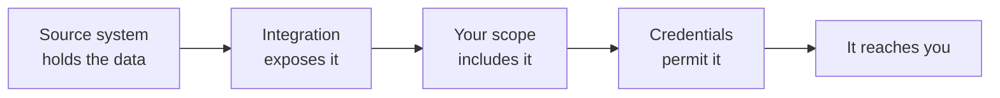

You called an endpoint, got a `200`, and the field you needed came back empty - or the whole model came back as an empty list. Nothing failed. There is no error to look up.

This is almost always one of three filters doing its job. **Data has to survive all three, and only one of them is yours to control.**

## Three filters, in order

| Filter | Decided by | Yours to change |
| --- | --- | --- |
| **Integration coverage** | What the vendor's API exposes | No |
| **Scope configuration** | You, for your organisation | **Yes** |
| **Source-system permissions** | Your customer's admin, at authorisation | No - but you can ask |

**Integration coverage** is a property of the source system, not a setting. If an HRIS has no concept of pay groups, or exposes benefits only through a report you cannot reach programmatically, that model does not exist for that integration.

**Scope configuration** is the one lever you hold. Anything you have not enabled is never fetched. It is set once for the organisation and applies across both environments, so a change in Development is a change in Production.

**Source-system permissions** come from the credentials your customer's admin authorised. A connector authorised by an admin with a restricted role returns less than the same integration authorised by a full administrator.

## Why absence is ambiguous

When credentials lack permission, the source system usually does not say so. It returns a response with the data simply absent, and Bindbee syncs what it received. A permission problem and a genuinely empty field look identical from your side.

The one signal that disambiguates cheaply is whether the value survived anywhere:

| What you see | What it usually means |
| --- | --- |
| Value in `raw_data`, missing from the unified field | A mapping gap, not a permission problem |
| Absent from both the unified field and `raw_data` | Scope excluded it, or the credentials could not read it |
| A whole model returning an empty list | Coverage, scope, or permission - check in that order |
| A sync error naming an authorisation failure | Permission, reported outright rather than silently |

That first row is worth internalising: it separates the two causes that get confused most often, and it costs one request with `include_raw_data=true`.

The connector's logs carry the failing request, the response, and its status code where the source system returned one - see [Resolve a Permission Error](/how-to/troubleshooting/resolve-a-permission-error).

## Scope is a contract, not a filter

It is tempting to read scope as a filter over data Bindbee already holds. It is not. **Data outside your scope is never fetched and never stored** - it appears in neither the unified response nor `raw_data`.

Two consequences follow:

- **Narrowing scope stops collection**, rather than hiding a copy. Sync time drops, and so does the volume of personal data you hold and have to justify.
- **Widening scope reveals nothing immediately**, because the data was never there. Newly enabled models populate on the next sync.

{/* VERIFY: both this page and restrict-models-and-fields state that widening scope waits for the next scheduled sync rather than triggering a backfill. The two are docs-side and could be wrong together - needs engineering confirmation. Merge triggers a full sync on scope expansion. */}

## Why it works this way

**Silent omission is deliberate, and it is the less obvious of the two options.**

The alternative is to fail loudly - error whenever any part of a request cannot be satisfied. That produces a system where one missing permission on one field breaks reads for every field, for every employee, on that connector. One customer's restrictive IT policy would take down your entire integration for them.

Partial success keeps the integration running on whatever the credentials do permit, and moves the diagnosis to where someone can act on it. The cost is exactly the ambiguity above, which is why diagnosis starts with the credentials rather than with the data.

**Scope exists for a different reason.** Unified APIs make it trivially easy to request far more personal data than a use case needs, and a default of "sync everything" is both a compliance liability and a performance cost. Making scope an explicit, up-front decision keeps the narrow option the easy one.

## What this means for you

- **An empty field is a permissions question first, a coverage question second.** Check the authorising credentials before assuming the integration lacks the field.
- **Check `raw_data` before escalating.** If the value is there, it is a mapping question, not a permission one.
- **Scope changes are organisation-wide and cross-environment.** Plan scope before connecting production customers.
- **Narrow scope deliberately.** Every model you do not enable is data you do not sync, do not store, and do not have to account for.
- **Coverage varies by integration, not just by category.** Two HRIS connectors under identical scope will not return the same models.

## Related

- [Configure scoping](/how-to/data-model/restrict-models-and-fields) - setting scope for your organisation
- [Resolve a Permission Error](/how-to/troubleshooting/resolve-a-permission-error) - diagnosing the credentials case
- [Unified model & raw data](/explanation/unified-model) - why the value you get differs from the source
