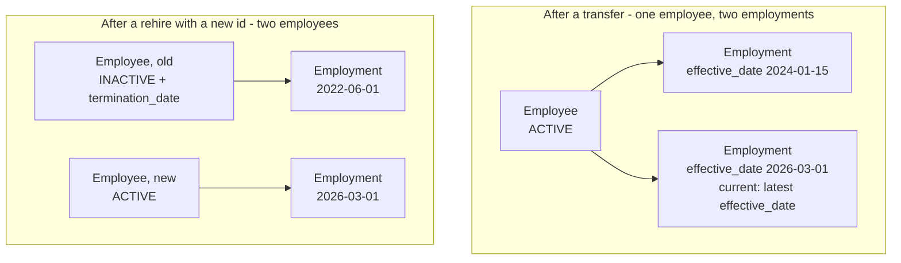

You expected the employee list to shrink when someone left. It did not. Or it shrank without anyone leaving.

Employment status is where the difference between **how HR systems actually work and how applications assume they work** shows up most sharply.

## Terminated employees do not disappear

HR systems almost never delete people. A termination sets a status and a date; the record stays, because payroll, benefits continuation, tax reporting and rehire eligibility all depend on it continuing to exist.

Bindbee follows that. A terminated employee remains in your results with an inactive `employment_status` and `termination_date` populated. **Filtering to current staff is your application's decision**, not something the API does for you.

<Info>
The corollary matters more than it sounds: an unfiltered employee count is a **lifetime** count, not a headcount. If your billing, seat allocation or reporting is keyed to employee count, it needs to filter on status or it will drift upward permanently.
</Info>

## "Active" is not one value

`employment_status` carries nine values, and treating it as a boolean is the most common way to get headcount wrong.

| Value | Means | Currently staff? |
| --- | --- | --- |
| `ACTIVE` | Employed and working | Yes |
| `LEAVE` | Employed, currently on leave | **Yes** - still employed |
| `PENDING` | Accepted, not yet started | Usually not |
| `INACTIVE` | No longer employed | No |
| `RETIRED` | Left via retirement | No |
| `DECEASED` | Died in service | No |
| `ACTIVE_EXTERNAL` | Active, not a direct employee | Depends what you are counting |
| `INACTIVE_EXTERNAL` | Former non-direct worker | No |
| `-` | The source value had no equivalent | **Unknown** - check `raw_data` |

<Warning>
`employment_status == "ACTIVE"` silently excludes everyone on parental, medical or sabbatical leave. They are still employed, still accruing benefits, still on payroll. For headcount, seat billing or provisioning, the set you almost always want is `ACTIVE` **and** `LEAVE`.
</Warning>

The other trap is `-`. It is not "no status" - it is a real status in the source system with no unified equivalent, so it means *unknown*, not *inactive*. **Defaulting it to inactive can deprovision a working employee.** See [Enum values](/explanation/enum-values).

## Custom statuses collapse into a fixed set

Source systems let customers define their own vocabularies. One tenant runs Active, Active PT, Leave, Inactive. Another runs a dozen values encoding division and contract type alongside employment state.

Every local vocabulary maps into the nine values above, and anything without a clean equivalent lands on `-`. A tenant distinguishing full-time from part-time *through status* loses that here - both become `ACTIVE`.

That particular distinction is usually recoverable elsewhere: `employment_type` on the employment record carries `FULL_TIME`, `PART_TIME`, `CONTRACTOR`, `INTERN`, `FREELANCE`, `REGULAR`, `FURLOUGHED` and `TERMINATED`.

Where the meaning is genuinely tenant-specific, the original string survives in `raw_data` - promote it into a custom field rather than trying to recover it from the enum.

## Transfers and rehires create new records

Two lifecycle events routinely produce a second record for someone who never left.

A **transfer** between positions, departments or legal entities is implemented in several systems as terminating the existing employment and creating a new one. Both are real - the history is genuinely two segments.

A **rehire** is similar and inconsistent between systems. Some reactivate the original record and clear the termination date. Others create a new record entirely, sometimes with a new identifier - and that produces a duplicate at the *employee* level, not just the employment level.

Where an employee has several employments, **the current one is the one with the latest `effective_date`.** Do not assume the first element of the array, and do not look for an end date on the employment - there isn't one.

The employee carries `termination_date` and `termination_reason`; employments carry only when each began.

The rehire case is the one to design for. Two employee records for one human is not something the API can fix - see [Record identity](/explanation/record-identity).

## Disappearing employees

An active employee vanishing has a small number of causes, and this is the order to check them in.

1. **Scope or permissions narrowed.** The most common and least dramatic. Workers the credentials lost access to stop syncing entirely rather than arriving marked inactive.
2. **The upstream identifier changed.** The person is still there under a new identity; the old record is what went quiet.
3. **A file-based connector stopped listing them.** For file-delivered integrations, absence from the current file is itself the signal - see [SFTP & file connectors](/explanation/sftp-and-file-connectors).

## Why it works this way

Bindbee reports status rather than filtering on it, and that generates most of the surprise here.

Filtering by default would make the common case effortless and silently break every other one. Benefits administration needs terminated employees for continuation. Payroll needs them for final pay and year-end reporting. Compliance needs them for retention periods measured in years.

**A platform that hid them by default would be unusable for a large share of what it exists to support**, and the workaround would be worse than the filter.

The enum collapse is the same trade seen elsewhere. A status field reproducing every customer's local vocabulary would not be a unified field at all - your code would branch per tenant.

Mapping to a fixed set is what makes one code path work, and raw data is what makes the loss recoverable.

## What this means for you

- **Treat current staff as `ACTIVE` + `LEAVE`.** Filtering on `ACTIVE` alone drops people who are still employed.
- **Never default `-` to inactive.** It means unknown, and guessing can deprovision a real person.
- **Do not key headcount or billing to raw record count.** An unfiltered list is everyone who ever worked there.
- **Expect multiple employments per person**, and select the current one by latest `effective_date`.
- **Check `employment_type` before reaching for raw data** when you need full-time versus part-time.
- **A disappearing employee is a permissions question first**, an identity question second.

## Related

- [Filter a Collection](/how-to/reading-data/filter-and-narrow-a-collection) - reading current staff only
- [Get Employments](/hris/employments/get-employments) - the employment model and its dates
- [Enum values](/explanation/enum-values) - why `-` appears and what to do with it
- [Record identity](/explanation/record-identity) - when a rehire becomes a second record
