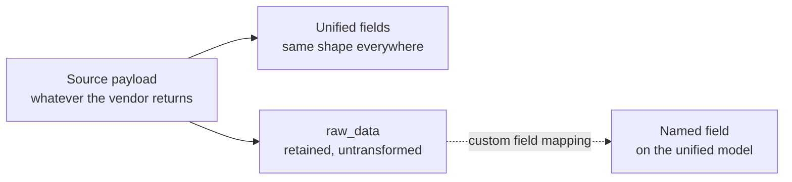

Bindbee returns the same employee shape whether your customer runs Workday, BambooHR, or a nightly SFTP drop. That consistency is the point of a unified API, and it is only achievable by making decisions on your behalf.

**Every one of those decisions loses something.** Knowing which were made, and where the discarded detail went, is most of what you need to know about the data model.

## Normalisation is opinionated

Source systems disagree about almost everything. One HRIS has a single `name` field. Another has legal, preferred and display names, each optional. A third stores names only inside a nested profile object that is present for some employees and absent for others.

Bindbee's employee model has one set of name fields, so populating them means choosing which source field maps to which unified field - and what to do when the preferred choice is missing.

These resolutions are usually **fallback chains**: preferred name if present, otherwise legal name, otherwise whatever the profile object holds. The chain is a judgement about what most applications want, and it will occasionally be wrong for yours.

Mappings are defined **per integration**, not per customer. If the Workday name chain changes, it changes for every Workday connector at once.

## Nothing is discarded, but not everything is returned

Normalisation sets the original aside rather than throwing it away.

That gives you three ways to reach a value, and they differ in more than convenience:

| Route | What you get | In default response | Request with |
| --- | --- | --- | --- |
| **Unified field** | The normalised value, same shape everywhere | Yes | — |
| **Custom field** | A value you named, stable once mapped | No | `include_custom_fields=true` |
| **Raw data** | The vendor's own payload, shape follows them | No | `include_raw_data=true` |

<Warning>
Both `raw_data` and `custom_fields` default to **off**. A mapped custom field does not appear in a response until you ask for it, which is the usual reason a mapping looks like it silently failed. See [Add raw_data & Custom Fields](/how-to/reading-data/include-raw-data-and-custom-fields).
</Warning>

Raw data is where you go when a unified field is empty, when the fallback chain picked the wrong source, or when the value has no unified equivalent at all. It is also where the source system's own timestamps, identifiers and status strings survive verbatim.

But it is deliberately not normalised. Its shape is whatever that integration returns, it differs between integrations, and it changes when the vendor changes their API. **Reading it directly in application code means writing integration-specific handling** - the thing you adopted a unified API to avoid. Promote what you need into a custom field instead.

## Coverage varies by integration

Two things limit what the unified model can give you for a particular customer.

**Not every integration supports every model.** Coverage follows what the source system exposes, and it differs integration by integration even within one category. A model that is rich for one HRIS may be absent for another.

**Some models are still settling.** Any model carrying a **BETA** badge in the API reference works, but its field names and shapes are not yet frozen. Check the badge rather than a list - which models are provisional changes over time.

{/* VERIFY: does Beta carry a stated notice period or deprecation policy before a contract change? */}

## Why it works this way

The alternative to an opinionated model is a permissive one: a union of every field every source system offers, everything optional.

**That design never loses information, and never delivers the benefit either.** Your code would branch on which integration a connector uses, which is precisely the work a unified API exists to remove. A union model is passthrough with extra steps.

A narrow, opinionated shape means one code path works everywhere - at the cost of decisions that are right in aggregate and wrong at the margins. **Raw data exists so the margins are recoverable rather than terminal**, and custom fields turn a recovery into a stable field instead of a permanent workaround.

Keeping mappings global rather than per-customer is the same trade one level up. Per-connector mappings would let every integration behave exactly as each customer wants, and would make the platform impossible to reason about across a customer base.

## What this means for you

- **Pass `include_custom_fields=true` to see a custom field.** Mapping it is only half the job.
- **When a unified field is empty, check raw data before concluding the source has no value.** The fallback chain may have missed it.
- **Do not read raw data directly in application code.** Promote what you need into a custom field.
- **Expect coverage to differ by integration**, not just by category. Test against the integrations your customers actually use.
- **Treat Beta models as provisional.** They work, but the contract is not frozen.

## Related

- [Add raw_data & Custom Fields](/how-to/reading-data/include-raw-data-and-custom-fields) - the query parameters that return them
- [Inspect the raw payload](/how-to/data-model/inspect-the-raw-upstream-payload) - see what the source system returned
- [How custom fields work](/explanation/how-custom-fields-work) - the supported way to surface a raw value
