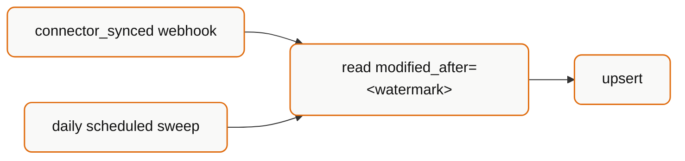

## Start by separating two questions

Teams conflate these, and the conflation causes bad decisions:

1. **How fresh is the data?** → determined by **sync frequency**. 24 hours by default in Production.
2. **How do I learn that it changed?** → determined by **webhooks vs polling**.

<Warning>
  Webhooks answer question 2 only. They cannot make data fresher than the sync
  schedule allows. If a customer needs hourly data, no delivery mechanism will
  provide it — the sync frequency has to change. See
  [Data Freshness](/explanation/data-freshness).
</Warning>

## The honest comparison

| | Webhooks | Polling |
| --- | --- | --- |
| Latency after a sync | Seconds | Up to your poll interval |
| Wasted requests | None | Most polls return nothing new |
| Infrastructure | Public HTTPS endpoint, signature verification, queue | An HTTP client and a cron |
| Failure mode | Silent — you don't know what you missed | Loud — the next poll retries |
| Missed events | Possible after 4 retries in 60s | Not possible |
| Local development | Needs a tunnel | Just works |
| Debugging | Delivery logs, replays | Read the response |
| Ordering | Not guaranteed | Whatever order you request |

Polling's real advantage is that failure is self-healing. If your poller is down for six hours, the next run catches everything. If your webhook endpoint is down for six hours, those events are gone.

## The retry gap

This is the fact that should shape your design:

| Property | Value |
| --- | --- |
| Max retries | 4 |
| Retry window | 60 seconds |
| Timeout per attempt | 10 seconds |
| Retry triggers | Network/protocol failures and all non-`2xx` responses |

<Warning>
  **Deliveries are retried for about a minute and then dropped.** A deploy that
  takes your endpoint down for two minutes loses events permanently, with no
  error surfaced anywhere in your system.
</Warning>

This is why webhooks-only is not a safe architecture for anything you must not miss.

## The recommendation

**Use both.** Webhooks for latency, a scheduled sweep for correctness.



The sweep runs the identical logic on a timer — daily is usually sufficient. It costs almost nothing when webhooks are working, and it is the only thing that saves you when they aren't.

Because the read is watermarked and the write is an idempotent upsert, running both is harmless. No deduplication logic beyond keying on `id`.

## Choosing by use case

| You are building | Strategy |
| --- | --- |
| A read-through UI (fetch when a user opens a page) | **Neither.** Read on demand, cache briefly, show data age |
| A mirrored database | **Both.** Webhook + daily sweep |
| Joiner/leaver provisioning | **Both.** `employee_data_changed` for latency; sweep for correctness — missing a leaver is a security problem |
| Nightly payroll/billing batch | **Polling only.** You run on a schedule anyway; webhooks add infrastructure for nothing |
| Connection-health UI | **Both.** `connector_sync_error` for immediacy; connector list poll to catch `RELINK_NEEDED` |
| A prototype | **Polling only.** Ship the feature; add webhooks when latency actually matters |

<Tip>
  Starting with polling is a legitimate engineering decision, not a shortcut.
  Add webhooks when you can name the latency requirement they satisfy.
</Tip>

## If you poll

**Poll the connector list, not the data endpoints.**

```bash
curl "https://api.bindbee.dev/api/hris/v1/connectors" \
  -H "Authorization: Bearer $BINDBEE_API_KEY"
```

One request tells you every connector's `sync_status`, `last_sync_start_time` and `next_sync_start_time`. Only fetch data for connectors whose `last_sync_start_time` moved since you last looked.

**Set the interval from the sync schedule.** With 24-hour syncs, polling every five minutes produces 288 identical responses a day. Poll a few times daily, or align to `next_sync_start_time`.

**Always use `modified_after`.** Re-reading whole directories is the main way teams hit rate limits.

## If you use webhooks

Non-negotiables:

- **Verify the signature** against the raw request body. See [Validate webhook signatures](/how-to/validate-webhook-signatures).
- **Respond within 10 seconds.** Acknowledge, then process on a queue.
- **Deduplicate** on `sync.sync_id` + `webhook.event`.
- **Register both environments.** Production webhooks never fire for Development connectors.
- **Don't assume ordering.** A `connector_synced` can arrive before a data-change event from the same sync.
- **Treat the payload as a notification.** It carries IDs, not records.

<Tip>
  Simplest robust handler: ignore the ID lists entirely. On `connector_synced`,
  run your `modified_after` read. Slightly more traffic, dramatically less state
  to get wrong — and it is the same code path as your sweep.
</Tip>

## Related

<CardGroup cols={2}>
  <Card title="Handle Webhooks" icon="webhook" href="/how-to/handle-webhooks">
    Build the receiver end to end.
  </Card>
  <Card title="Data Freshness" icon="clock" href="/explanation/data-freshness">
    The question webhooks don't answer.
  </Card>
</CardGroup>
