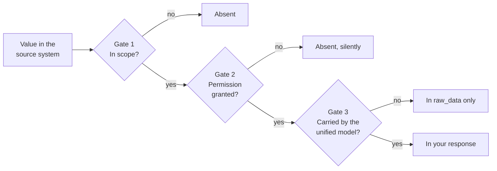

Between a value sitting in your customer's HRIS and that value appearing in your response, there are three gates. They are controlled by three different parties, they fail in three different ways, and a field must clear all three.

Most "why is this empty?" questions are really "which gate closed?" - and answering that takes one request.



## Gate 1 - Scope

**You control this one.** Scope is the set of models and fields Bindbee requests, configured once for your organization and applied to every connector.

A model outside scope is never requested, so it never syncs, so it is absent from responses. Not `null` with an explanation - absent.

Two properties are worth holding onto:

- **Scope is shared across environments.** What you configure in Development applies in Production. It is one of the few settings that crosses that boundary.
- **Widening scope does not backfill by itself.** Existing connectors pick up newly scoped fields on their next sync. In Development, that is a sync you trigger.

This gate is the easiest to diagnose because you can just go look at it.

## Gate 2 - Source-system permission

**Your customer's administrator controls this one**, and it is the expensive gate.

Every model in scope maps to a permission in the source system. If the integration user was never granted access to compensation, or benefits, or bank details, then Bindbee asks and the system declines to answer.

<Warning>
  **This failure is silent.** A missing permission usually does not produce an
  error. The source API returns a successful response with the fields absent, or
  a collection with nothing in it. Bindbee has nothing to normalize, so it writes
  nothing, and you receive a well-formed response that is simply empty.
</Warning>

That silence is not an oversight in Bindbee - it is inherited. From the integration user's point of view, data it cannot see and data that does not exist look identical, and no layer above the source system can distinguish them. Bindbee cannot report an error it was never told about.

Two practical consequences:

- **An entire model coming back empty points at permissions**, far more often than at a mapping problem. A single odd field is a mapping question; a whole empty collection is a permissions question.
- **This is why sandbox tenants mislead.** Test tenants come pre-permissioned, so the tutorial path never hits this gate. Your first real customer will.

Fixing it is a conversation with the customer's admin, not a change on Bindbee's side. See the [Go-live checklist](/how-to/go-live-checklist).

## Gate 3 - Unified model coverage

**Bindbee controls this one.** The unified model carries what is common across systems, not the union of everything any one system offers, and per-connector field support varies.

This gate is different from the other two in an important way: **the data is there.** It synced. It just has no unified field to live in, so it sits in `raw_data` and nowhere else.

That makes it the only gate you can clear yourself, without touching scope and without asking your customer for anything - map the value as a [custom field](/explanation/custom-fields-mental-model) and it appears on the unified object.

## Which gate closed?

One request separates all three.

```bash
curl -G "https://api.bindbee.dev/api/hris/v1/employees" \
  -H "Authorization: Bearer $BINDBEE_API_KEY" \
  -H "X-Connector-Token: $CONNECTOR_TOKEN" \
  --data-urlencode "include_raw_data=true" \
  --data-urlencode "page_size=1"
```

| What you see | Gate | What to do |
| --- | --- | --- |
| The value is in `raw_data` | 3 - coverage | Map a custom field |
| `raw_data` is present but the value isn't, and the model is in scope | 2 - permission | Check what the integration user was granted |
| The model is out of scope | 1 - scope | Widen scope, then resync |
| Everything is empty and no sync has completed | None of the three | Nothing has synced yet |

<Info>
  Check for a completed sync before reading anything into an empty response. In
  Development nothing syncs on a schedule, so "empty" most often means "not yet
  synced" rather than any gate at all. See
  [How syncing works](/explanation/how-syncing-works).
</Info>

## Why this is worth understanding rather than looking up

The three gates fail identically from your application's point of view - a field that isn't there - while requiring three completely different responses: a config change you make, a conversation your customer has, and a mapping you write. Code that treats them as one condition will send the wrong person to fix the wrong thing.

The design consequence is small and worth building early: **when a field your product depends on is missing, record which gate it failed at.** A log line carrying the `integration_slug` and the gate turns a recurring support conversation into a list of things to fix, and the set stabilizes quickly per connector.

## Related

<CardGroup cols={2}>
  <Card title="The Unified Model and Raw Data" icon="boxes" href="/explanation/unified-model-and-raw-data">
    What normalization promises, and what it gives up.
  </Card>
  <Card title="Field Semantics" icon="circle-help" href="/explanation/field-semantics">
    Diagnosing a null field, symptom by symptom.
  </Card>
  <Card title="How Syncing Works" icon="rotate-cw" href="/explanation/how-syncing-works">
    Why an empty response often means "not yet", not "never".
  </Card>
  <Card title="Go-Live Checklist" icon="rocket" href="/how-to/go-live-checklist">
    Getting permissions right before your first real customer.
  </Card>
</CardGroup>
