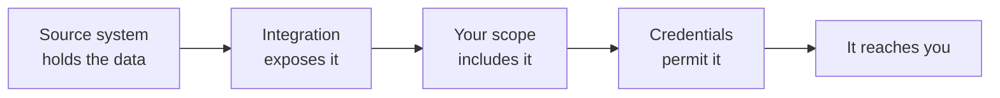

{/* CONTENT PASS: merged from explanation/scope-and-permissions, how-to/data-model/restrict-models-and-fields. Dashboard steps duplicate the concept section - collapse. */}

## Configure scoping

<Warning>
Scoping is applied across all connectors, integrations, and environments.
</Warning>

In the dashboard, go to **Configure → Scoping**, pick the category, and switch on the models you need. Each one expands so you can keep or drop individual fields. Do this before you connect real customers.

<Frame caption="Configure → Scoping. Each model is switched on or off, and expands to keep or drop individual fields.">
  
</Frame>

<Note>
If you change the scoping, you must resync the connector to see the effects.
</Note>

## What scope actually does

Scope is not permissions. Credentials govern what Bindbee *can* read, scope what it *does* read - for a hard guarantee, restrict the integration user upstream.

{/* VERIFY: both this page and restrict-models-and-fields state that widening scope waits for the next scheduled sync rather than triggering a backfill. The two are docs-side and could be wrong together - needs engineering confirmation. Merge triggers a full sync on scope expansion. */}

You called an endpoint, got a `200`, and the field came back empty - or the whole model came back as an empty list. Nothing failed, and there's no error to look up. **Data has to get past three chekcs, and only one of them is yours.**

## Three checks, before data fetch

| Filter | Decided by | Yours to change |
| --- | --- | --- |
| **Integration coverage** | What the vendor's API exposes. If their system has no pay groups, that model doesn't exist here | No |
| **Scope** | You, for your whole organisation. Anything you haven't enabled is never fetched | **Yes** |
| **Source-system permissions** | The admin who authorised the connection. A restricted role returns less | No - but you can ask |

## Why data is missing

Permission failures are silent - the source system leaves the data out instead of erroring, so a missing permission and an empty field look the same. One request with `include_raw_data=true` tells you which:

| What you see | What it usually means |
| --- | --- |
| In `raw_data`, missing from the unified field | A mapping gap, not a permission problem |
| Missing from both | Scope excluded it, or the credentials couldn't read it |
| A whole model returning an empty list | Coverage, scope, or permission - check in that order |
| A sync error naming an authorisation failure | Permission, reported outright |

The connector's logs carry the failing request and response - see [Origin-system errors](/guides/troubleshooting/errors#origin-system-errors).

## Frequently Asked Questions

<AccordionGroup>
  <Accordion title="Excluded fields still appear">
    A scope change only affects the next sync. Data already synced stays until a fresh sync replaces it - resync and check again.
  </Accordion>

  <Accordion title="A model you need stopped returning data">
    It's probably out of scope. Scope and permission failures both show up as absence, so check the scope before investigating permissions.
  </Accordion>

  <Accordion title="A custom field stopped resolving">
    Its source path is likely out of scope, so the raw payload no longer contains it. Either bring the field back into scope or drop the mapping.
  </Accordion>

  <Accordion title="Sync times didn't improve">
    Sync duration is driven mostly by how many records there are and how many upstream calls each one costs. Excluding fields inside a model you still sync saves less than excluding whole models.
  </Accordion>
</AccordionGroup>

## Related

- [Core concepts](/get-started/core-concepts) - where scope sits among the levels
- [Model availability](/get-started/model-availability) - which models an integration returns at all
- [Raw Data](/guides/reading-writing/raw-data) - reaching a value the unified model drops
