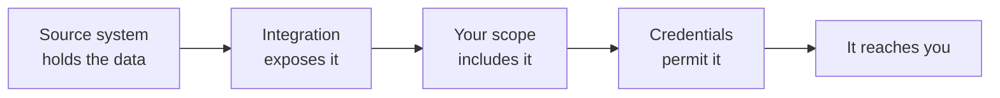

{/* CONTENT PASS: merged from explanation/scope-and-permissions, how-to/data-model/restrict-models-and-fields. Dashboard steps duplicate the concept section - collapse. */}

You called an endpoint, got a `200`, and the field you needed came back empty - or the whole model came back as an empty list. Nothing failed. There is no error to look up.

This is almost always one of three filters doing its job. **Data has to survive all three, and only one of them is yours to control.**

## Three filters, in order

| Filter | Decided by | Yours to change |
| --- | --- | --- |
| **Integration coverage** | What the vendor's API exposes | No |
| **Scope configuration** | You, for your organisation | **Yes** |
| **Source-system permissions** | Your customer's admin, at authorisation | No - but you can ask |

**Integration coverage** is a property of the source system, not a setting. If an HRIS has no concept of pay groups, or exposes benefits only through a report you cannot reach programmatically, that model does not exist for that integration.

**Scope configuration** is the one lever you hold. Anything you have not enabled is never fetched. It is set once for the organisation and applies across both environments, so a change in Development is a change in Production.

**Source-system permissions** come from the credentials your customer's admin authorised. A connector authorised by an admin with a restricted role returns less than the same integration authorised by a full administrator.

## Why absence is ambiguous

When credentials lack permission, the source system usually does not say so. It returns a response with the data simply absent, and Bindbee syncs what it received. A permission problem and a genuinely empty field look identical from your side.

The one signal that disambiguates cheaply is whether the value survived anywhere:

| What you see | What it usually means |
| --- | --- |
| Value in `raw_data`, missing from the unified field | A mapping gap, not a permission problem |
| Absent from both the unified field and `raw_data` | Scope excluded it, or the credentials could not read it |
| A whole model returning an empty list | Coverage, scope, or permission - check in that order |
| A sync error naming an authorisation failure | Permission, reported outright rather than silently |

That first row is worth internalising: it separates the two causes that get confused most often, and it costs one request with `include_raw_data=true`.

The connector's logs carry the failing request, the response, and its status code where the source system returned one - see [Permission errors](/guides/troubleshooting/permission-errors).

## Scope is a contract, not a filter

It is tempting to read scope as a filter over data Bindbee already holds. It is not. **Data outside your scope is never fetched and never stored** - it appears in neither the unified response nor `raw_data`.

Two consequences follow:

- **Narrowing scope stops collection**, rather than hiding a copy. Sync time drops, and so does the volume of personal data you hold and have to justify.
- **Widening scope reveals nothing immediately**, because the data was never there. Newly enabled models populate on the next sync.

{/* VERIFY: both this page and restrict-models-and-fields state that widening scope waits for the next scheduled sync rather than triggering a backfill. The two are docs-side and could be wrong together - needs engineering confirmation. Merge triggers a full sync on scope expansion. */}

## Why it works this way

**Silent omission is deliberate, and it is the less obvious of the two options.**

The alternative is to fail loudly - error whenever any part of a request cannot be satisfied. That produces a system where one missing permission on one field breaks reads for every field, for every employee, on that connector. One customer's restrictive IT policy would take down your entire integration for them.

Partial success keeps the integration running on whatever the credentials do permit, and moves the diagnosis to where someone can act on it. The cost is exactly the ambiguity above, which is why diagnosis starts with the credentials rather than with the data.

**Scope exists for a different reason.** Unified APIs make it trivially easy to request far more personal data than a use case needs, and a default of "sync everything" is both a compliance liability and a performance cost. Making scope an explicit, up-front decision keeps the narrow option the easy one.

## What this means for you

- **An empty field is a permissions question first, a coverage question second.** Check the authorising credentials before assuming the integration lacks the field.
- **Check `raw_data` before escalating.** If the value is there, it is a mapping question, not a permission one.
- **Scope changes are organisation-wide and cross-environment.** Plan scope before connecting production customers.
- **Narrow scope deliberately.** Every model you do not enable is data you do not sync, do not store, and do not have to account for.
- **Coverage varies by integration, not just by category.** Two HRIS connectors under identical scope will not return the same models.

## Restricting what syncs

Scoping controls what Bindbee syncs. Narrowing it reduces sync time, reduces load on the source system, and - the reason most customers ask - keeps sensitive data you have no use for out of your systems entirely.

<Warning>
  Scope is set once for your **organization**, not per connector, and it is **shared across environments**. A change made while testing in Development applies to your live Production connectors too.

  There is no per-connector scope. If one customer needs a narrower set than the rest, that has to be enforced upstream in their own system.
</Warning>

<Info>
  **Before you start**

  - You know which models your integration reads. Scoping out something you later need means a configuration change and a resync.
  - Nobody else is relying on a model you're about to remove - the change reaches every connector in both environments.
</Info>

### Steps

<Steps>
  <Step title="List the models you actually consume">
    Work from your own code, not from the model list. Most integrations use a fraction of what's available - an eligibility feed may need only employees, employments, and benefits.

    **Result:** A minimum set.
  </Step>

  <Step title="Identify sensitive fields you don't need">
    These come up in nearly every security review:

    | Field | Why it's usually excluded |
    | --- | --- |
    | National ID / SSN | Rarely required; expands your compliance scope substantially |
    | Bank info | Almost never needed outside payroll disbursement |
    | Date of birth | Needed for dependent age rules, not much else |
    | Home address | Needed for tax or ICHRA affordability, not for most reads |
    | Compensation | Needed for deduction and affordability calculations only |

    Excluding a field you don't consume is the cleanest answer to "what do you store about our employees" - better than storing it and explaining your controls.

    **Result:** An exclusion list.
  </Step>

  <Step title="Apply the scope">
    In the Dashboard, go to **Configure → Scoping** and select the models and fields to keep. See [Scoping](/get-started/platform) for what the screen shows.

    Settle this before you start connecting customers. Scope applies to every connector in the organization, so it's a decision you make once rather than per customer.

    **Result:** The organization is limited to the selected models and fields.
  </Step>

  <Step title="Resync and verify">
    Scope changes apply to subsequent syncs, not retroactively. Trigger a run - see [Force a resync](/guides/reading-writing/syncing) - then read a record and confirm the excluded fields are absent.

    Newly enabled models are populated on the next sync rather than appearing immediately, so widening scope needs the same step.

    **Result:** Confirmation the scope is in effect.
  </Step>
</Steps>

### What scoping does and doesn't affect

Scoping determines what Bindbee **pulls from the source system**. A field outside scope is not synced, so it appears in neither the unified response nor `raw_data`.

That last point matters for custom fields: a mapping pointing at an out-of-scope field resolves to nothing, and the symptom is a field that previews correctly against an integration sample but returns nothing in production. See [Test an expression](/guides/extending/custom-fields).

Scoping is also not a substitute for source-system permissions. The credentials still govern what Bindbee *can* read; scoping governs what it *does* read. For customers who want a hard guarantee, restricting the integration user's permissions upstream is the stronger control - see [Permission errors](/guides/troubleshooting/permission-errors).

### If this didn't work

<AccordionGroup>
  <Accordion title="Excluded fields still appear">
    Scope changes aren't retroactive. Previously synced data persists until a fresh sync replaces it - resync and check again.
  </Accordion>

  <Accordion title="A model you need stopped returning data">
    It's out of scope. An empty result from an in-scope-looking model is the usual symptom, since scoping and permission failures both present as absence. Check the scope before investigating permissions.
  </Accordion>

  <Accordion title="A custom field stopped resolving">
    Its source path is likely out of scope now - the raw payload no longer contains it. Either bring the field back into scope or drop the mapping.
  </Accordion>

  <Accordion title="Sync times didn't improve">
    Sync duration is driven mostly by population size and by how many upstream calls each record costs. Excluding fields within a model you still sync saves less than excluding whole models.
  </Accordion>

  <Accordion title="A customer wants a guarantee you never receive a field">
    Scoping is the right first answer, but the stronger control is upstream - an integration user without permission to that field cannot expose it regardless of configuration. Offer both.
  </Accordion>
</AccordionGroup>

## Related

- [Core concepts](/get-started/core-concepts) - where scope sits among the levels
- [Model availability](/get-started/model-availability) - which models an integration returns at all
- [Raw Data](/guides/reading-writing/raw-data) - reaching a value the unified model drops
