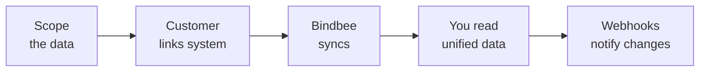

Your customers run their people data somewhere — BambooHR, ADP, Workday, Gusto, an SFTP drop, or something you have never heard of. Your product needs that data, and every one of those systems models it differently.

Bindbee sits between the two. You integrate once, against one schema. Your customer authorizes their own system. Bindbee keeps the data in sync and hands it to you in a shape that does not change when the underlying system does.

## What you get

- **Unified models** across HRIS, Payroll, ATS, and LMS — the same `Employee` object whether the data came from Gusto or Workday.
- **Customer-authorized connectors** — your customer links their own system through [Magic Link](/how-to/magic-link), with no credentials passing through your product.
- **Raw data and [custom fields](/explanation/custom-fields)** — when the unified model does not carry a value you need, you can map it out of the original payload yourself.
- **[Webhooks](/webhooks/overview)** — your application finds out when a sync finishes or a record changes, instead of polling for it.

## How an integration works

Five things happen, in this order, every time.

**Scope the data.** You decide which models and fields your product actually needs. Scope narrows what Bindbee requests and what your customer has to grant.

**Your customer links their system.** They authorize their HRIS, payroll, ATS, or LMS through Magic Link. That authorization produces a connector.

**Bindbee syncs.** Bindbee pulls the scoped data from the source system and normalizes it into the unified models.

**You read unified data.** One set of endpoints, one schema, regardless of which system is on the other end.

**Webhooks notify you of changes.** Sync completions and record-level changes are pushed to your endpoint.

## Where to go next

<CardGroup cols={2}>
  <Card title="Build your first integration" icon="play" href="/get-started/before-you-begin">
    A guided tutorial that takes you from an empty environment to employee data
    in your own code, including a custom field and a webhook. Start here if you
    are new to Bindbee.
  </Card>

  <Card title="Integrations & coverage" icon="plug" href="/integrations">
    Every supported system, its slug, and whether it connects over API or SFTP —
    across HRIS, Payroll, ATS, and LMS.
  </Card>

  <Card title="Take an integration live" icon="rocket" href="/how-to/go-live-checklist">
    Preparing a real customer's source system, moving from development to
    production, and the checks worth running before you switch over.
  </Card>

  <Card title="API reference" icon="code" href="/api-reference/basics/authentication">
    Authentication, pagination, rate limits, and every endpoint across HRIS,
    Payroll, ATS, and LMS.
  </Card>

  <Card title="Core concepts" icon="book-open" href="/explanation/core-concepts">
    Connectors, environments, scope, syncs, and how the unified model relates to
    the data underneath it.
  </Card>
</CardGroup>

## Getting help

You have a dedicated Slack channel with the Bindbee team — that is the fastest route for anything blocking. For everything else, email [support@bindbee.dev](mailto:support@bindbee.dev).

<Info>
  Bindbee accounts are provisioned by our team during onboarding, not through
  self-serve signup. If you do not yet have dashboard access, ask in your Slack
  channel.
</Info>
