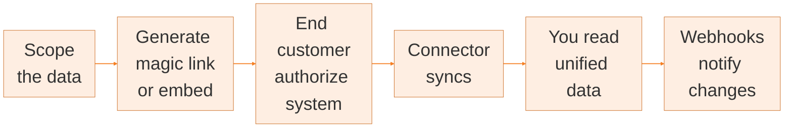

Your customers run payroll and HR in different systems: BambooHR, ADP, Workday, an SFTP drop, or something niche. Each models the same employee differently.

Bindbee normalizes them into one schema. You integrate against Bindbee once. Your customer authorizes their own system, Bindbee syncs it, and the shape of what you receive stays fixed even when the underlying system changes.
## How an integration works

Six things happen, in this order, for every connection.

**Scope the data.** You decide which models and fields your product actually needs. Scope narrows what Bindbee requests and what your customer has to grant.

**Generate a Magic Link or embed the flow.** Create a [Magic Link](/how-to/magic-link) from Bindbee dashboard and send it to your customer, or use [Bindbee Embed](/how-to/bindbee-embed) so they can connect directly inside your own product.

**Your customer authorizes their system.** They open the link (or the embedded flow) and authorize their HRIS, payroll, ATS, or LMS - no credentials pass through your product.

**The connector syncs.** Bindbee pulls the scoped data from the source system and normalizes it into one schema - the same `Employee` object whether the data came from ADP or Workday. When the unified model does not carry a value you need, [custom fields](/explanation/custom-fields) let you map it out of the raw payload yourself.

**You read unified data.** Call `GET /api/hris/v1/employees` (or the equivalent for Payroll, ATS, or LMS) and get the same schema back no matter which system is connected. Beyond `Employee`, the same pattern covers `Compensation`, `PayrollRun`, `Benefit`, timesheet entries, and more - one set of endpoints, one schema, regardless of which system is on the other end. 

**[Webhooks](/webhooks/overview) notify you of changes.** As soon as a sync finishes or a record changes, Bindbee pushes an event to your endpoint - no polling required.

## Getting help

You have a dedicated communication channel with the Bindbee team. For anything else, email us at [support@bindbee.dev](mailto:support@bindbee.dev).

<Info>
  Bindbee dashboard access is not available through self-serve signup. To get access, [book a demo](https://bindbee.dev/book-demo/?utm_source=documentation&utm_medium=what-is-bindbee&utm_campaign=documentation&utm_content=book-demo) with our integration experts.
</Info>

## Where to go next

<CardGroup cols={2}>
  <Card title="Build your first integration" icon="graduation-cap" href="/get-started/quickstart">
    From an empty environment to employee data in your own code, with a custom field and a webhook.
  </Card>

  <Card title="Go-Live Checklist" icon="rocket" href="/how-to/go-live-checklist">
    Move from development to production, and the checks worth running first.
  </Card>

  <Card title="API reference" icon="code" href="/api-reference/basics/authentication">
    Authentication, pagination, rate limits, and every endpoint across HRIS, Payroll, ATS, and LMS.
  </Card>

  <Card title="Core concepts" icon="book-open" href="/explanation/core-concepts">
    Connectors, environments, scope, and syncs - how the unified model fits together.
  </Card>
</CardGroup>

