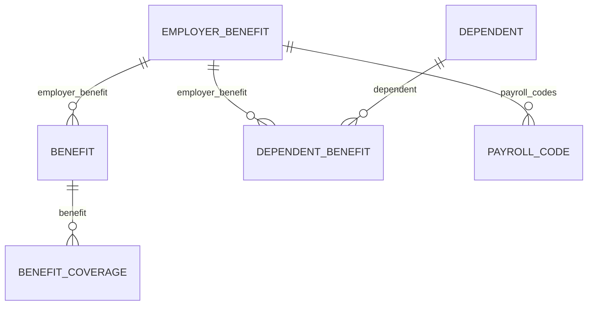

{/* CONTENT PASS: merged from explanation/benefits-models, how-to/reading-data/read-benefits-data. Both list the models and both explain plan-year bounding. */}


Four models carry benefits data, and their names are close enough that picking the wrong one is easy. The failure mode is not an error - it is a number that looks reasonable and is wrong.

The distinction that matters is not what the benefit is. It is whose fact it is.

## The four models

| Model | Whose fact | Answers |
| --- | --- | --- |
| **Employer benefit** | The employer's | What plans are offered? |
| **Benefit** | One employee's | Who enrolled, and what do they pay? |
| **Dependent benefit** | A dependant's | Which plans is that person covered under? |
| **Benefit coverage** | A covered party's | How much is each person insured for? |

An employer benefit is a catalogue entry - it exists whether or not anyone enrols. A benefit is one employee's enrolment in it, so an employee on medical, dental and vision has three.

<Note>
Dependants themselves are not a benefits model. A dependant is a person attached to an employee, and exists whether or not they are covered by anything. Coverage is the dependent benefit; the person is [an employee relation](/guides/data-models/employee-and-org).
</Note>

## How they link



The asymmetry is the point, and the names hide it. **Benefit coverage attaches to the enrolment. Dependent benefit attaches to the plan.**

<Warning>
There is no link from a dependant's coverage to the employee's enrolment in the same plan. To group them, join both on `employer_benefit` and resolve the person through the dependant's own employee relation.
</Warning>

Note also that **dependent benefit carries no money at all** - no contribution fields, only dates and which plan covers whom. Benefits are paid by the employee, so the contribution sits on their enrolment, and a dependant's coverage extends it rather than forming a separate financial relationship.

That asymmetry also explains where amounts live. Some plans insure different sums for the employee, the spouse and each child - life insurance is the usual case - and **an amount that varies per person cannot be a field on the enrolment** without capping how many people a plan can cover.

So it becomes one benefit coverage record per covered party instead. Read only the enrolment and you get the contribution and the tier but no sums assured, with nothing in the response to signal the gap.

## Plan years bound everything

Benefits are the most time-bound data in an HR system. A plan year opens, enrolments run against it, contributions are deducted during it, and the whole structure is replaced at renewal.

Two consequences follow, and both break naive reads.

**Enrolments accumulate rather than update.** An employee in their third year has three medical enrolments, not one that was edited twice. An unfiltered read returns benefits history, and treating it as current state overstates coverage.

**Renewal changes identity.** Most systems create new plan records at renewal instead of editing existing ones, so plans that look identical across years are distinct objects. Any plan identifier you stored last year will not resolve this year.

The same time-boundedness shows up inside a single enrolment. An employee elects during open enrolment, but coverage begins at the plan year boundary - so **an enrolment's start date and its effective date are a waiting period apart**, not the same day.

## The payroll code is the join

**Benefits data describes an intent** - who is enrolled in what, and what they agreed to contribute. **Payroll data describes money that moved** - what was withheld from a paycheque, as deductions on an employee payroll run.

The employer benefit carries the link between them:

- **`payroll_codes`** - references to the payroll code records associated with this plan.
- **`deduction_code`** - the customer's own code string for it, such as `MEDPPO`.

So the plan tells you which codes represent it in payroll. A deduction line on an employee payroll run carries `payroll_code` - the ID of the same record - so the two match on identifiers rather than on the code string.

<Warning>
Both fields are nullable and not every integration populates them. Where they are empty, the mapping genuinely is yours to hold - **check before assuming the join is available** on a given connector.
</Warning>

What the codes still cannot give you is the **plan year**. Attributing a deduction to one needs the payment date, since a January deduction may belong to either year depending on how the customer's calendar falls.

## Why it works this way

**Splitting the plan from the enrolment is what makes the data usable at scale.** Folding them together would copy the plan's name, carrier and terms onto every enrolled employee's record - inconsistent the moment one copy is updated and another is not.

Stating the plan once means a correction to it is a correction everywhere.

**The separate coverage model exists because coverage genuinely isn't an attribute of the enrolment.** On a life insurance plan, a model with its own covered party is the only shape that holds every case without capping how many people a plan can cover.

**Keeping dependants outside the benefits cluster follows the same principle.** A dependant is a person who exists independently of coverage - enrolled in some plans and not others, added mid-year, or recorded without being covered at all.

## What this means for you

- **Read benefit coverages when amounts matter**, not just enrolments.
- **Join dependants to employees through the plan**, not through the employee's benefit row.
- **Filter enrolments by plan year.** Unfiltered reads return history.
- **Do not expect plan identifiers to survive renewal.** Match on plan attributes, not identity.
- **Read `payroll_codes` on the plan before building your own mapping.** Fall back to your own only where it is null.

## Reading benefits data

Benefits data is spread across five models, and most benefits integration problems come from reading the wrong one. This page covers what's specific to them - for the general techniques, see [Pagination](/api-reference/basics/pagination).

<Info>
  **Before you start**

  - The connector has synced, and the customer's benefits module is in scope.
</Info>

### The five models

| Model | Represents | Endpoint |
| --- | --- | --- |
| Employer benefit | The plan the employer offers | [Get Employer Benefits](/hris/employer-benefits/get-employer-benefits) |
| Benefit | An employee's enrolment in a plan | [Get Benefits](/hris/benefits/get-benefits) |
| Dependent | A person covered under an employee | [Get Dependents](/hris/dependents/get-dependents) |
| Dependent benefit | A dependent's coverage under a specific plan | [Get Dependent Benefits](/hris/dependent-benefits/get-dependent-benefits) |
| Benefit coverage | The amount covered, per covered person | [Get Benefit Coverages](/hris/benefit-coverages/get-benefit-coverages) |

Or, shortest: employer benefit for what is offered, benefit for who enrolled, dependent benefit for who else is covered, dependent for who they are, benefit coverage for how much.

The distinction that matters most: an **employer benefit** is the plan definition, a **benefit** is one employee's enrolment in it. Counting benefits to find out how many plans a customer offers gives you an enrolment count.

Similarly, a **dependent** existing does not mean they're covered. Coverage is a **dependent benefit**. Reading dependents alone and assuming coverage overstates who's enrolled - the usual cause of an eligibility file with too many lives on it.

### Steps

<Steps>
  <Step title="Read the plans the employer offers">
    ```bash
    curl --request GET \
      --url 'https://api.bindbee.dev/api/hris/v1/employer-benefits?page_size=200' \
      --header 'Authorization: Bearer <BINDBEE_API_KEY>' \
      --header 'X-Connector-Token: <CONNECTOR_TOKEN>'
    ```

    Filter with `benefit_plan_category` to narrow to medical, dental, and so on.

    **Result:** The plan catalogue for this customer.
  </Step>

  <Step title="Read enrolments">
    ```bash
    curl --request GET \
      --url 'https://api.bindbee.dev/api/hris/v1/benefits?employee_id=<EMPLOYEE_ID>&page_size=200' \
      --header 'Authorization: Bearer <BINDBEE_API_KEY>' \
      --header 'X-Connector-Token: <CONNECTOR_TOKEN>'
    ```

    Useful filters: `employee_id`, `employer_benefit_id`, `benefit_plan_category`, and `coverage_tier`.

    **Result:** Enrolment records linking employees to plans.
  </Step>

  <Step title="Use the date filters to scope a period">
    Benefits carry three independent date ranges, each with its own filter pair.

    | Filter pair | Bounds |
    | --- | --- |
    | `start_date_from` / `start_date_to` | When the benefit record starts |
    | `end_date_from` / `end_date_to` | When it ends |
    | `effective_date_from` / `effective_date_to` | When coverage takes effect |

    Start date and effective date are not the same thing. A benefit elected during open enrolment starts on election and becomes effective at the plan year boundary - filtering on the wrong one returns a different population.

    **Result:** Records scoped to the period you actually mean.
  </Step>

  <Step title="Read dependents and their coverage separately">
    ```bash
    # Who is a dependent
    curl '...\/api/hris/v1/dependents?employee_id=<EMPLOYEE_ID>' ...

    # What they're actually covered under
    curl '...\/api/hris/v1/dependent-benefits?page_size=200' ...
    ```

    Build coverage from dependent benefits, using dependents for demographics like date of birth and relationship.

    **Result:** An accurate picture of who is covered, not just who exists.
  </Step>

  <Step title="Read coverage amounts from the coverage model">
    Amounts are not on the enrolment. Where a plan insures different sums for the employee, the spouse, and each child - life insurance is the common case - those amounts live on benefit coverage, one record per covered person.

    ```bash
    curl --request GET \
      --url 'https://api.bindbee.dev/api/hris/v1/benefit-coverages?benefit_id=<BENEFIT_ID>&page_size=200' \
      --header 'Authorization: Bearer <BINDBEE_API_KEY>' \
      --header 'X-Connector-Token: <CONNECTOR_TOKEN>'
    ```

    Each record carries `amount` and `currency`, plus `is_employee_covered` and `covered_dependents` to say who the amount applies to. Filter by `benefit_id` to get the coverages for one enrolment. The model is currently **BETA** - it works, but field names and shapes are not yet frozen, so pin what you depend on and expect to revisit it. See [Unified model & raw data](/get-started/core-concepts).

    <Warning>
      Reading only the enrolment produces a plausible but incomplete picture - it has the contribution and the tier, and no sums assured. This is the most common modelling error on benefits, and nothing in the response signals the gap.
    </Warning>

    **Result:** How much each covered person is insured for, not just who is enrolled.
  </Step>
</Steps>

### Assigning a plan year

Neither benefits nor payroll records carry a plan year directly. To attribute a deduction to a plan year, cross-reference the payroll run's payment date against the benefit's coverage dates - see [Reading payroll](/guides/data-models/payroll).

The edge case that breaks naive implementations: a deduction paid in January can belong to the previous plan year, because payroll timing and plan year boundaries don't align. Reconciling on payment date alone misattributes those. Use the effective dates on the benefit, not the payroll date, to decide the plan year.

### If this didn't work

<AccordionGroup>
  <Accordion title="Benefits return nothing though the customer has enrolments">
    Most often permission - benefits are frequently a separately licensed module with its own access grant, and several platforms return an empty set rather than an error. See [Permission errors](/guides/troubleshooting/permission-errors).

    Also check the model is in scope for this connector.
  </Accordion>

  <Accordion title="Dependents exist but no dependent benefits">
    Either they genuinely aren't enrolled, or dependent coverage isn't exposed on this integration. Check `raw_data` on a dependent you know is covered - see [Inspect raw data](/guides/reading-writing/raw-data).
  </Accordion>

  <Accordion title="Terminated employees still show active benefits">
    Benefit records don't automatically end when employment does - the source system usually ends coverage as a separate action, sometimes weeks later. Check the benefit's end date rather than inferring from employment status.
  </Accordion>

  <Accordion title="Coverage tiers don't match the customer's naming">
    Tier vocabularies are platform- and customer-specific. Map their values to yours per connector rather than assuming a standard set.
  </Accordion>

  <Accordion title="A plan attribute isn't in the model">
    Contribution amounts, plan codes, and carrier identifiers are frequently in `raw_data` but not unified. Map them as [custom fields](/guides/extending/custom-fields).
  </Accordion>
</AccordionGroup>

## Related

- [Benefits endpoints](/hris/benefits/get-benefits) - the API reference
- [Payroll](/guides/data-models/payroll) - the payroll code that joins the two
- [Scoping](/get-started/scoping) - why a benefit field can be absent
