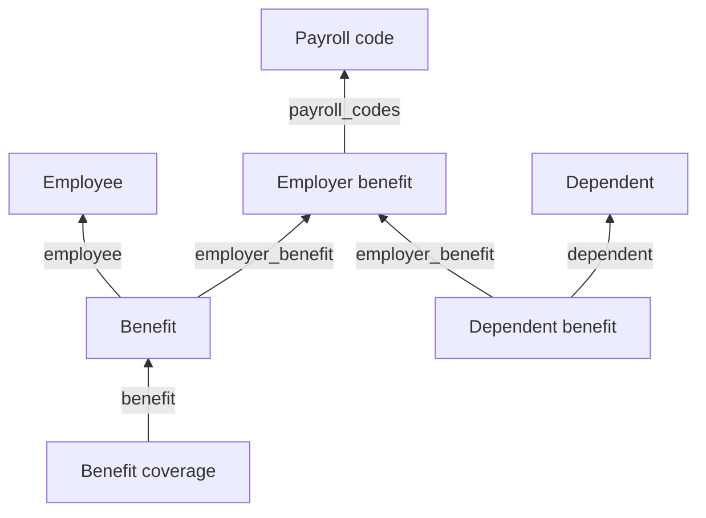

Four models carry benefits data with names close enough that picking the wrong one is easy, and a wrong pick returns a plausible number rather than an error. **Each answers for a different party** - the employer, one employee, one dependent, or one covered person.

## The models

| Model | Holds | Endpoint |
| --- | --- | --- |
| **Employer benefit** | The employer's catalog entry: `plan_name`, `provider_name`, `benefit_plan_category`, `payroll_codes`, `deduction_code` | [Get Employer Benefits](/hris/employer-benefits/get-employer-benefits) |
| **Benefit** | One employee's enrollment: `coverage_tier`, `employee_contribution`, `company_contribution`, `effective_date` | [Get Benefits](/hris/benefits/get-benefits) |
| **Dependent benefit** | Which plan covers a dependent: `dependent`, `employer_benefit` and dates | [Get Dependent Benefits](/hris/dependent-benefits/get-dependent-benefits) |
| **Benefit coverage** | How much each covered person is insured for: `amount`, `currency`, `is_employee_covered`, `covered_dependents` | [Get Benefit Coverages](/hris/benefit-coverages/get-benefit-coverages) |

An employer benefit is a catalog entry that exists whether or not anyone enrolls. A benefit is one employee's enrollment in it. Benefit coverage is **BETA** - field names and shapes can still change, so pin what you depend on.

<Note>
A dependent is not a benefits model. It is a person attached to an employee, read from [Get Dependents](/hris/dependents/get-dependents) and covered in [Employee data](/guides/data-models/employee-data). Dependent benefit is that person's coverage, not the person.
</Note>

## How they connect

**Benefit coverage attaches to the enrollment. Dependent benefit attaches to the plan.** So there is no direct link from a dependent's coverage to the employee's enrollment in the same plan - join both on `employer_benefit`, then reach the person through the dependent's own employee relation.

The employee pays for the plan, so **dependent benefit carries no money at all** - contributions sit on the enrollment, and a dependent's coverage extends it rather than being a separate financial record.

The employer benefit also holds `payroll_codes` and `deduction_code`, which is how a deduction line on a payroll run matches back to the plan - by ID, not by comparing code strings. Both fields can be empty, so check before relying on the link - see [Payroll](/guides/data-models/payroll).

## How many per employee

| Model | Per employee |
| --- | --- |
| Benefit | One per plan enrolled |
| Benefit coverage | One per covered person, per enrollment |
| Dependent benefit | One per plan, per dependent |

**Amounts are not on the enrollment.** Read only the benefit and you get the contribution and the tier, no insured sums, and nothing to tell you they are missing. Where a plan insures different amounts for the employee, the spouse and each child, each covered person gets a benefit coverage record.

Enrollments accumulate rather than update. An employee in their third year has three medical enrollments, not one record edited twice, so an unfiltered read returns history rather than what is true now.

Two dates on one enrollment are not the same day. A plan elected during open enrollment carries a `start_date` at election and an `effective_date` at the plan year boundary. Renewal also creates new plan records instead of editing old ones, so a plan ID stored last year will not resolve this year.

## What you can write

All four models are read-only. Enrollment changes happen in the source system and reach you on the next sync.

## Related

- [Read benefit enrollments](/get-started/use-cases/read-benefit-enrollments) - the catalog, enrollments and dependent coverage
- [Read benefit coverage](/get-started/use-cases/read-benefit-coverage) - the amounts behind an enrollment
- [Payroll](/guides/data-models/payroll) - the payroll code that joins the two
- [Employee data](/guides/data-models/employee-data) - where dependents live
- [Scoping](/get-started/scoping) - why a benefit field can be missing
