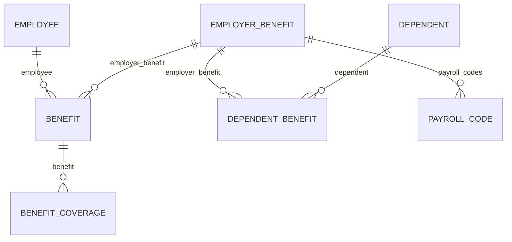

Four models carry benefits data, and their names are close enough that picking the wrong one is easy. Get it wrong and you will not see an error - you will just see a number that looks right and isn't.

The question to ask is not "what is this benefit?" **It is "whose fact is this?"**

## The models

| Model | Whose fact | Answers | Endpoint |
| --- | --- | --- | --- |
| **Employer benefit** | The employer's | What plans are offered? | [Get Employer Benefits](/hris/employer-benefits/get-employer-benefits) |
| **Benefit** | One employee's | Who enrolled, and what do they pay? | [Get Benefits](/hris/benefits/get-benefits) |
| **Dependent benefit** | A dependant's | Which plans is that person covered under? | [Get Dependent Benefits](/hris/dependent-benefits/get-dependent-benefits) |
| **Benefit coverage** | A covered party's | How much is each person insured for? | [Get Benefit Coverages](/hris/benefit-coverages/get-benefit-coverages) |

An employer benefit is a catalogue entry. It exists whether or not anyone enrols. A benefit is one employee's enrolment in it, so an employee on medical, dental and vision has three of them.

<Note>
Dependants are not a benefits model on their own. A dependant is a person attached to an employee, and they exist whether or not they are covered by anything. Coverage is the dependent benefit; the person is [an employee relation](/guides/data-models/employee-and-org), read from [Get Dependents](/hris/dependents/get-dependents).
</Note>

## How they link



Look closely and the diagram is uneven, and that unevenness is the point. **Benefit coverage attaches to the enrolment. Dependent benefit attaches to the plan.**

<Warning>
There is no direct link from a dependant's coverage to the employee's enrolment in the same plan. To group them, join both on `employer_benefit`, then find the person through the dependant's own employee relation.
</Warning>

Also, **dependent benefit carries no money at all** - no contribution fields, only `start_date`, `effective_date`, `end_date` and which plan covers whom. The employee pays for the benefit, so the contribution sits on their enrolment. A dependant's coverage just extends it - it is not a separate financial record.

That same pattern explains where amounts live. Some plans insure different sums for the employee, the spouse and each child - life insurance is the usual case. **An amount that changes per person cannot be a field on the enrolment**, because that would cap how many people a plan can cover.

So instead, each covered person gets their own benefit coverage record. If you read only the enrolment, you get the contribution and the tier - but no sums insured, and nothing tells you that's missing.

## Plan years bound everything

Benefits are the most time-bound data in an HR system. A plan year opens, enrolments run against it, contributions are deducted during it, and the whole structure is replaced when it renews.

Two things follow from that, and both can trip up a simple read.

**Enrolments pile up instead of updating.** An employee in their third year has three medical enrolments - not one record edited twice. Read the data without filtering and you get the full history, and treating that as "what's true now" overstates coverage.

**Renewal creates new identities.** Most systems create new plan records at renewal instead of editing the old ones, so plans that look identical across years are actually different objects. A plan ID you stored last year will not work this year.

The same time-boundedness shows up inside one enrolment, too. An employee elects a plan during open enrolment, but coverage only starts at the plan year boundary. So **an enrolment's `start_date` and its `effective_date` are not the same day** - there is a waiting period between them.

Neither benefits nor payroll records carry a plan year directly, so linking a deduction to one takes a cross-reference, not a simple lookup. **A deduction paid in January can belong to last year's plan**, because payroll timing and plan year boundaries don't line up. Use the benefit's effective dates to decide, not the payroll date.

## The payroll code is the join

**Benefits data describes intent** - who is enrolled in what, and what they agreed to pay. **Payroll data describes money that actually moved** - what was taken out of a paycheque, as deductions on an employee payroll run.

The employer benefit holds the link between the two:

- **`payroll_codes`** - references to the payroll code records tied to this plan.
- **`deduction_code`** - the customer's own code string for it, such as `MEDPPO`.

So the plan tells you which codes represent it in payroll. A deduction line on an employee payroll run carries `payroll_code` - the ID of that same record - so the two match by ID, not by comparing code strings.

Both fields can be empty, and not every integration fills them in. **Check before you assume the link is there.** Where it's missing, you'll need to hold that mapping yourself. See [Payroll](/guides/data-models/payroll).

## Reading benefits data

<Info>
  **Before you start**

  - The connector has synced, and the customer's benefits module is in scope.
</Info>

### Steps

<Steps>
  <Step title="Read the plans the employer offers">
    ```bash
    curl --request GET \
      --url 'https://api.bindbee.dev/api/hris/v1/employer-benefits?page_size=200' \
      --header 'Authorization: Bearer <BINDBEE_API_KEY>' \
      --header 'X-Connector-Token: <CONNECTOR_TOKEN>'
    ```

    Filter with `benefit_plan_category` to narrow down to medical, dental, and so on.

    **Result:** The plan catalogue for this customer.
  </Step>

  <Step title="Read enrolments">
    ```bash
    curl --request GET \
      --url 'https://api.bindbee.dev/api/hris/v1/benefits?employee_id=<EMPLOYEE_ID>&page_size=200' \
      --header 'Authorization: Bearer <BINDBEE_API_KEY>' \
      --header 'X-Connector-Token: <CONNECTOR_TOKEN>'
    ```

    Useful filters: `employee_id`, `employer_benefit_id`, `benefit_plan_category` and `coverage_tier`.

    Counting these to find out how many plans a customer offers will not work - it gives you an enrolment count, not a plan count. Read employer benefits for that instead.

    **Result:** Enrolment records linking employees to plans.
  </Step>

  <Step title="Use the date filters to scope a period">
    Benefits carry three separate date ranges, each with its own filter pair.

    | Filter pair | Bounds |
    | --- | --- |
    | `start_date_from` / `start_date_to` | When the benefit record starts |
    | `end_date_from` / `end_date_to` | When it ends |
    | `effective_date_from` / `effective_date_to` | When coverage takes effect |

    Start date and effective date are not the same thing. A benefit elected during open enrolment starts on election, and becomes effective at the plan year boundary. Filter on the wrong one and you get a different set of records.

    **Result:** Records scoped to the period you actually mean.
  </Step>

  <Step title="Read dependants and their coverage separately">
    ```bash
    # Who is a dependant
    curl --request GET \
      --url 'https://api.bindbee.dev/api/hris/v1/dependents?employee_id=<EMPLOYEE_ID>&page_size=200' \
      --header 'Authorization: Bearer <BINDBEE_API_KEY>' \
      --header 'X-Connector-Token: <CONNECTOR_TOKEN>'

    # What they are actually covered under
    curl --request GET \
      --url 'https://api.bindbee.dev/api/hris/v1/dependent-benefits?dependent_id=<DEPENDENT_ID>&page_size=200' \
      --header 'Authorization: Bearer <BINDBEE_API_KEY>' \
      --header 'X-Connector-Token: <CONNECTOR_TOKEN>'
    ```

    A dependant existing does not mean they are covered. Build coverage from dependent benefits, and use dependents for details like `date_of_birth` and `relationship`. Reading dependents alone and assuming coverage is the usual cause of an eligibility list with too many people on it.

    **Result:** An accurate picture of who is covered, not just who exists.
  </Step>

  <Step title="Read coverage amounts from the coverage model">
    Amounts are not on the enrolment. Where a plan insures different sums for the employee, the spouse and each child, those amounts live on benefit coverage - one record per covered person.

    ```bash
    curl --request GET \
      --url 'https://api.bindbee.dev/api/hris/v1/benefit-coverages?benefit_id=<BENEFIT_ID>&page_size=200' \
      --header 'Authorization: Bearer <BINDBEE_API_KEY>' \
      --header 'X-Connector-Token: <CONNECTOR_TOKEN>'
    ```

    Each record carries `amount` and `currency`, plus `is_employee_covered` and `covered_dependents` to say who the amount is for. This model is currently **BETA** - it works, but field names and shapes can still change, so pin what you depend on. See [Unified model & raw data](/get-started/core-concepts).

    Reading only the enrolment looks fine but isn't - you get the contribution and the tier, but no insured amounts, and nothing warns you they're missing. This is the most common mistake people make with benefits data.

    **Result:** How much each covered person is insured for, not just who is enrolled.
  </Step>
</Steps>

### If this didn't work

<AccordionGroup>
  <Accordion title="Benefits return nothing though the customer has enrolments">
    Most often it's a permissions issue - benefits are frequently a separately licensed module with its own access grant, and several platforms return an empty set rather than an error. See [Permission errors](/guides/troubleshooting/permission-errors).

    Also check that the model is in scope for this connector.
  </Accordion>

  <Accordion title="Dependants exist but no dependent benefits">
    Either they genuinely aren't enrolled, or dependant coverage isn't exposed on this integration. Check `raw_data` on a dependant you know is covered - see [Inspect raw data](/guides/reading-writing/raw-data).
  </Accordion>

  <Accordion title="Terminated employees still show active benefits">
    Benefit records don't automatically end when employment does - the source system usually ends coverage as a separate action, sometimes weeks later. Check the benefit's `end_date` instead of guessing from employment status.
  </Accordion>

  <Accordion title="Coverage tiers don't match the customer's naming">
    Tier names are platform- and customer-specific. Map their values to yours per connector rather than assuming a standard set.
  </Accordion>

  <Accordion title="A plan attribute isn't in the model">
    Contribution amounts, plan codes and carrier identifiers are often in `raw_data` but not unified. Map them as [custom fields](/guides/extending/custom-fields).
  </Accordion>
</AccordionGroup>

## Why it works this way

**Splitting the plan from the enrolment is what makes the data usable at any real size.** Put them together, and the plan's name, carrier and terms get copied onto every enrolled employee's record - inconsistent the moment one copy is updated and another isn't.

Stating the plan once means a correction to it is a correction everywhere.

**The separate coverage model exists because coverage isn't really part of the enrolment.** On a life insurance plan, giving each covered person their own record is the only shape that works for every case, without limiting how many people a plan can cover.

**Keeping dependants outside the benefits models follows the same idea.** A dependant is a person who exists whether or not they're covered - enrolled in some plans and not others, added mid-year, or not covered by anything at all.

## What this means for you

- **Read benefit coverages when amounts matter**, not just enrolments.
- **Join dependants to employees through the plan**, not through the employee's benefit row.
- **Filter enrolments by plan year.** An unfiltered read returns history.
- **Don't expect plan IDs to survive renewal.** Match on plan details instead.
- **Read `payroll_codes` on the plan before building your own mapping.** Fall back to your own only where it's empty.

## Related

- [Benefits endpoints](/hris/benefits/get-benefits) - the API reference
- [Payroll](/guides/data-models/payroll) - the payroll code that joins the two
- [Employee & org data](/guides/data-models/employee-and-org) - where dependants live
- [Scoping](/get-started/scoping) - why a benefit field can be missing
