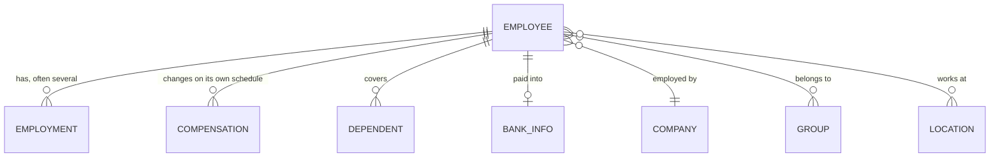

The field you are looking for is often not on the employee. Salary, cost centre, office, legal entity, dependants: all of these feel like employee attributes, and none of them are stored that way.

They change independently of the person, and usually more than once.

## Where each field lives
 
| Looking for | Read it from | Because |
| --- | --- | --- |
| Job title, employment type, dated role history | [**Employment**](/hris/employments/get-employments) | Changes independently, and there can be several |
| Salary, pay frequency, FLSA status | [**Compensation**](/hris/compensation/get-compensations) | Changes on its own schedule |
| Cost centre, team, division, business unit | [**Group**](/hris/groups/get-groups), filtered by `type` | One typed model, not one per concept |
| Office address, tax jurisdiction | [**Location**](/hris/locations/get-locations) | A workplace is not an organisational unit |
| Legal name, EINs | [**Company**](/hris/companies/get-companies) | A legal fact, not an organisational one |
| Spouse, children, their DOB and SSN | [**Dependent**](/hris/dependents/get-dependents) | Attached to the employee, not part of them |
| Account and routing numbers | [**Bank info**](/hris/bank-info/get-bank-info-list) | Held apart because of what it costs you to hold |
| Whether they still work there | [**Employee**](/hris/employee/get-employees) | Status is person-level, not position-level |

## How the person's records relate

| Model | Holds | Dated by | Several per person? |
| --- | --- | --- | --- |
| **Employee** | Names, contact, DOB, demographics, status, termination | Not dated | No |
| **Employment** | `job_title`, `employment_type`, `department`, `division` | `effective_date` | Yes, routinely |
| **Compensation** | `pay_rate`, `pay_period`, `pay_currency`, `flsa_status` | `start_date` | Yes, independently |

A promotion recorded as a new position, a transfer, a move between full-time and part-time, or a rehire each add an employment. A raise with no title change adds a compensation record and no employment.

<Warning>
Neither dated model carries an end date. **The current record is the one with the latest date, never the first element of the array.** Ordering is not meaningful.

Whether the person still works there is answered on the employee. See [Status & terminations](/guides/data-models/employment-status).
</Warning>

Read `pay_rate` with `pay_period` and `pay_currency`. On its own it is a bare number, and `flsa_status` is the field for exempt status, not something to infer from the pay period.

### The employee-level copies are a convenience

`designation`, `department` and `division` also appear on the employee, populated from whatever the source exposes as current at the top level. They are fine for a list view and misleading for anything else: not populated on every integration, no dates, and unable to represent two concurrent positions.

`work_location` and `home_location` are the same story. They are inline addresses. `work_locations` is the array of [Location](/hris/locations/get-locations) IDs, and that is what to expand for a real workplace record.

## The organisation side

**Group** covers departments, teams, divisions, business units and cost centres in one model. `type` is `DEPARTMENT`, `TEAM`, `DIVISION`, `BUSINESS_UNIT` or `COST_CENTER`, and `parent_group` rebuilds the hierarchy.

There is no dedicated department or cost-centre model, which surprises most people. Source systems disagree too profoundly for one: some run a single hierarchy, some run separate trees for reporting, cost allocation and legal entity, some let customers invent dimensions. One typed model maps everywhere. You pay for it with a filter on every read.

**Location** stays separate, because people from several departments share an office and a department spans several sites. It is **BETA**, so pin what you depend on.

**Company** holds `legal_name`, `display_name` and `eins`: a legal fact rather than an organisational one. A customer running several entities may have them as multiple companies under one connector or as separate connectors. Both occur and neither is wrong.

## Two models worth an explicit decision

**Dependent** carries a spouse or child's name, `relationship`, `date_of_birth`, `gender`, `is_student`, `ssn` and a home address. It is what benefits eligibility runs on, and it is personal data about people who are not your customer's employees. Coverage elections live in [Dependent benefits](/hris/dependent-benefits/get-dependent-benefits).

**Bank info** carries `account_number` and `routing_number` as real values, not masked ones.

<Warning>
Bank info is the most sensitive model in the API. Syncing it expands what you store, what you must protect and what you answer for in a security review. **Scope it out unless you have a specific reason to hold it.** See [Scope & permissions](/get-started/scoping).
</Warning>

## Model-specific filters

`ids`, `remote_id`, `modified_after`, `page_size` and `cursor` are on every endpoint. These are the rest.

| Endpoint | Also filters on |
| --- | --- |
| Employees | `manager_id`, `company_id`, `groups`, `work_locations`, `pay_group_id`, `employment_status` |
| Employments | `employee_id`, `employment_type` |
| Compensation | `employee_id`, `pay_group_id`, `start_date_from`, `start_date_to` |
| Dependents | `employee_id` |
| Bank info | `employee_id`, `account_type` |
| Groups | `type`, `parent_group_id` |

Because the data is spread across models by design, reading it back means `expand` or a second call. Prefer `expand`: one larger response beats the N+1 pattern that exhausts a connector's rate limit. See [Querying data](/guides/reading-writing/querying-data).

## Why it works this way

Separating employment and compensation from the employee is what makes history representable at all.

As employee fields, every change would overwrite the last. A promotion would be indistinguishable from a correction, and anything needing a point-in-time view (payroll reconciliation, eligibility on a past date, an audit) would be impossible. You pay a join and a decision about which record is current. In exchange the data can answer questions about the past, which is much of what HR data is for.

## What this means for you

- **Select the current employment by latest `effective_date`**, and the current compensation by latest `start_date`.
- **Treat `designation`, `department` and `division` on the employee as display only.**
- **Filter groups by `type`** rather than looking for a department model.
- **Scope bank info and dependents deliberately.** The numbers in both are real.

## Related

- [Employee endpoints](/hris/employee/get-employees) - the API reference
- [Querying the data](/guides/reading-writing/querying-data) - filters and modified_after
- [Scoping](/get-started/scoping) - why a field can be absent
