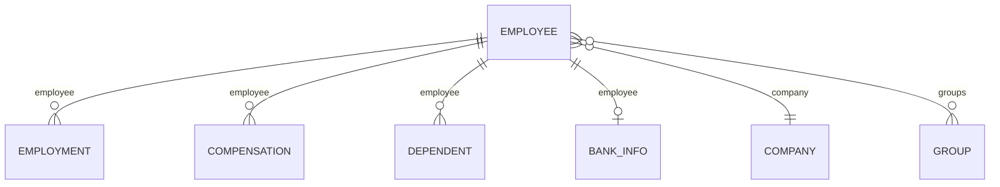

The field you're looking for is often not on the employee. Salary, cost centre, office, legal entity, dependants - all of these feel like they should live on the employee, and none of them do.

**They change on their own, separately from the person, and often more than once.**

## The models

| Model | Holds | Endpoint |
| --- | --- | --- |
| **Employee** | Names, contact, DOB, demographics, `employment_status`, termination | [Get Employees](/hris/employee/get-employees) |
| **Employment** | `job_title`, `employment_type`, `department`, `division`, dated by `effective_date` | [Get Employments](/hris/employments/get-employments) |
| **Compensation** | `pay_rate`, `pay_period`, `pay_frequency`, `pay_currency`, `flsa_status`, dated by `start_date` | [Get Compensations](/hris/compensation/get-compensations) |
| **Group** | Departments, teams, divisions, business units and cost centres, by `type` | [Get Groups](/hris/groups/get-groups) |
| **Location** | Office address, tax jurisdiction | [Get Locations](/hris/locations/get-locations) |
| **Company** | `legal_name`, `display_name`, `eins` | [Get Companies](/hris/companies/get-companies) |
| **Dependent** | A spouse or child, with `relationship`, `date_of_birth`, `ssn` | [Get Dependents](/hris/dependents/get-dependents) |
| **Bank info** | `account_number`, `routing_number`, `account_type` | [Get Bank Info](/hris/bank-info/get-bank-info-list) |

Employment and compensation are the two dated models, and a person usually has several records in each. Every other model has just one per person.

## How they link



**The ID sits on the child record in the first four cases, and on the employee in the last two** - and that decides how you read each one. For employments, compensations, dependants and bank info, you filter their own endpoint on `employee_id`. Company and groups are already IDs on the employee record, so they can just be expanded inline.

`work_locations` links the employee to [Location](/hris/locations/get-locations) the same way `groups` does. `manager` and `pay_group` work the same way too.

## Where each field lives

| Looking for | Read it from | Because |
| --- | --- | --- |
| Job title, employment type, dated role history | **Employment** | Changes on its own, and there can be several |
| Salary, pay frequency, FLSA status | **Compensation** | Changes on its own schedule |
| Cost centre, team, division, business unit | **Group**, filtered by `type` | One model covers all of them |
| Office address, tax jurisdiction | **Location** | A workplace isn't an organisational unit |
| Legal name, EINs | **Company** | A legal fact, not an organisational one |
| Spouse, children, their DOB and SSN | **Dependent** | Attached to the employee, not part of them |
| Account and routing numbers | **Bank info** | Kept separate because of what it costs you to hold |
| Whether they still work there | **Employee** | Status belongs to the person, not the job |

That last row is the one people search hardest for elsewhere. `employment_status`, `termination_date` and `termination_reason` all live on the employee, not on the employment. A person's employment history can hold several past positions, and none of them says whether the person still works there.

`employment_status` carries values like `ACTIVE`, `PENDING`, `INACTIVE`, `LEAVE` and `RETIRED`, and connector-specific values pass through as-is. See [Enum values](/guides/reading-writing/enum-values).

## Picking the record you meant

A promotion recorded as a new position, a transfer, a switch between full-time and part-time, or a rehire - each of these adds a new employment record. A raise with no title change adds a compensation record and nothing else.

<Warning>
Neither dated model carries an end date. **The current record is whichever one has the latest date - never the first item in the list.** Array order means nothing.
</Warning>

Read `pay_rate` together with `pay_period` and `pay_currency`. On its own it's just a number. And `flsa_status` is the actual field for exempt status - don't try to guess it from the pay period.

## The organisation side

**Group** covers departments, teams, divisions, business units and cost centres in one model. `type` is `DEPARTMENT`, `TEAM`, `DIVISION`, `BUSINESS_UNIT` or `COST_CENTER`, and `parent_group` rebuilds the hierarchy.

There's no separate department model or cost-centre model, which surprises most people. Source systems don't agree closely enough for one to work: some run a single hierarchy, some run separate trees for reporting, cost allocation and legal entity, and some let customers invent their own. One typed model covers every case. The cost is a filter on every read.

**Location** stays separate, because people from several departments can share an office, and a department can span several sites. It's **BETA**, so pin what you depend on.

**Company** holds `legal_name`, `display_name` and `eins` - a legal fact, not an organisational one. A customer running several entities might have them as multiple companies under one connector, or as separate connectors entirely. Both happen, and neither is wrong.

## Two models worth an explicit decision

**Dependent** carries a spouse or child's name, `relationship`, `date_of_birth`, `gender`, `is_student`, `ssn` and a home address. It's what benefits eligibility runs on, and it's personal data about people who aren't your customer's employees. Coverage elections live in [Dependent benefits](/hris/dependent-benefits/get-dependent-benefits) - see [Benefits](/guides/data-models/benefits).

**Bank info** carries `account_number` and `routing_number` as real values, not masked ones.

<Warning>
Bank info is the most sensitive model in the API. Syncing it means more to store, more to protect, and more to answer for in a security review. **Leave it out of scope unless you have a specific reason to hold it.** See [Scope & permissions](/get-started/scoping).
</Warning>

## Reading employee & org data

<Info>
  **Before you start**

  - The connector has synced, and the models you need are in scope - see [Scoping](/get-started/scoping).
</Info>

### Steps

<Steps>
  <Step title="Read employees, filtered rather than whole">
    ```bash
    curl --request GET \
      --url 'https://api.bindbee.dev/api/hris/v1/employees?employment_status=ACTIVE&page_size=200' \
      --header 'Authorization: Bearer <BINDBEE_API_KEY>' \
      --header 'X-Connector-Token: <CONNECTOR_TOKEN>'
    ```

    `ids`, `remote_id`, `modified_after`, `page_size` and `cursor` work on every endpoint. These are the ones specific to each model:

    | Endpoint | Also filters on |
    | --- | --- |
    | Employees | `manager_id`, `company_id`, `groups`, `work_locations`, `pay_group_id`, `employment_status`, `employee_number`, `first_name`, `last_name`, `work_email` |
    | Employments | `employee_id`, `employment_type` |
    | Compensations | `employee_id`, `pay_group_id`, `start_date_from`, `start_date_to` |
    | Dependents | `employee_id` |
    | Bank info | `employee_id`, `account_type` |
    | Groups | `type`, `parent_group_id` |

    **Result:** The people you meant, not everyone.
  </Step>

  <Step title="Expand the relations the employee actually carries">
    ```bash
    curl --request GET \
      --url 'https://api.bindbee.dev/api/hris/v1/employees?expand=manager[first_name,last_name],company,groups&page_size=200' \
      --header 'Authorization: Bearer <BINDBEE_API_KEY>' \
      --header 'X-Connector-Token: <CONNECTOR_TOKEN>'
    ```

    `expand` only works on ID fields already on the employee record - `manager`, `company`, `groups`, `work_locations`, `pay_group`. List them with commas and no spaces, and narrow each with `[field,field]` to keep the response small. See [Querying data](/guides/reading-writing/querying-data).

    **Result:** Related records inline, without a second call.
  </Step>

  <Step title="Read dated history in bulk, not one employee at a time">
    Employment and compensation are not fields on the employee, so you can't expand them from it. Read their own endpoints instead, and group the results yourself.

    ```bash
    curl --request GET \
      --url 'https://api.bindbee.dev/api/hris/v1/employments?page_size=200' \
      --header 'Authorization: Bearer <BINDBEE_API_KEY>' \
      --header 'X-Connector-Token: <CONNECTOR_TOKEN>'
    ```

    Calling this once per employee in a loop is what burns through a connector's rate limit on a large workforce. Page through the whole collection once instead, and sort the results by the `employee` field.

    **Result:** Every position and pay record, in as few calls as the page size allows.
  </Step>

  <Step title="Select the current record by latest date">
    Neither model carries an end date, and the order of the list means nothing.

    ```python
    current_employment = max(employments, key=lambda e: e["effective_date"])
    current_comp       = max(compensations, key=lambda c: c["start_date"])
    ```

    Whether the person still works there is a different question, answered by `employment_status` on the employee.

    **Result:** One position and one pay rate per person, picked on purpose.
  </Step>

  <Step title="Filter groups by type">
    ```bash
    curl --request GET \
      --url 'https://api.bindbee.dev/api/hris/v1/groups?type=COST_CENTER&page_size=200' \
      --header 'Authorization: Bearer <BINDBEE_API_KEY>' \
      --header 'X-Connector-Token: <CONNECTOR_TOKEN>'
    ```

    There's no department endpoint and no cost-centre endpoint. To rebuild a hierarchy, follow `parent_group`.

    **Result:** One organisational dimension at a time, instead of all of them mixed together.
  </Step>
</Steps>

### If this didn't work

<AccordionGroup>
  <Accordion title="An employee's job title is empty">
    `designation` on the employee is a convenience copy, and it's not filled in on every integration. Read `job_title` from the current employment instead.
  </Accordion>

  <Accordion title="Someone has several employments and you expected one">
    That's expected. Promotions, transfers, employment-type changes and rehires each add a new record instead of editing the last one. Pick the record with the latest `effective_date`.
  </Accordion>

  <Accordion title="Salary looks wrong by a factor of ten or more">
    `pay_rate` means nothing without `pay_period`. An hourly rate and an annual salary use the same field. Read both, plus `pay_currency`, before comparing anything.
  </Accordion>

  <Accordion title="Groups returns departments and cost centres mixed together">
    `type` wasn't passed. One typed model covers every organisational dimension, so reading it without a filter returns all of them at once.
  </Accordion>

  <Accordion title="Bank info or dependents return nothing">
    Most likely it's scoped out on purpose - both are commonly excluded, and a model outside scope is never synced. Check [Scoping](/get-started/scoping) before assuming it's a permissions problem.
  </Accordion>

  <Accordion title="Locations are missing or thin">
    Location is **BETA** and coverage varies by connector. Check `raw_data` for the address on an employee you know has one - see [Inspect raw data](/guides/reading-writing/raw-data).
  </Accordion>
</AccordionGroup>

## Why it works this way

Keeping employment and compensation off the employee is what makes history possible at all.

As fields on the employee, every change would just overwrite the last one. A promotion would look no different from a correction, and anything that needs a view of the past - payroll reconciliation, eligibility on a given date, an audit - would be impossible.

The cost is a join, and a decision about which record is current. In return, the data can answer questions about the past, which is a large part of what HR data is for.

**One typed Group model makes the same trade, but for variety instead of time.** Source systems don't agree on how many organisational dimensions exist, so a model per concept would fit some customers and miss the rest. A `type` field fits all of them, at the cost of a filter on every read.

## What this means for you

- **Pick the current employment by latest `effective_date`**, and the current compensation by latest `start_date`.
- **Treat `designation`, `department` and `division` on the employee as display only** - read the real values from employment and compensation.
- **Read employment and compensation from their own endpoints**, in bulk, not by expanding from the employee.
- **Filter groups by `type`** instead of looking for a department model.
- **Read `employment_status` on the employee** to find out if someone still works there.
- **Scope bank info and dependents on purpose.** The numbers in both are real, not masked.

## Related

- [Employee endpoints](/hris/employee/get-employees) - the API reference
- [Querying the data](/guides/reading-writing/querying-data) - filters, `expand` and `modified_after`
- [Benefits](/guides/data-models/benefits) - what dependants are covered under
- [Scoping](/get-started/scoping) - why a field can be missing
