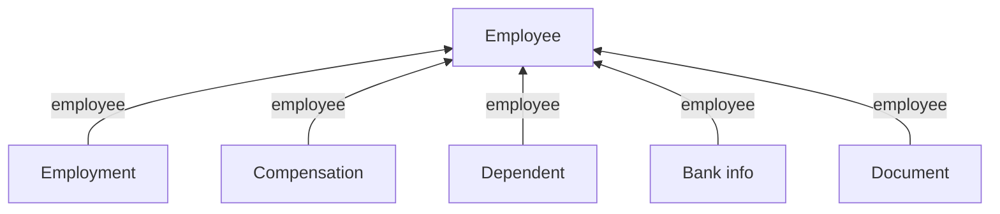

Six models describe one person. **Employee** holds who they are. The rest hang off it, and anything that changes over time gets a new dated record instead of overwriting the old one.

## The models

| Model | Holds | Endpoint |
| --- | --- | --- |
| **Employee** | Who someone is: names, contact, DOB, demographics, and `employment_status` | [Get Employees](/hris/employee/get-employees) |
| **Employment** | One dated role: `job_title`, `employment_type`, `effective_date` | [Get Employments](/hris/employments/get-employments) |
| **Compensation** | One dated pay record: `pay_rate`, `pay_period`, `pay_frequency`, `flsa_status` | [Get Compensations](/hris/compensation/get-compensations) |
| **Dependent** | A spouse or child: `date_of_birth`, `relationship`, `ssn` | [Get Dependents](/hris/dependents/get-dependents) |
| **Bank info** | `account_number` and `routing_number`, unmasked | [Get Bank Info](/hris/bank-info/get-bank-info-list) |
| **Document** | Stored files, typed `W4`, `I9` or `OTHER` | [Get Documents](/hris/documents/get-documents) |

## How they connect



Every model carries the employee's ID, so you read each from its own endpoint and filter on `employee_id`. Compensation also points at a pay group - see [Payroll](/guides/data-models/payroll).

## How many per employee

| Model | Per employee |
| --- | --- |
| Employee | Exactly one |
| Employment, Compensation | Several, dated |
| Dependent, Document | Several |
| Bank info | None or one |

For Employment & Compensation, **the current record is the one with the latest date**, never the first in the list. Employment is dated by `effective_date`& compensation by `start_date`.

```json
{ "id": "emp_1", "employment_status": "ACTIVE" }

{ "employee": "emp_1", "job_title": "Engineer II", "effective_date": "2024-03-01" }
{ "employee": "emp_1", "job_title": "Engineer",    "effective_date": "2022-01-10" }
```

If an employee is still working or not is answered via `employment_status`, `termination_date` and `termination_reason` which all are present in the **employee** model. `employment_status` has a fixed set of values - see [Enum values](/guides/reading-writing/enum-values).

## What you can write

Currently **Employee** accepts writes here - see [Create an employee](/get-started/use-cases/create-an-employee).

## Related

- [Organization](/guides/data-models/organization) - the company, groups and offices an employee points at
- [Filters](/guides/reading-writing/reading-data/filters) - what each endpoint filters on
- [Benefits](/guides/data-models/benefits) - what dependents are covered under
