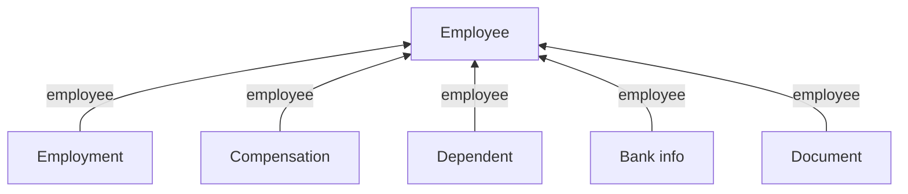

**Employee** holds who someone is and whether they still work there. **Employment** and **Compensation** hold what they do and what they're paid, with a new dated record each time either changes.

Dependants, bank details and documents attach to the employee the same way.

## The shape

Every model here carries the employee's ID, so you read each one from its own endpoint and filter on `employee_id`.



One person with two roles and two pay records:

```json
{ "id": "emp_1", "employment_status": "ACTIVE", "company": "co_1" }

{ "employee": "emp_1", "job_title": "Engineer II", "effective_date": "2024-03-01" }
{ "employee": "emp_1", "job_title": "Engineer",    "effective_date": "2022-01-10" }

{ "employee": "emp_1", "pay_rate": 95000, "pay_period": "YEAR", "start_date": "2024-03-01" }
{ "employee": "emp_1", "pay_rate": 80000, "pay_period": "YEAR", "start_date": "2022-01-10" }
```

## Find a field

| Looking for | Read it from | Endpoint |
| --- | --- | --- |
| Names, contact, DOB, demographics, whether they still work there | **Employee** | [Get Employees](/hris/employee/get-employees) |
| `job_title`, `employment_type`, dated role history | **Employment** | [Get Employments](/hris/employments/get-employments) |
| `pay_rate`, `pay_period`, `pay_frequency`, `flsa_status` | **Compensation** | [Get Compensations](/hris/compensation/get-compensations) |
| A spouse or child, their DOB and SSN | **Dependent** | [Get Dependents](/hris/dependents/get-dependents) |
| `account_number`, `routing_number` | **Bank info** | [Get Bank Info](/hris/bank-info/get-bank-info-list) |
| Stored files and W-4 data | **Document** | [Get Documents](/hris/documents/get-documents) |

Where the person sits in the organisation - company, group, office - lives in [Organization](/guides/data-models/organization).

<Note>
  `designation`, `department` and `division` on the employee are convenience copies, and not
  every integration fills them in. The real values live on the current employment.
</Note>

## How many of each

| Model | Per person |
| --- | --- |
| Employee | Exactly one |
| Employment, Compensation | Several, dated |
| Dependent, Document | Several |
| Bank info | None or one |

A promotion, a transfer, a switch between full-time and part-time, or a rehire each adds an employment record. A raise with no title change adds a compensation record and nothing else.

## Picking the current record

<Warning>
Neither dated model carries an end date. **The current record is whichever one has the latest date - never the first item in the list.** Array order means nothing.
</Warning>

The current employment is the one with the latest `effective_date`; the current compensation the one with the latest `start_date`.

Whether the person still works there is a separate question. `employment_status`, `termination_date` and `termination_reason` all live on the **employee**, not the employment - an employment history can hold several past positions and none of them says whether the person left. `employment_status` is open-ended, so connector-specific values pass through as-is; see [Enum values](/guides/reading-writing/enum-values).

Read `pay_rate` with `pay_period` and `pay_currency`. On its own it's just a number - an hourly rate and an annual salary use the same field. `flsa_status` is the actual field for exempt status.

## Models that are a scoping decision

**Bank info** carries `account_number` and `routing_number` as real values, not masked ones. **Dependent** carries a spouse or child's `date_of_birth`, `gender`, `ssn` and home address - personal data about people who aren't your customer's employees. **Document** stores files, including W-4 tax data, behind a download endpoint.

<Warning>
Each one adds to what you store and what you have to protect.
**Leave them out of scope unless you have a specific reason to hold them.** See
[Scope & permissions](/get-started/scoping).
</Warning>

A model outside scope never syncs, so an empty response points at a scoping decision before a permissions problem.

## Why it works this way

Keeping employment and compensation off the employee is what makes history possible at all.

As fields on the employee, every change would overwrite the last one. A promotion would look no different from a correction, and anything needing a view of the past - payroll reconciliation, eligibility on a date, an audit - would be impossible.

The cost is a join, and a decision about which record is current. What you get back is a dataset that can answer questions about any date, not just today.

## What this means for you

- **Pick the current employment by latest `effective_date`**, and the current compensation by latest `start_date`.
- **Read `employment_status` on the employee** to find out whether someone still works there.
- **Treat `designation`, `department` and `division` on the employee as display only.**
- **Read every model here from its own endpoint**, filtered on `employee_id`.
- **Scope bank info, dependents and documents on purpose**, not by default.

## Related

- [Organization](/guides/data-models/organization) - the company, groups and offices an employee points at
- [Employee endpoints](/hris/employee/get-employees) - the API reference
- [Filters](/guides/reading-writing/reading-data/filters) - what each endpoint filters on
- [Benefits](/guides/data-models/benefits) - what dependants are covered under
