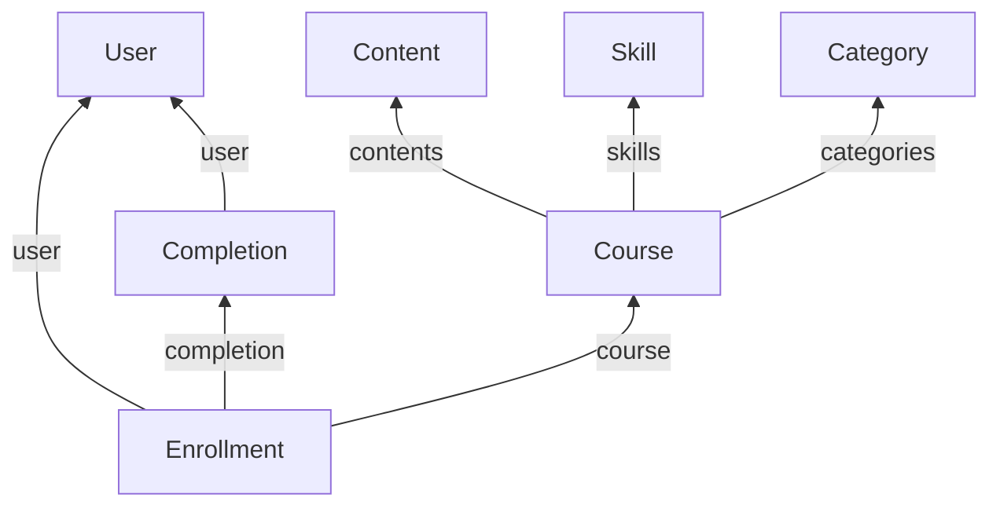

Learning data answers two questions: what training exists, and who has done it. Seven models cover both, and the split that decides your reporting is **assigned versus achieved** - report the first as the second and someone counts as trained when the data only says they were told to be.

## The models

| Model | Holds | Endpoint |
| --- | --- | --- |
| **Course** | The unit of learning people are assigned: `name`, `duration`, `status`, `instructors` | [Get Courses](/lms/courses/get-courses) |
| **Content** | Material inside courses - modules, videos, documents | [Get Contents](/lms/contents/get-contents) |
| **Category** | Groups courses, using the customer's own categories | [Get Categories](/lms/categories/get-categories) |
| **Skill** | A competency that courses and content point at | [Get Skills](/lms/skills/get-skills) |
| **User** | A learner in the LMS, with `email_address` and `status` | [Get Users](/lms/users/get-users) |
| **Enrollment** | An assignment: `user`, `course`, `start_date`, `completion` | [Get Enrollments](/lms/enrollments/get-enrollments) |
| **Completion** | An achievement: `completed_at`, `time_duration`, `score`, `grade` | [Get Completions](/lms/completions/get-completions) |

Coverage thins toward the top of that list. Where a system does not separate content from courses, content is sparse or absent, and **many LMS platforms have no concept of skills at all**, so that model comes back empty for those integrations.

<Warning>
Course, content, category, skill and user all carry a `status` of `ACTIVE`, `PENDING` or `INACTIVE`. **Read without filtering and you get retired courses and deactivated learners**, which inflates any compliance count built on top.
</Warning>

## How they connect

An enrollment points straight at its completion, so **finding outstanding training is a null check on a record you already hold**, not a join you build. An enrollment with an empty `completion` is training assigned but not finished, and in a compliance context that gap is the report.

Course and content reference each other both ways, so one video used across three courses is one record rather than three. Skills attach to courses and content the same way.

**A learner is not an employee.** LMS user IDs and HRIS employee IDs do not correspond, so join on `email_address` and keep a bucket for learners with no employee record - contractors, leavers and outside participants routinely have one without the other.

## How many per user

| Model | Per user |
| --- | --- |
| Enrollment | One per course assigned |
| Completion | One per course or module finished, and one per repeat |

A completion references either a `course` **or** a `content`, so finishing one module counts as its own completion. Count completions without checking which field is set and you overstate how many full courses someone finished.

Recurring compliance training produces one dated completion per cycle rather than overwriting the last, which is why the two models stay separate: a single record with a status field could only hold the most recent one.

## Related

- [Passthrough](/guides/extending/passthrough) - the only write route for LMS
- [Record identity](/guides/reading-writing/record-identity) - matching learners to employees
- [Scoping](/get-started/scoping) - why a model can come back empty
- [Authentication](/api-reference/basics/authentication) - why an HRIS token returns `403` on LMS
