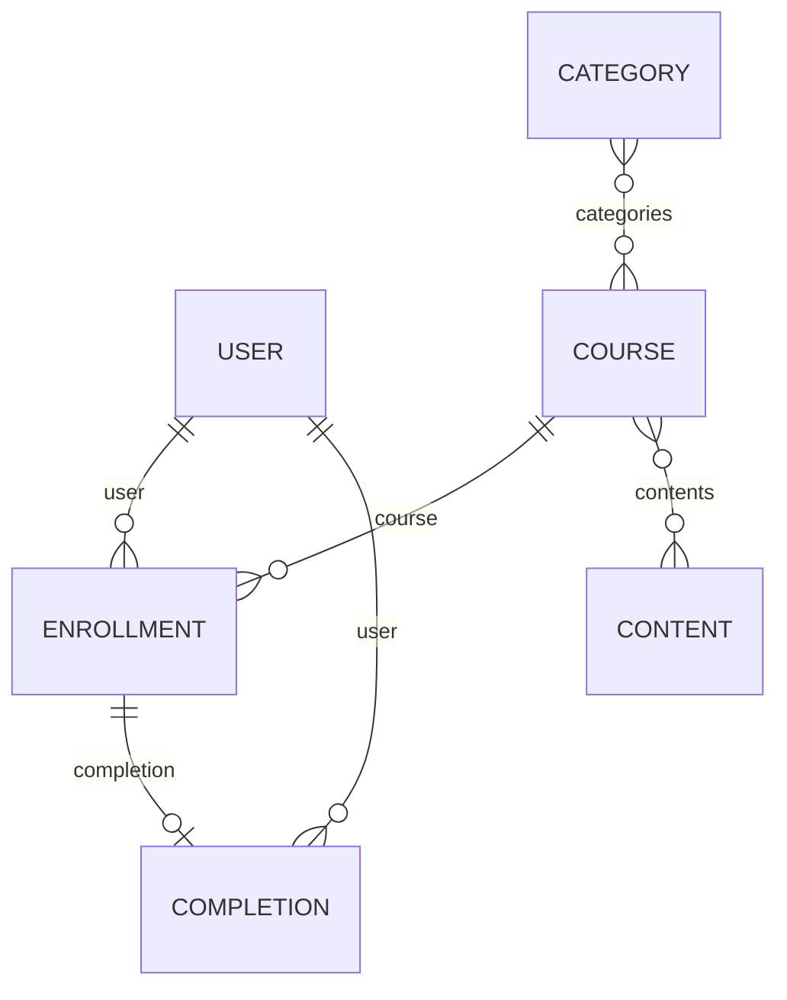

Learning data answers two questions: what training exists, and who has done it. Seven models cover both, and **the split between "assigned" and "achieved" is the one that matters.**

Get that split wrong, and you'll report someone as trained when the data only says they were told to be.

## The models

| Model | Holds | Endpoint |
| --- | --- | --- |
| **Course** | The unit of learning people are assigned and complete | [Get Courses](/lms/courses/get-courses) |
| **Content** | Material inside courses - modules, videos, documents | [Get Contents](/lms/contents/get-contents) |
| **Category** | Groups courses, using the customer's own categories | [Get Categories](/lms/categories/get-categories) |
| **Skill** | A competency, linked to courses that build or test it | [Get Skills](/lms/skills/get-skills) |
| **User** | A learner in the LMS | [Get Users](/lms/users/get-users) |
| **Enrollment** | An assignment: `user`, `course`, `start_date`, `completion` | [Get Enrollments](/lms/enrollments/get-enrollments) |
| **Completion** | An achievement: `completed_at`, `time_duration`, `score`, `grade` | [Get Completions](/lms/completions/get-completions) |

Coverage gets thinner toward the top of that list. Where a system doesn't separate content from courses, content may be sparse or missing entirely, and **many LMS platforms have no idea of "skills" at all** - the model will just be empty for those integrations.

## How they link



**The `completion` edge is the one worth noticing.** An enrolment points straight at its completion, so finding outstanding training is a null check on a record you already have - not a join you have to build.

Course and content reference each other both ways - a course has `contents`, a content item has `courses` - so it's a many-to-many relationship. One video used across three courses is one record, not three. Skills attach to courses and content the same way.

## Assignment and achievement are separate

**Enrollment** is an assignment - someone has been given a course, or started one. It says nothing about whether they finished.

**Completion** is an achievement - someone finished, with `completed_at`, `time_duration`, and where the system tracks them, `score` and `grade` (`A` to `D`, `F`, `PASS`, `FAIL` or `-`).

A completion references a `course` **and** a `content`, so finishing one module inside a course counts as its own completion. Count completions per learner without checking which field is set, and you'll overstate how many full courses they finished.

Reading enrolments as if they were training records is the most common mistake here, and in a compliance context, a costly one. **An enrolment just means the training was assigned - which is exactly what someone out of compliance also has.**

<Warning>
Enrollment carries a `completion` reference, so **finding outstanding training is a null check**, not a matching exercise: an enrolment with an empty `completion` is training that was assigned but not finished. If your product reports on compliance, that gap is the report - not the enrolment count.
</Warning>

## LMS users are not HRIS employees

**User** is a learner inside the LMS, and that's a separate identity from the HRIS employee - even when it's the same person.

The two systems are set up independently, and their IDs don't match up. To join learning data to employee data, match on something stable - `email_address` on the user is usually the only field you can rely on.

**Expect some learners not to match.** Contractors, former employees and outside participants often have LMS accounts with no HRIS record at all. Plan for that case explicitly instead of treating an unmatched learner as an error.

## Reading learning data

<Info>
  **Before you start**

  - The connector is an LMS connector. A connector token only works for one API category, so an HRIS token on `/api/lms/v1/*` returns `403` - see [Authentication](/api-reference/basics/authentication).
</Info>

### Steps

<Steps>
  <Step title="Read the catalogue, filtered by status">
    ```bash
    curl --request GET \
      --url 'https://api.bindbee.dev/api/lms/v1/courses?status=ACTIVE&page_size=200' \
      --header 'Authorization: Bearer <BINDBEE_API_KEY>' \
      --header 'X-Connector-Token: <CONNECTOR_TOKEN>'
    ```

    <Warning>
      Course, content, category, skill and user all carry a `status` of `ACTIVE`, `PENDING` or `INACTIVE`. **Read the catalogue without filtering, and you'll get retired and unpublished courses too** - and an unfiltered user read includes deactivated learners. A compliance count built on top of that includes people and courses that aren't live anymore.
    </Warning>

    Narrow further with `categories`, `skills` or `languages`.

    **Result:** The courses that are actually live.
  </Step>

  <Step title="Read enrolments">
    ```bash
    curl --request GET \
      --url 'https://api.bindbee.dev/api/lms/v1/enrollments?course=<COURSE_ID>&page_size=200' \
      --header 'Authorization: Bearer <BINDBEE_API_KEY>' \
      --header 'X-Connector-Token: <CONNECTOR_TOKEN>'
    ```

    Filter by `user` for one learner, or `course` for everyone assigned a given course. `start_date_from` and `start_date_to` scope the assignment period.

    **Result:** Who was assigned what, and when.
  </Step>

  <Step title="Find outstanding training with a null check">
    An enrolment with an empty `completion` is training that's been assigned but not finished. No join needed.

    ```python
    outstanding = [e for e in enrollments if not e["completion"]]
    ```

    This is the compliance report. Counting enrolments instead just reports the assignment, which everyone out of compliance also has.

    **Result:** The people who still owe the training.
  </Step>

  <Step title="Read completions for what was actually finished">
    ```bash
    curl --request GET \
      --url 'https://api.bindbee.dev/api/lms/v1/completions?user=<USER_ID>&page_size=200' \
      --header 'Authorization: Bearer <BINDBEE_API_KEY>' \
      --header 'X-Connector-Token: <CONNECTOR_TOKEN>'
    ```

    Filter by `user`, `course`, `content` or `grade`; scope by date with `completed_at_from` and `completed_at_to`.

    Check whether `course` or `content` is set before you count anything. A completion against a `content` is one module finished, not one whole course.

    **Result:** Achievements, dated, with scores where the platform tracks them.
  </Step>

  <Step title="Match learners to employees on email">
    ```bash
    curl --request GET \
      --url 'https://api.bindbee.dev/api/lms/v1/users?email_address=<EMAIL>&status=ACTIVE' \
      --header 'Authorization: Bearer <BINDBEE_API_KEY>' \
      --header 'X-Connector-Token: <CONNECTOR_TOKEN>'
    ```

    LMS user IDs and HRIS employee IDs don't correspond. Match on `email_address`, and keep a separate bucket for learners with no employee record instead of dropping them.

    **Result:** Learning data tied to real people, with the unmatched ones called out.
  </Step>
</Steps>

### If this didn't work

<AccordionGroup>
  <Accordion title="Every request returns 403">
    A connector token only works for one API category. An HRIS connector called on `/api/lms/v1/*` returns `403` even with valid credentials.
  </Accordion>

  <Accordion title="Skills or contents return nothing">
    Expected on many integrations. A large share of LMS platforms have no concept of skills, and some don't separate content from courses. Check `raw_data` before treating it as a sync problem - see [Inspect raw data](/guides/reading-writing/raw-data).
  </Accordion>

  <Accordion title="Completion counts are higher than course counts">
    Completions reference either a `course` or a `content`. Module-level completions are being counted as course completions - check which field is set.
  </Accordion>

  <Accordion title="Learners don't match any employee">
    Expected for contractors, former employees and outside participants. They hold LMS accounts with no HRIS record, and `email_address` is the only field you can reliably join on - see [Record identity](/guides/reading-writing/record-identity).
  </Accordion>

  <Accordion title="A compliance count looks too large">
    Almost always an unfiltered `status`. Retired courses and deactivated learners are returned right alongside live ones.
  </Accordion>

  <Accordion title="You need to write an enrolment">
    Not supported by any LMS model. [Passthrough](/guides/extending/passthrough) is the only route, and it's specific to each integration - see [Write support](/guides/reading-writing/meta-apis).
  </Accordion>
</AccordionGroup>

## Why it works this way

Keeping enrolment and completion separate follows how the domain actually works, not what's convenient to model.

Collapsing them into one record with a status field works fine, until you hit the interesting cases: a learner who enrolled twice, a completion for a course that's since been removed from the catalogue, an assignment with a due date and no progress.

**Recurring compliance training is the clearest example.** The same course gets completed every year, and each completion is its own separately-dated fact. A single record with just a status can only hold the most recent one.

**No LMS model accepts writes, and that's a reflection of the source systems, not a limit Bindbee adds on top.** Enrolling someone in a course, recording a completion, or creating a course aren't operations the unified API performs - the only write in this category is deleting a connector. LMS platforms mostly treat enrolment as something their own admins or automation handle, and expose narrow write APIs or none at all. Reading is the mature part of this category; there often isn't a write API upstream to unify in the first place. Where a customer needs to write, [passthrough](/guides/extending/passthrough) is the route, with the usual cost of code specific to that integration.

## What this means for you

- **Report on completions, not enrolments.** They answer different questions.
- **Find outstanding training by checking `completion` on the enrolment.** No join needed.
- **Match learners to employees on email**, and plan for the unmatched case.
- **Filter on `status`.** Catalogue and user reads include `INACTIVE` and `PENDING` records by default.
- **Expect skills and content to be thin or missing** on several integrations.
- **Plan for read-only.** Any write need goes through passthrough.

## Related

- [LMS endpoints](/lms/completions/get-completions) - the API reference
- [Passthrough](/guides/extending/passthrough) - the only write route
- [Write support](/guides/reading-writing/meta-apis) - why LMS accepts none
- [Record identity](/guides/reading-writing/record-identity) - matching learners to employees
