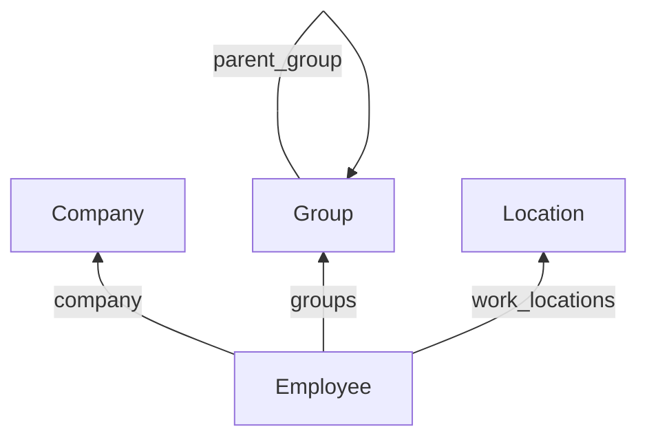

Three models describe where a job sits: the legal entity that employs someone, the organisational units they belong to, and the office they work from.

All three are shared. Many employees point at one company, one group, one location - so the ID lives on the employee, not on these records.

## The shape

Because these are IDs on the employee record, [`expand`](/guides/reading-writing/reading-data/expand) returns them inline on an employee read. `manager` and `pay_group` behave the same way.

Company and Group are independent of each other. A group's only parent is another group.

## The three models

| Looking for | Read it from | Endpoint |
| --- | --- | --- |
| Departments, teams, divisions, business units, cost centres | **Group**, filtered by `type` | [Get Groups](/hris/groups/get-groups) |
| Office address, tax jurisdiction | **Location** | [Get Locations](/hris/locations/get-locations) |
| `legal_name`, `display_name`, `eins` | **Company** | [Get Companies](/hris/companies/get-companies) |

## Group is one typed model

`type` is `DEPARTMENT`, `TEAM`, `DIVISION`, `BUSINESS_UNIT` or `COST_CENTER`, and `parent_group` rebuilds the hierarchy.

<Warning>
There is no department endpoint and no cost-centre endpoint. **Reading groups without a
`type` filter returns every organisational dimension mixed together.**
</Warning>

## Offices and org units stay separate

People from several departments share a floor, and a department spans several sites. Location and Group model those two facts independently.

Location is **BETA** and coverage varies by connector. Pin what you depend on, and check `raw_data` on an employee you know has an address before assuming the field is empty everywhere.

## Company

`legal_name` and `eins` describe the legal entity that employs someone.

A customer running several entities might hold them as multiple companies under one connector, or as separate connectors entirely. Both happen, and neither is wrong - so don't assume one company per connector.

## Why it works this way

**One typed Group model is a trade for variety.** Source systems don't agree on how many organisational dimensions exist: some run a single hierarchy, some run separate trees for reporting, cost allocation and legal entity, and some let customers invent their own. A model per concept would fit some customers and miss the rest. A `type` field fits all of them, at the cost of a filter on every read.

Location takes the opposite approach for the same reason. Offices and org units overlap in some systems and are unrelated in others, so merging them would lose information that only some customers hold.

## What this means for you

- **Filter groups by `type`** instead of looking for a department model.
- **Follow `parent_group`** to rebuild a hierarchy rather than expecting a flat list.
- **Expand company, groups and work locations** from the employee rather than fetching them separately.
- **Don't assume one company per connector.** Check before treating the first one as the customer.
- **Treat Location as BETA** and verify coverage on the integrations you support.

## Related

- [Employee data](/guides/data-models/employee-data) - the person these models attach to
- [Expand](/guides/reading-writing/reading-data/expand) - returning company and groups inline
- [Filters](/guides/reading-writing/reading-data/filters) - filtering groups by `type`
- [Scoping](/get-started/scoping) - why a model can be missing entirely
