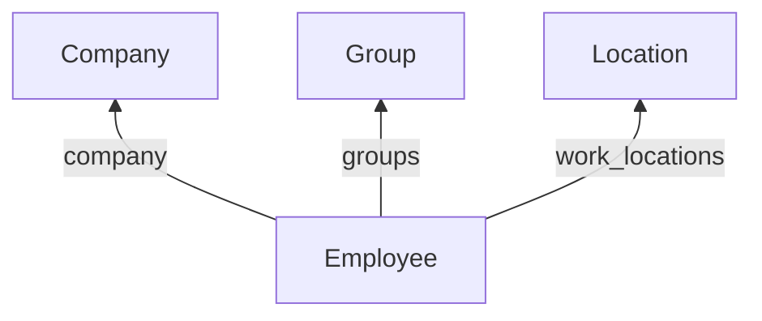

Three models describe where a job sits: the legal entity that employs someone, the organizational units they belong to, and the office they work from. All three are shared, so the ID lives on the employee rather than on these records.

## The models

| Model | Holds | Endpoint |
| --- | --- | --- |
| **Group** | One organizational unit, typed `DEPARTMENT`, `TEAM`, `DIVISION`, `BUSINESS_UNIT` or `COST_CENTER`, with `parent_group` for the hierarchy | [Get Groups](/hris/groups/get-groups) |
| **Location** | An office address: `street_1`, `city`, `state`, `postal_code`, `country` | [Get Locations](/hris/locations/get-locations) |
| **Company** | The legal entity: `legal_name`, `display_name`, `eins` | [Get Companies](/hris/companies/get-companies) |

HRIS has no department endpoint and no cost-center endpoint. Every organizational dimension comes back from Get Groups, so **filter by `type`** or you get them mixed together.

## How they connect

These are IDs on the employee, so [`expand`](/guides/reading-writing/reading-data/expand) returns them inline on an employee read instead of a second call. `manager` and `pay_group` behave the same way.

Company and Group are independent of each other, and a group's only parent is another group.

## How many per employee

| Field on the employee | Points at | How many |
| --- | --- | --- |
| `company` | Company | One |
| `groups` | Group | Several |
| `work_locations` | Location | Several |

**`work_location`, singular, is not a Location reference.** It is an address object embedded on the employee, so reading it gets you the address without resolving an ID.

A customer running several legal entities may hold them as several companies under one connector, or as separate connectors. Both happen, so don't treat the first company as the customer.

## What you can write

All three are read-only. Organizational structure changes in the source system and reaches you on the next sync.

## Related

- [Employee data](/guides/data-models/employee-data) - the person these models attach to
- [Expand](/guides/reading-writing/reading-data/expand) - returning company and groups inline
- [Filters](/guides/reading-writing/reading-data/filters) - filtering groups by `type`
- [Scoping](/get-started/scoping) - why a model can be missing entirely
