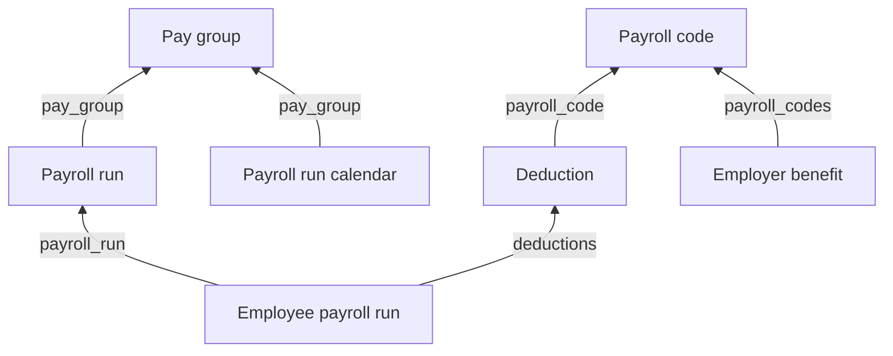

Payroll answers what was paid. What was *worked* is a different set of models that will not reconcile with it, and often comes from a different system - see [Time & attendance](/guides/data-models/time-and-attendance). Five models cover payroll, and **a run existing does not mean anyone was paid**.

## The models

| Model | Holds | Endpoint |
| --- | --- | --- |
| **Payroll run** | The employer's processing event: period, check date, `run_type`, `run_state` | [Get Payroll Runs](/hris/payroll-runs/get-payroll-runs) |
| **Employee payroll run** | One person's line: `gross_pay`, `net_pay`, and the itemised earnings, deductions and taxes | [Get Employee Payroll Runs](/hris/employee-payroll-runs/get-employee-payroll-runs) |
| **Payroll run calendar** | The upcoming schedule of periods and pay dates | [Get Payroll Run Calendars](/hris/payroll-run-calendar/get-payroll-run-calendars) |
| **Payroll code** | The customer's earning and deduction codes, typed `EARNING`, `DEDUCTION` or `TAX` | [Get Payroll Codes](/hris/payroll-codes/get-payroll-codes) |
| **Pay group** | `name` and `description` only | [Get Pay Groups](/hris/pay-groups/get-pay-groups) |

<Warning>
`run_state` is `PAID`, `DRAFT`, `APPROVED`, `FAILED`, `CLOSED` or `NOT_STARTED`. **Read runs without checking it and you count drafts as money that moved.**
</Warning>

`run_type` separates `REGULAR` from `OFF_CYCLE`, `CORRECTION`, `TERMINATION`, `BONUS` and `SIGN_ON_BONUS`. Both fields are filters on the runs endpoint, so scope the query rather than reading everything.

**Pay group is a label, not a schedule.** It carries no timing and no employee list, and pay frequency lives on compensation as `pay_frequency`.

The calendar names its dates differently from the run: `pay_period_start_date`, `pay_period_end_date` and `pay_date` against the run's `start_date`, `end_date` and `check_date`. The two sets mean the same three things.

Payroll code `sub_type` narrows the type further - `RETIREMENT`, `HEALTH`, `GARNISHMENT`, `FICA`, `MEDICARE`, `FIT`, `SIT` and more - so a withholding can be classified without parsing a name. The codes endpoint filters on `type` but not `sub_type`, so pull the set once per connector and look up client-side.

## How they connect

**A deduction line and a benefit plan meet at the payroll code**, so a withholding traces back to the plan that caused it with no per-customer mapping in between. Every field in that chain can be empty, so check both ends for a given connector before relying on it.

The customer's own `code` and `name` are not normalized. A code identifying a specific 401(k) at one customer means something else at another - match by ID, not by string.

## How many per payroll run

| Model | Per payroll run |
| --- | --- |
| Employee payroll run | One per employee |
| Payroll run calendar | One, shared through the pay group |

`earnings`, `deductions` and `taxes` on an employee payroll run are arrays of objects rather than amounts:

| | Fields |
| --- | --- |
| **Earning** | `amount`, `name`, `payroll_code` |
| **Deduction** | `name`, `employee_deduction`, `company_deduction`, `payroll_code` |
| **Tax** | `name`, `amount`, `payroll_code` |

A deduction carries two amounts, so the employer's and the employee's shares arrive already split.

`Earning.name` is normalized to `SALARY`, `REIMBURSEMENT`, `OVERTIME`, `BONUS` or `HOURLY`. `Deduction.name` and `Tax.name` are not normalized at all.

No line item carries a currency. Take it from the employee's compensation as `pay_currency`.

## What you can write

Only **Employee payroll run** accepts writes - see [Write payroll deductions](/get-started/use-cases/write-payroll-deductions). Runs, calendars, codes and pay groups are read-only.

## Related

- [Read payroll data](/get-started/use-cases/read-payroll-data) - reading a payslip and matching deductions to plans
- [Time & attendance](/guides/data-models/time-and-attendance) - what was worked, as opposed to what was paid
- [Benefits](/guides/data-models/benefits) - the payroll code that joins the two
- [Employee data](/guides/data-models/employee-data) - where `pay_frequency` and pay group references live
