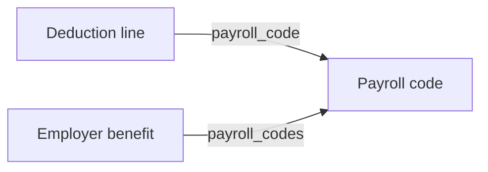

Payroll answers what was paid. What was *worked* is a separate set of models that neither derives from nor reconciles arithmetically with this one, and in many organisations comes from a different system entirely. See [Time & attendance](/guides/data-models/time-and-attendance) for that half.

<Info>
  **Before you start**

  - The connector has synced, and the customer's payroll module is in scope.
</Info>

## The models

| Model | Holds | Endpoint |
| --- | --- | --- |
| **Payroll run** | The employer's processing event: period, check date, `run_type`, `run_state` | [Get Payroll Runs](/hris/payroll-runs/get-payroll-runs) |
| **Employee payroll run** | One person's line: `gross_pay`, `net_pay`, and the itemised earnings, deductions and taxes | [Get Employee Payroll Runs](/hris/employee-payroll-runs/get-employee-payroll-runs) |
| **Payroll run calendar** | The forward schedule of periods and pay dates | [Get Payroll Run Calendars](/hris/payroll-run-calendar/get-payroll-run-calendars) |
| **Payroll code** | The customer's earning and deduction codes, classified | [Get Payroll Codes](/hris/payroll-codes/get-payroll-codes) |
| **Pay group** | `name` and `description` only | [Get Pay Groups](/hris/pay-groups/get-pay-groups) |

Which one you read depends on whether you need the cycle or the amounts. A run exists before it is paid.

<Warning>
`run_state` is `PAID`, `DRAFT`, `APPROVED`, `FAILED`, `CLOSED` or `NOT_STARTED`. **A payroll run existing does not mean anybody was paid.** Reading runs without checking `run_state` counts drafts as money that moved.
</Warning>

`run_type` separates `REGULAR` from `OFF_CYCLE`, `CORRECTION`, `TERMINATION`, `BONUS` and `SIGN_ON_BONUS`. Both fields are filters on the runs endpoint, so scope the query rather than reading everything and discarding.

**Pay group is a label, not a schedule.** Two things commonly assumed about it are not in the model: it has no cadence and no employee list. The link runs the other way. Employees, compensation and payroll runs reference a pay group, and pay frequency lives on compensation as `pay_frequency`.

**The calendar matters more than it looks.** It is the only model here describing the future, and deduction changes have to land before the customer's processing cut-off. See [Write payroll deductions](/get-started/use-cases/write-payroll-deductions).

<Info>
The calendar names its dates differently from the run. The calendar carries `pay_period_start_date`, `pay_period_end_date` and `pay_date`. The run carries `start_date`, `end_date` and `check_date`. They mean the same three things.
</Info>

## A payslip line is a structured object

`earnings`, `deductions` and `taxes` are not amounts. Each is an array of objects, and each object references the code behind it and carries its own `currency`.

| | Fields |
| --- | --- |
| **Earning** | `amount`, `name`, `currency`, `payroll_code` |
| **Deduction** | `name`, `employee_deduction`, `company_deduction`, `currency`, `payroll_code` |
| **Tax** | `name`, `amount`, `currency`, `payroll_code` |

**A deduction carries two amounts**, `employee_deduction` and `company_deduction`, so employer and employee shares are already split rather than inferred.

`Earning.name` is a fixed enum: `SALARY`, `REIMBURSEMENT`, `OVERTIME`, `BONUS`, `HOURLY`. `Deduction.name` and `Tax.name` are not. They come through as the customer wrote them.

## Payroll codes classify, and connect

Every line references a code, and Bindbee normalises the code itself. `type` is `EARNING`, `DEDUCTION` or `TAX`, and `sub_type` narrows it: `RETIREMENT`, `HEALTH`, `GARNISHMENT`, `SEVERANCE`, `FICA`, `MEDICARE`, `FIT`, `SIT` and so on. Tax subtypes are worth knowing about, because they let you classify withholding without parsing a name string.

What is not normalised is the customer's own `code` and `name`, which come from their payroll configuration rather than any standard. A code identifying a specific 401(k) at one customer identifies something else at another.

**But you do not have to interpret the code to find the plan.** `payroll_code` on a line is an ID, and the employer benefit carries `payroll_codes` referencing the same records:



So a deduction line resolves to a benefit plan by matching identifiers, with no per-customer mapping in between. See [Benefits](/guides/data-models/benefits).

<Warning>
Every field in that chain is nullable. Where `payroll_code` on a line or `payroll_codes` on a plan is empty, the mapping falls back to configuration you agree with the customer and store yourself. **Check both ends before relying on the join** for a given connector.
</Warning>

The codes endpoint filters on `type` but not `sub_type`, so pull the set once per connector and index it client-side rather than querying per line.

## Reading payroll data

<Steps>
  <Step title="Read per-employee payroll">
    ```bash
    curl --request GET \
      --url 'https://api.bindbee.dev/api/hris/v1/employee-payroll-runs?employee_id=<EMPLOYEE_ID>&page_size=200' \
      --header 'Authorization: Bearer <BINDBEE_API_KEY>' \
      --header 'X-Connector-Token: <CONNECTOR_TOKEN>'
    ```

    Filter by `employee_id` for one person, or `payroll_run_id` for everyone in a cycle.

    **Result:** Earnings, deductions and taxes per employee.
  </Step>

  <Step title="Choose the right date filter">
    Three independent pairs, on both the run and the employee-run endpoint, and they mean different things.

    | Filter pair | Bounds |
    | --- | --- |
    | `start_date_from` / `start_date_to` | Start of the pay period |
    | `end_date_from` / `end_date_to` | End of the pay period |
    | `check_date_from` / `check_date_to` | When payment was actually issued |

    <Warning>
      Check date and pay period are routinely different, and a period ending in December can pay in January. Reconciling by check date attributes that run to the wrong year. Reconciling by period end attributes it to the wrong cash month.

      Pick deliberately based on whether you are reconciling coverage or cash.
    </Warning>

    **Result:** Records scoped to the period you mean.
  </Step>

  <Step title="Resolve deductions to plans">
    Take `payroll_code` from each deduction line and match it against `payroll_codes` on the employer benefit. Where either side is null, fall back to the mapping you hold for that connector.

    Do not attempt to infer the plan from the deduction's `name`. It is the customer's own string, and it is the one part of this chain that is not normalised.

    **Result:** Deduction lines attributed to plans.
  </Step>
</Steps>

## If this didn't work

<AccordionGroup>
  <Accordion title="Payroll returns nothing though the customer runs payroll">
    Payroll is usually a separately licensed module with its own permission grant, and an empty result is the common failure mode rather than an error. See [Permission errors](/guides/troubleshooting/permission-errors).
  </Accordion>

  <Accordion title="Amounts are off by a factor of 100">
    Some platforms report in minor units. Check `raw_data` for one record against a known figure before scaling anything.
  </Accordion>

  <Accordion title="A run is missing from a period you expected">
    Check `run_type` before assuming a regular cadence. Off-cycle, bonus, termination and correction runs are separate values and may sit outside the schedule you were looking at. Then check `run_state`, since a run that has not reached `PAID` may not be where you expected either.
  </Accordion>

  <Accordion title="A deduction line has no payroll_code">
    Expected on some connectors. The field is nullable at both ends of the join. Confirm the mapping with the customer and store it against the connector.
  </Accordion>

  <Accordion title="Payroll doesn't reconcile with hours worked">
    Expected. Overtime is calculated by rules the timesheet does not encode, salaried employees are paid without timesheets at all, and corrections land in a later run than the period they fix. See [Time & attendance](/guides/data-models/time-and-attendance).
  </Accordion>
</AccordionGroup>

## Why it works this way

**The run and employee-run split mirrors how payroll executes**: an employer-level event producing per-employee results. Collapsing them would repeat the period and state on every line, with no way to represent a run that exists before its results do.

**Codes are classified only as far as classification is safe.** Sorting one into earning, deduction or tax is something the source metadata supports. Inferring which plan a `RETIREMENT` deduction funds from its name would be guessing. So the association is stated as an identifier on the plan instead, which is why the join is reliable wherever it is populated.

## What this means for you

- **Check `run_state` before treating a payroll run as money that moved.** Drafts are in the data.
- **Read line items as objects.** A deduction already splits employee and company amounts.
- **Resolve a deduction to a plan through `payroll_code`**, not by interpreting the code string.
- **Pick your date filter deliberately.** Check date and period end answer different questions.
- **Do not expect a cadence on pay group.** Pay frequency is on compensation.

## Related

- [Payroll endpoints](/hris/payroll-runs/get-payroll-runs) - the API reference
- [Time & attendance](/guides/data-models/time-and-attendance) - what was worked, as opposed to what was paid
- [Benefits](/guides/data-models/benefits) - the payroll code that joins the two
- [Employee & org data](/guides/data-models/employee-and-org-data) - where `pay_frequency` and pay group references live
