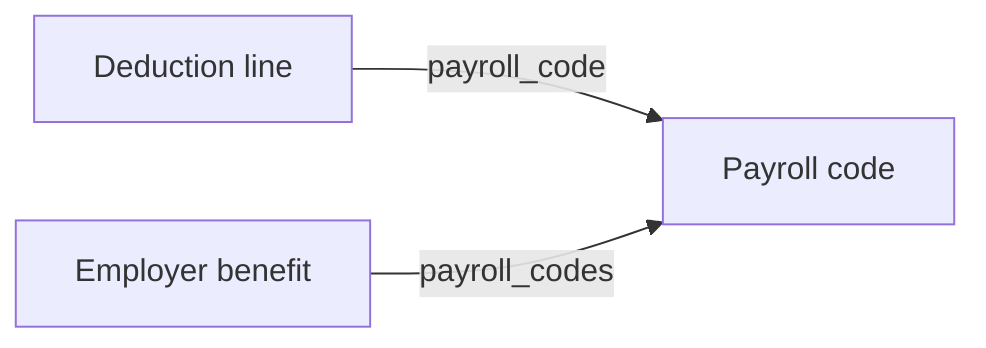

{/* CONTENT PASS: split out of explanation/payroll-and-time-models, merged with how-to/reading-data/read-payroll-data. The tail sections (Why it works this way / What this means for you) covered both halves and are duplicated on Time & Attendance - split them. */}

Eight models cover payroll and time, and they divide into two groups that are constantly confused: **what was paid, and what was worked.** They are related, neither derives from the other, and in many organisations they come from different systems entirely.

## What was paid

| Model | Holds | Note |
| --- | --- | --- |
| **Payroll run** | The employer's processing event - period, check date, `run_type`, `run_state` | A run exists before it is paid |
| **Employee payroll run** | One person's line: gross, net, and the itemised earnings, deductions and taxes | Where the money is |
| **Pay group** | `name` and `description` only | A label, not a schedule |
| **Payroll run calendar** | The forward schedule of periods and check dates | The only model here describing the future |
| **Payroll code** | The customer's earning and deduction codes, classified | The join to benefits |

<Warning>
`run_state` is `PAID`, `DRAFT`, `APPROVED`, `FAILED`, `CLOSED` or `NOT_STARTED`. **A payroll run existing does not mean anybody was paid.** Reading runs without checking `run_state` counts drafts as money that moved.
</Warning>

Two things commonly assumed about **pay group** are not in the model: it has no cadence and no employee list.

The link runs the other way - employees and compensation reference a pay group, and pay frequency lives on compensation as `pay_frequency`.

## A payslip line is a structured object

`earnings`, `deductions` and `taxes` are not amounts. Each is an array of objects, and each object references the code behind it.

| | Fields |
| --- | --- |
| **Earning** | `amount`, `name`, `payroll_code` |
| **Deduction** | `name`, `employee_deduction`, `company_deduction`, `payroll_code` |
| **Tax** | `name`, `amount`, `payroll_code` |

**A deduction carries two amounts** - `employee_deduction` and `company_deduction` - so employer and employee shares are already split rather than inferred.

`Earning.name` is also a fixed enum: `SALARY`, `REIMBURSEMENT`, `OVERTIME`, `BONUS`, `HOURLY`.

## Payroll codes classify, and connect

Every line references a code, and Bindbee normalises the code itself. `type` is `EARNING`, `DEDUCTION` or `TAX`, and `sub_type` narrows it - `RETIREMENT`, `HEALTH`, `GARNISHMENT`, `OVERTIME`, `SEVERANCE` and so on.

What is not normalised is the customer's own `code` and `name`, which come from their payroll configuration rather than any standard. A code identifying a specific 401(k) at one customer identifies something else at another.

**But you do not have to interpret the code to find the plan.** `payroll_code` on a line is a UUID, and the employer benefit carries `payroll_codes` referencing the same records:



So a deduction line resolves to a benefit plan by matching identifiers, with no per-customer mapping in between - see [Benefits models](/guides/data-models/benefits).

<Warning>
Every field in that chain is nullable. Where `payroll_code` on a line or `payroll_codes` on a plan is empty, the mapping falls back to configuration you agree with the customer. **Check both ends before relying on the join** for a given connector.
</Warning>

## Why it works this way

**The run and employee-run split mirrors how payroll executes** - an employer-level event producing per-employee results. Collapsing them would repeat the period and state on every line, with no way to represent a run that exists before its results do.

**Codes are classified only as far as classification is safe.** Sorting one into earning, deduction or tax is something the source metadata supports; inferring which plan a `RETIREMENT` deduction funds from its name would be guessing. So the association is stated as an identifier on the plan instead, which is why the join is reliable wherever it is populated.

**Time off is a request because the source systems model approval, not outcome.** Flattening it to "days absent" would lose the pending state, which is exactly what most applications need to act on.

## What this means for you

- **Check `run_state` before treating a payroll run as money that moved.** Drafts are in the data.
- **Read line items as objects.** A deduction already splits employee and company amounts.
- **Resolve a deduction to a plan through `payroll_code`**, not by interpreting the code string.
- **Filter time off by `status`**, and read `units` before interpreting `amount`.
- **Do not expect a cadence on pay group.** Pay frequency is on compensation.
- **Do not reconcile timesheets against payroll arithmetically** without encoding the customer's overtime and salary rules.

## Reading payroll data

Payroll spans a run-level model and a per-employee model, plus a calendar of scheduled runs. Which one you read depends on whether you need the cycle or the amounts.

For hours worked rather than money paid, see [Reading time & attendance](/guides/data-models/time-and-attendance) - the two do not reconcile arithmetically, and [Payroll & time models](/guides/data-models/payroll) explains why.

<Info>
  **Before you start**

  - The connector has synced, and the customer's payroll module is in scope.
</Info>

### The models

| Model | Represents | Endpoint |
| --- | --- | --- |
| Payroll run | One pay cycle for the employer | [Get Payroll Runs](/hris/payroll-runs/get-payroll-runs) |
| Employee payroll run | One employee's earnings, deductions, and taxes within a run | [Get Employee Payroll Runs](/hris/employee-payroll-runs/get-employee-payroll-runs) |
| Payroll run calendar | Scheduled and upcoming runs | [Get Payroll Run Calendars](/hris/payroll-run-calendar/get-payroll-run-calendars) |
| Payroll code | The earning and deduction codes defined in the payroll system | [Get Payroll Codes](/hris/payroll-codes/get-payroll-codes) |
| Pay group | How employees are grouped onto a pay schedule | [Get Pay Groups](/hris/pay-groups/get-pay-groups) |

The calendar matters more than it looks. Deduction changes have to land before the customer's processing cut-off, and the calendar is how you know when the next run is - see [Employee payroll run](/get-started/use-cases/write-payroll-deductions).

### Steps

<Steps>
  <Step title="Read per-employee payroll">
    ```bash
    curl --request GET \
      --url 'https://api.bindbee.dev/api/hris/v1/employee-payroll-runs?employee_id=<EMPLOYEE_ID>&page_size=200' \
      --header 'Authorization: Bearer <BINDBEE_API_KEY>' \
      --header 'X-Connector-Token: <CONNECTOR_TOKEN>'
    ```

    Filter by `employee_id` for one person, or `payroll_run_id` for everyone in a cycle.

    **Result:** Earnings, deductions, and taxes per employee.
  </Step>

  <Step title="Choose the right date filter">
    Three independent pairs, and they mean different things.

    | Filter pair | Bounds |
    | --- | --- |
    | `start_date_from` / `start_date_to` | Start of the pay period |
    | `end_date_from` / `end_date_to` | End of the pay period |
    | `check_date_from` / `check_date_to` | When payment was actually issued |

    <Warning>
      Check date and pay period are routinely different, and a period ending in December can pay in January. Reconciling by check date attributes that run to the wrong year; reconciling by period end attributes it to the wrong cash month.

      Pick deliberately based on whether you're reconciling coverage or cash.
    </Warning>

    **Result:** Records scoped to the period you mean.
  </Step>

  <Step title="Read deductions from the per-employee model">
    Deduction lines carry the codes defined in the customer's payroll configuration.

    Those codes are customer-specific and do not map automatically to benefit plans - the relationship is configuration you establish with the customer and store yourself. See [Reading benefits](/guides/data-models/benefits) for the plan side.

    **Result:** Deduction lines you can attribute, given a mapping you own.
  </Step>
</Steps>

### If this didn't work

<AccordionGroup>
  <Accordion title="Payroll returns nothing though the customer runs payroll">
    Payroll is usually a separately licensed module with its own permission grant, and an empty result is the common failure mode rather than an error. See [Permission errors](/guides/troubleshooting/permission-errors).
  </Accordion>

  <Accordion title="Amounts are off by a factor of 100">
    Some platforms report in minor units. Check `raw_data` for one record against a known figure before scaling anything.
  </Accordion>

  <Accordion title="A run is missing from a period you expected">
    Off-cycle runs, bonus runs, and corrections may be modelled differently or excluded. Check the calendar for what was actually scheduled rather than assuming a regular cadence.
  </Accordion>

  <Accordion title="Deduction codes are unfamiliar">
    They're defined per customer in their payroll system. There's no universal set - confirm the mapping with the customer and store it against the connector.
  </Accordion>

  <Accordion title="Payroll doesn't reconcile with hours worked">
    Expected. Overtime is calculated by rules the timesheet doesn't encode, salaried employees are paid without timesheets at all, and corrections land in a later run than the period they fix. See [Reading time & attendance](/guides/data-models/time-and-attendance).
  </Accordion>
</AccordionGroup>

## Related

- [Payroll endpoints](/hris/payroll-runs/get-payroll-runs) - the API reference
- [Time & Attendance](/guides/data-models/time-and-attendance) - what was worked, as opposed to what was paid
- [Benefits](/guides/data-models/benefits) - the payroll code that joins the two
