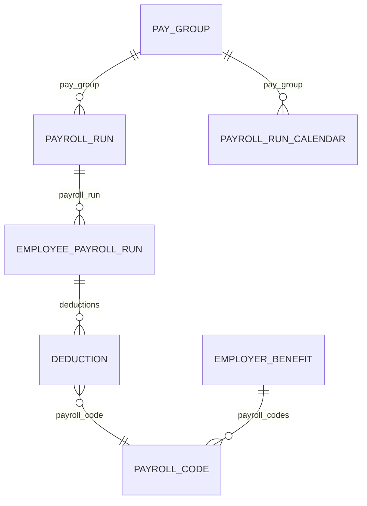

Payroll answers what was paid. What was *worked* is a different set of models - it doesn't come from this data, and it won't add up to match it either. In many companies it even comes from a different system. See [Time & attendance](/guides/data-models/time-and-attendance) for that half.

Five models cover payroll, and **the mistake people make most often is treating a run as proof that money moved.** A run exists before anyone gets paid.

## The models

| Model | Holds | Endpoint |
| --- | --- | --- |
| **Payroll run** | The employer's processing event: period, check date, `run_type`, `run_state` | [Get Payroll Runs](/hris/payroll-runs/get-payroll-runs) |
| **Employee payroll run** | One person's line: `gross_pay`, `net_pay`, and the itemised earnings, deductions and taxes | [Get Employee Payroll Runs](/hris/employee-payroll-runs/get-employee-payroll-runs) |
| **Payroll run calendar** | The upcoming schedule of periods and pay dates | [Get Payroll Run Calendars](/hris/payroll-run-calendar/get-payroll-run-calendars) |
| **Payroll code** | The customer's earning and deduction codes, classified | [Get Payroll Codes](/hris/payroll-codes/get-payroll-codes) |
| **Pay group** | `name` and `description` only | [Get Pay Groups](/hris/pay-groups/get-pay-groups) |

Which one you read depends on whether you need the cycle or the amounts.

<Warning>
`run_state` is `PAID`, `DRAFT`, `APPROVED`, `FAILED`, `CLOSED` or `NOT_STARTED`. **A payroll run existing doesn't mean anyone got paid.** Read runs without checking `run_state`, and you'll count drafts as money that moved.
</Warning>

`run_type` separates `REGULAR` from `OFF_CYCLE`, `CORRECTION`, `TERMINATION`, `BONUS` and `SIGN_ON_BONUS`. Both fields are filters on the runs endpoint, so scope your query with them instead of reading everything and throwing away what you don't need.

**Pay group is a label, not a schedule.** Two things people usually assume about it aren't true: it has no timing and no employee list. The link runs the other way - employees, compensation and payroll runs each point to a pay group, and pay frequency actually lives on compensation as `pay_frequency`.

**The calendar matters more than it looks like it should.** It's the only model here that describes the future, and deduction changes need to land before the customer's processing cut-off. See [Write payroll deductions](/get-started/use-cases/write-payroll-deductions).

It also names its dates differently from the run. The calendar uses `pay_period_start_date`, `pay_period_end_date` and `pay_date`; the run uses `start_date`, `end_date` and `check_date`. The two sets mean the same three things.

## How they link



The two edges at the bottom are the useful ones. **A deduction line and a benefit plan meet at the payroll code**, which is what lets a withholding trace back to the plan that caused it - with no per-customer mapping needed in between.

## A payslip line is a structured object

`earnings`, `deductions` and `taxes` are not plain amounts. Each one is a list of objects, and each object references the code behind it.

| | Fields |
| --- | --- |
| **Earning** | `amount`, `name`, `payroll_code` |
| **Deduction** | `name`, `employee_deduction`, `company_deduction`, `payroll_code` |
| **Tax** | `name`, `amount`, `payroll_code` |

**A deduction carries two amounts** - `employee_deduction` and `company_deduction` - so the employer's and employee's shares are already split out for you.

`Earning.name` is cleaned up into `SALARY`, `REIMBURSEMENT`, `OVERTIME`, `BONUS` or `HOURLY`, and anything that doesn't map passes through as-is - see [Enum values](/guides/reading-writing/enum-values). `Deduction.name` and `Tax.name` are not cleaned up at all. They come through exactly as the customer wrote them.

No line item carries its own currency. Where you need one, get it from the employee's compensation record instead.

## Payroll codes classify, and connect

Every line references a code, and Bindbee cleans up the code itself. `type` is `EARNING`, `DEDUCTION` or `TAX`, and `sub_type` narrows it further: `RETIREMENT`, `HEALTH`, `GARNISHMENT`, `SEVERANCE`, `FICA`, `MEDICARE`, `FIT`, `SIT` and more. Tax subtypes are worth knowing, because they let you classify a withholding without parsing a name string.

What isn't cleaned up is the customer's own `code` and `name`, which come from their payroll setup rather than any standard. A code that identifies a specific 401(k) at one customer means something else at another.

**But you don't have to read the code to find the plan.** `payroll_code` on a line is an ID, and the employer benefit carries `payroll_codes` pointing at the same records - so a deduction line matches a benefit plan by ID. See [Benefits](/guides/data-models/benefits).

<Warning>
Every field in that chain can be empty. Where `payroll_code` on a line, or `payroll_codes` on a plan, is missing, fall back to a mapping you agree with the customer and store yourself. **Check both ends before relying on the link** for a given connector.
</Warning>

The codes endpoint filters on `type` but not `sub_type`, so pull the full set once per connector and look things up client-side instead of querying per line.

## Reading payroll data

<Info>
  **Before you start**

  - The connector has synced, and the customer's payroll module is in scope.
</Info>

### Steps

<Steps>
  <Step title="Read per-employee payroll">
    ```bash
    curl --request GET \
      --url 'https://api.bindbee.dev/api/hris/v1/employee-payroll-runs?employee_id=<EMPLOYEE_ID>&page_size=200' \
      --header 'Authorization: Bearer <BINDBEE_API_KEY>' \
      --header 'X-Connector-Token: <CONNECTOR_TOKEN>'
    ```

    Filter by `employee_id` for one person, or `payroll_run_id` for everyone in a cycle.

    **Result:** Earnings, deductions and taxes per employee.
  </Step>

  <Step title="Choose the right date filter">
    Three separate filter pairs exist on both the run and the employee-run endpoint, and they mean different things.

    | Filter pair | Bounds |
    | --- | --- |
    | `start_date_from` / `start_date_to` | Start of the pay period |
    | `end_date_from` / `end_date_to` | End of the pay period |
    | `check_date_from` / `check_date_to` | When payment was actually issued |

    <Warning>
      Check date and pay period routinely fall in different months, and a period ending in December can pay in January. Filter by check date, and you'll attribute that run to the wrong year. Filter by period end, and you'll attribute it to the wrong cash month.

      Pick on purpose, based on whether you're reconciling coverage or cash.
    </Warning>

    **Result:** Records scoped to the period you actually mean.
  </Step>

  <Step title="Resolve deductions to plans">
    Take `payroll_code` from each deduction line and match it against `payroll_codes` on the employer benefit. Where either side is empty, fall back to the mapping you hold for that connector.

    Don't try to guess the plan from the deduction's `name`. It's the customer's own string, and it's the one part of this chain that isn't cleaned up.

    **Result:** Deduction lines matched to plans.
  </Step>
</Steps>

### If this didn't work

<AccordionGroup>
  <Accordion title="Payroll returns nothing though the customer runs payroll">
    Payroll is usually a separately licensed module with its own permission grant, and an empty result is the common failure here, not an error. See [Origin-system errors](/guides/troubleshooting/errors#origin-system-errors).
  </Accordion>

  <Accordion title="Amounts are off by a factor of 100">
    Some platforms report in minor units (cents, not dollars). Check `raw_data` for one record against a known figure before scaling anything.
  </Accordion>

  <Accordion title="A run is missing from a period you expected">
    Check `run_type` before assuming a regular schedule. Off-cycle, bonus, termination and correction runs are separate values and may fall outside the schedule you were looking at. Then check `run_state`, since a run that hasn't reached `PAID` may not be where you expected it to be either.
  </Accordion>

  <Accordion title="A deduction line has no payroll_code">
    Expected on some connectors. The field can be empty at both ends of the link. Confirm the mapping with the customer and store it against the connector.
  </Accordion>

  <Accordion title="Payroll doesn't reconcile with hours worked">
    Expected. Overtime follows rules the timesheet doesn't capture, salaried employees are paid without timesheets at all, and corrections land in a later run than the period they fix. See [Time & attendance](/guides/data-models/time-and-attendance).
  </Accordion>
</AccordionGroup>

## Why it works this way

**The run and employee-run split mirrors how payroll actually happens** - one employer-level event that produces a result for each employee. Put them together, and you'd repeat the period and state on every line, with no way to represent a run that exists before its results do.

**Codes are only classified as far as it's safe to.** Sorting one into earning, deduction or tax is something the source data supports. Guessing which plan a `RETIREMENT` deduction funds from its name would just be a guess.

So instead, that link is stored as an ID on the plan - which is why it's reliable wherever it's filled in.

## What this means for you

- **Check `run_state` before treating a payroll run as money that moved.** Drafts are in the data too.
- **Read line items as objects.** A deduction already splits employee and company amounts.
- **Match a deduction to a plan through `payroll_code`**, not by reading the code string.
- **Pick your date filter on purpose.** Check date and period end answer different questions.
- **Don't expect a schedule on pay group.** Pay frequency lives on compensation.

## Related

- [Payroll endpoints](/hris/payroll-runs/get-payroll-runs) - the API reference
- [Time & attendance](/guides/data-models/time-and-attendance) - what was worked, as opposed to what was paid
- [Benefits](/guides/data-models/benefits) - the payroll code that joins the two
- [Employee & org data](/guides/data-models/employee-data) - where `pay_frequency` and pay group references live
