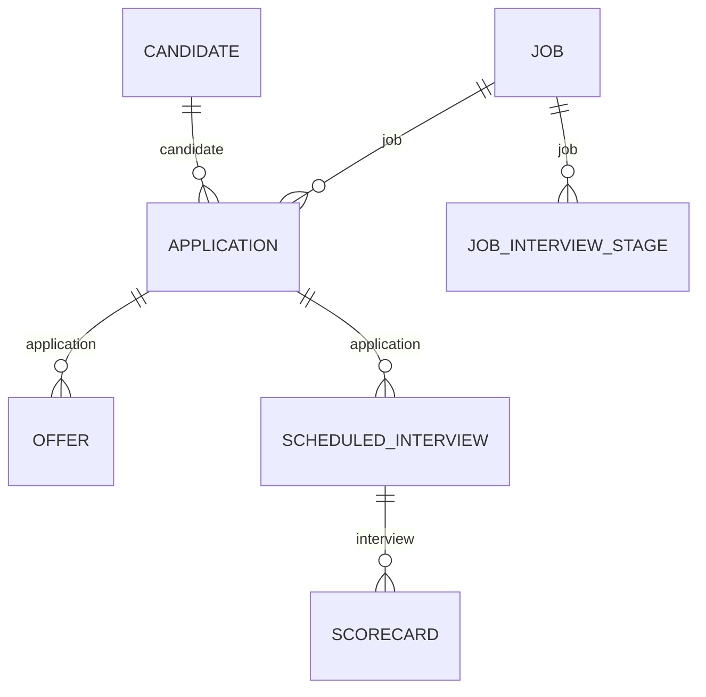

Recruiting data describes a process, not a fixed state, and the models reflect that. The one distinction most likely to trip you up is **the difference between a person and their attempt at one particular job.**

## The models

| Model | Holds | Endpoint |
| --- | --- | --- |
| **Candidate** | The person: names, `email_addresses`, `locations`, `tags`, `is_private`, `can_email` | [Get Candidates](/ats/candidate/get-candidates) |
| **Application** | One candidate's attempt at one job: `current_stage`, `source`, `applied_at`, `rejected_at` | [Get Applications](/ats/application/get-applications) |
| **Job** | The opening, with `status`, `departments`, `offices`, `hiring_managers`, `recruiters` | [Get Jobs](/ats/job/get-jobs) |
| **Job interview stage** | A step in one job's process, with `stage_order` | [Get Job Interview Stages](/ats/job-interview-stage/get-job-interview-stages) |
| **Offer** | An offer against an application, with `status`, `sent_at`, `start_date` | [Get Offers](/ats/offer/get-offers) |
| **Scheduled interview** | A specific interview event, with time and participants | [Get Scheduled Interviews](/ats/scheduled-interview/get-scheduled-interviews) |
| **Scorecard** | Feedback, with `interviewer` and `overall_recommendation` | [Get Scorecards](/ats/scorecard/get-scorecards) |
| **EEOC** | `race`, `gender`, `veteran_status`, `disability_status` against a candidate | [Get EEOCs](/ats/eeoc/get-eeocs) |
| **Activity** | The audit trail: notes, emails, status changes | [Get Activities](/ats/activity/get-activities) |
| **Reject reason** | The customer's own words for why an application ended | [Get Reject Reasons](/ats/reject-reason/get-reject-reasons) |
| **Remote user** | Staff inside the ATS - recruiter, hiring manager, interviewer | [Get Remote Users](/ats/remote-user/get-remote-users) |
| **Department**, **Office** | Where the job sits, organisationally and physically | [Get Departments](/ats/department/get-departments), [Get Offices](/ats/office/get-offices) |
| **Attachment**, **Screening question**, **Tag** | Files, application-form questions, free-form labels | [Get Attachments](/ats/attachment/get-attachments) |

Coverage gets thinner toward the bottom of that list, activity history most of all. **Reject reasons and tags are made up by each customer** and don't carry meaning from one customer to the next - much like payroll codes.

Remote users are staff, not candidates, and they're a different identity from HRIS employees, even when it's the same person.

## How they link



**Almost everything attaches to the application, not the candidate.** Offers, interviews and stages all belong to one attempt at one job, which is what lets the same person be rejected for one role while still active on another.

EEOC is the one exception: it attaches to the candidate, because demographic data is a fact about a person, not about an application. That's also why it's easy to leave out - see below.

## Candidate and application are not the same thing

**Candidate** is the person. They exist once, no matter how many roles they go for, and they carry an `applications` array.

**Application** is one candidate's attempt at one job. It holds `current_stage`, `source`, `applied_at`, `rejected_at` and `reject_reason`.

<Warning>
Status lives on the application, not the candidate. **There's no such thing as a rejected candidate** - only a candidate whose application to one job was rejected, who might still be active on another. Read rejection at the person level, and you'll get the pipeline wrong, possibly excluding someone who's still in the running.
</Warning>

This is also why counting candidates and counting applications gives you different numbers - and why the ratio between the two is useful on its own.

Two candidate flags are worth respecting. `is_private` marks a candidate restricted inside the customer's ATS, usually a confidential search, and `can_email` records whether they can be contacted. **Neither is enforced by the API - both are on you to honour.** Showing a private candidate, or emailing someone flagged otherwise, is a mistake your product makes, not one Bindbee prevents.

## Jobs, stages and offers

**Job** is the opening, with `status` of `OPEN`, `CLOSED`, `DRAFT`, `ARCHIVED`, `PENDING` or `-`. Note `confidential` here too.

**Job interview stage** is one step in a job's process. Stages belong to jobs, not to the company as a whole, because different roles run different processes - an engineering pipeline with a technical screen isn't a sales pipeline. `stage_order` is the number that sets the sequence; names are just the customer's own words.

**Department** and **office** describe where the job sits, organisationally and physically. These are ATS-side records, and **they don't automatically match the HRIS group and location models**, even at the same company. The two systems are set up independently.

**Offer** attaches to the application, not the candidate - same idea as before. Someone can hold an offer for one role while still in process on another. Its `status` runs `DRAFT`, `APPROVAL-SENT`, `APPROVED`, `SENT`, `SENT-MANUALLY`, `OPENED`, `DENIED`, `SIGNED` and `DEPRECATED`.

<Warning>
`SENT` doesn't mean accepted, and `SIGNED` doesn't mean started. Only `start_date` says when the person actually begins, and it's usually set well before that date arrives - so an offer pipeline built on status alone will report starts that haven't happened yet.
</Warning>

## EEOC is separated on purpose

**EEOC** holds `race`, `gender`, `veteran_status` and `disability_status` against a candidate, collected for compliance reporting. It's a separate model because the data is sensitive, tightly restricted in how it can be used, and in most places must not influence hiring decisions.

Keeping it separate makes leaving it out a single decision instead of a field-by-field argument. **Most applications should leave it out.**

<Warning>
If you sync this data, you're responsible for it. Holding demographic data you have no use for adds to your compliance work, your breach risk, and what you have to answer for in a security review - with nothing gained in return.
</Warning>

To exclude it, go to **Configure → Scoping** in the Dashboard and leave the EEOC model unselected - see [Scoping](/get-started/scoping) for the full walkthrough. A model outside scope is never synced or stored, so it's a decision made once, not something to verify per customer.

Some products genuinely need demographic reporting - diversity analytics built for the customer's own compliance team is the usual case. If that's you: read it only through the EEOC model, keep it in your own storage with its own access controls, and confirm with each customer that you have a lawful basis to use it. Your configuration doesn't satisfy their obligations for them.

## Reading recruiting data

<Info>
  **Before you start**

  - The connector is an ATS connector. A connector token only works for one API category, so an HRIS token on `/api/ats/v1/*` returns `403` - see [Authentication](/api-reference/basics/authentication).
</Info>

The general techniques are the same as HRIS - see [Pagination](/api-reference/basics/pagination) and [Reading data](/guides/reading-writing/reading-data). What follows is specific to ATS.

### Candidates & applications

<Steps>
  <Step title="Read candidates">
    ```bash
    curl --request GET \
      --url 'https://api.bindbee.dev/api/ats/v1/candidates?page_size=200' \
      --header 'Authorization: Bearer <BINDBEE_API_KEY>' \
      --header 'X-Connector-Token: <CONNECTOR_TOKEN>'
    ```

    Filters: `ids`, `remote_id`, `email_addresses`, `first_name`, `last_name`, `company` and `tag`. A candidate exists once no matter how many roles they go for, and `email_addresses`, `phone_numbers`, `locations`, `urls` and `tags` are all lists.

    **Result:** People, with duplicates already removed by the ATS.
  </Step>

  <Step title="Read applications">
    ```bash
    curl --request GET \
      --url 'https://api.bindbee.dev/api/ats/v1/applications?job=<JOB_ID>&page_size=200' \
      --header 'Authorization: Bearer <BINDBEE_API_KEY>' \
      --header 'X-Connector-Token: <CONNECTOR_TOKEN>'
    ```

    | Filter | Matches |
    | --- | --- |
    | `candidate` | Every application from one person |
    | `job` | Every application to one opening |
    | `current_stage` | Applications sitting at a stage |
    | `source` | Where the application came from |
    | `credited_to` | The recruiter credited |
    | `reject_reason` | Applications closed for a given reason |

    **Result:** One record per candidate-job pair.
  </Step>

  <Step title="Count the right model for the question">
    | Question | Read |
    | --- | --- |
    | How many people are in the pipeline? | Candidates |
    | How many applications are open? | Applications |
    | How many people applied to this role? | Applications filtered by `job` |
    | Has this person applied before? | Applications filtered by `candidate` |

    A candidate who applies to three roles is one candidate and three applications. Count applications to report pipeline headcount, and you'll overcount by however many people applied more than once - which, if a company is hiring across several similar roles, can be a lot.

    **Result:** Numbers that actually mean what you think they mean.
  </Step>

  <Step title="Expand rather than fetching in a loop">
    `expand` returns related records inline. List them with commas, no spaces.

    ```
    ?expand=candidate
    ?expand=job,candidate
    ```

    One expanded request beats many follow-up calls, which is what burns through the per-connector rate limit on a large pipeline - see [Errors & issues](/guides/troubleshooting/errors-and-issues).

    **Result:** Related records inline, at the cost of a bigger response.
  </Step>
</Steps>

### Application stages

<Steps>
  <Step title="Read the stages for a job">
    ```bash
    curl --request GET \
      --url 'https://api.bindbee.dev/api/ats/v1/job-interview-stages?job=<JOB_ID>&page_size=200' \
      --header 'Authorization: Bearer <BINDBEE_API_KEY>' \
      --header 'X-Connector-Token: <CONNECTOR_TOKEN>'
    ```

    Each stage carries `name`, `job` and `stage_order`. Filter by `job` - read them without one and you get every stage of every job, which isn't a pipeline.

    **Result:** One job's process, in order.
  </Step>

  <Step title="Order by stage_order, never by name">
    ```python
    stages = sorted(job_stages, key=lambda s: s["stage_order"])
    positions = {s["id"]: i for i, s in enumerate(stages)}
    ```

    Stage names are just the customer's own words - "Phone Screen", "Screen", "HM Screen" and "Recruiter Call" might all be the same step at different customers. Sort by name, or match names against a fixed list, and it breaks the moment a customer renames a stage.

    **Result:** A sequence you can actually compare positions in.
  </Step>

  <Step title="Resolve each application's position">
    ```bash
    curl --request GET \
      --url 'https://api.bindbee.dev/api/ats/v1/applications?job=<JOB_ID>&expand=current_stage&page_size=200' \
      --header 'Authorization: Bearer <BINDBEE_API_KEY>' \
      --header 'X-Connector-Token: <CONNECTOR_TOKEN>'
    ```

    Expanding `current_stage` skips a lookup per application. Join it against the ordered list from the last step to get a position instead of just a label.

    **Result:** Where each application sits, in a way you can compare.
  </Step>

  <Step title="Treat rejection as separate from stage">
    An application that's ended carries `rejected_at` and a `reject_reason`, and its `current_stage` shows wherever it stopped - not a "rejected" stage.

    ```python
    if app["rejected_at"]:
        outcome = "rejected"          # current_stage says where, not whether
    ```

    Count applications by stage without excluding rejected ones, and every stage looks more full than it really is.

    **Result:** Active pipeline kept separate from closed applications.
  </Step>

  <Step title="Detect movement rather than polling for it">
    Subscribe to `connector_data_modified` and re-read the applications that changed - see [Choose Webhook Events](/guides/reading-writing/webhooks).

    Change events carry IDs, not records - they tell you something changed, not what. To know an application *moved*, compare `current_stage` against your last stored copy.

    **Result:** Real stage transitions, not just "something changed."
  </Step>
</Steps>

### Interview feedback

An interview is an event. A scorecard is the feedback from it. The gap between them - interviews held with no feedback ever submitted - is usually the thing a hiring team actually wants to see.

<Steps>
  <Step title="Read the interviews">
    ```bash
    curl --request GET \
      --url 'https://api.bindbee.dev/api/ats/v1/scheduled-interviews?application=<APPLICATION_ID>&page_size=200' \
      --header 'Authorization: Bearer <BINDBEE_API_KEY>' \
      --header 'X-Connector-Token: <CONNECTOR_TOKEN>'
    ```

    Filter by `application`, `organizer` or `job_interview_stage`. Each record carries `start_at`, `end_at`, `location`, `organizer`, `interviewers` and a `status`.

    | `status` | Meaning |
    | --- | --- |
    | `SCHEDULED` | Booked, not yet held |
    | `AWAITING_FEEDBACK` | Held, feedback outstanding |
    | `COMPLETE` | Held and feedback submitted |

    **Result:** The interview events, with where each one stands.
  </Step>

  <Step title="Read the scorecards">
    ```bash
    curl --request GET \
      --url 'https://api.bindbee.dev/api/ats/v1/scorecards?application=<APPLICATION_ID>&page_size=200' \
      --header 'Authorization: Bearer <BINDBEE_API_KEY>' \
      --header 'X-Connector-Token: <CONNECTOR_TOKEN>'
    ```

    Filter by `application`, `interview` or `interviewer`. Each carries `application`, `interview`, `interviewer`, `submitted_at` and `overall_recommendation`.

    **Result:** Whatever feedback exists.
  </Step>

  <Step title="Join on the interview, not the application">
    A scorecard's `interview` field points at the scheduled interview it belongs to. Join on `application` alone, and you'll collapse several rounds into one, making it impossible to report per round.

    ```python
    by_interview = {s["interview"]: s for s in scorecards}
    for iv in interviews:
        feedback = by_interview.get(iv["id"])          # may be absent
    ```

    **Result:** Feedback matched to the round it actually came from.
  </Step>

  <Step title="Surface the missing feedback">
    The gap is the useful part. An interview marked `AWAITING_FEEDBACK` with no scorecard is a real, actionable state - it's what stalls a pipeline.

    ```python
    outstanding = [
        iv for iv in interviews
        if iv["status"] == "AWAITING_FEEDBACK" and iv["id"] not in by_interview
    ]
    ```

    Report it by interviewer and by age. Treat a missing scorecard as pending, not as a bad sign - absence isn't an evaluation.

    **Result:** A list of people to chase, not a silent gap.
  </Step>
</Steps>

### If this didn't work

<AccordionGroup>
  <Accordion title="Every request returns 403">
    A connector token only works for one API category. An HRIS connector called on `/api/ats/v1/*` returns `403` even with valid credentials.
  </Accordion>

  <Accordion title="The same person appears more than once">
    Some ATS platforms create a second candidate record instead of a second application when someone applies again, especially after a long gap or through a different source. Match on `email_addresses` to catch it - see [Record identity](/guides/reading-writing/record-identity).
  </Accordion>

  <Accordion title="Tags or reject reasons don't match the customer's words">
    Both are free-form and specific to each customer. Map them per connector rather than assuming a standard set.
  </Accordion>

  <Accordion title="Stages from different jobs are mixed together">
    `job-interview-stages` was read without the `job` filter. Stages belong to one job each, so an unfiltered read is every process at once.
  </Accordion>

  <Accordion title="Stage counts are higher than the number of live candidates">
    Rejected applications are being counted. `current_stage` shows where an application stopped, not whether it's still moving - filter on `rejected_at`.
  </Accordion>

  <Accordion title="Scorecards return nothing though interviews happened">
    Either feedback genuinely hasn't been submitted, or this integration doesn't expose scorecards. Check `raw_data` on an interview you know was scored - see [Inspect raw data](/guides/reading-writing/raw-data).
  </Accordion>

  <Accordion title="EEOC records still return after you scoped it out">
    Scope only applies going forward - see [Restrict what syncs](/get-started/scoping). Resync the connector and check again. If values show up on the candidate record instead, some platforms carry demographic fields on their own candidate object, and those pass through in `raw_data`.
  </Accordion>
</AccordionGroup>

## Why it works this way

**Splitting candidate from application is what makes this data usable at all.** Put them together, and you'd get one person record per application, so a candidate applying to three roles becomes three people.

Removing the duplicates afterward is guesswork, and the questions recruiting teams actually ask - has this person applied before, how many roles are they in, what happened last time - become impossible to answer.

**Interview stages belonging to jobs instead of being shared across the company is the same idea, applied to process.** A single shared stage list would force every role through one pipeline, which no ATS actually does.

**Keeping EEOC separate reflects a legal reality, not a modelling choice.** Mix demographic data into the candidate record, and it shows up by default in every read. Keeping it apart makes leaving it out the easy option.

## What this means for you

- **Read status from applications, never from candidates.**
- **Expect several applications per candidate.** Remove duplicates on the candidate, add up on applications.
- **Honour `is_private` and `can_email`.** The API won't enforce them for you.
- **Order stages by `stage_order`**, and treat stage names as display text only.
- **Don't map ATS departments and offices to HRIS groups and locations** without checking the customer keeps them in sync.
- **Leave EEOC out of scope** unless you have a specific, lawful reason to hold it.

## Related

- [ATS endpoints](/ats/candidate/get-candidates) - the API reference
- [Write support](/guides/reading-writing/writing-data/meta-apis) - what ATS lets you create
- [Scoping](/get-started/scoping) - excluding a model such as EEOC
- [Record identity](/guides/reading-writing/record-identity) - detecting duplicate candidates
