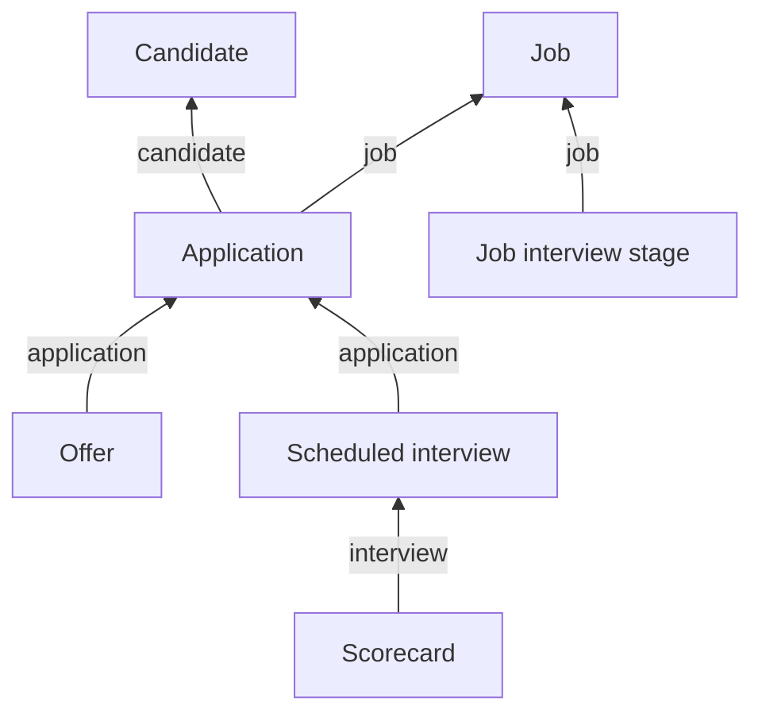

Recruiting data describes a process rather than a fixed state. The distinction that catches people out is **a person versus their attempt at one particular job** - status belongs to the attempt, never to the person.

## The models

| Model | Holds | Endpoint |
| --- | --- | --- |
| **Candidate** | The person: names, `email_addresses`, `locations`, `tags`, `is_private`, `can_email` | [Get Candidates](/ats/candidate/get-candidates) |
| **Application** | One candidate's attempt at one job: `current_stage`, `source`, `applied_at`, `rejected_at`, `reject_reason` | [Get Applications](/ats/application/get-applications) |
| **Job** | The opening: `status` of `OPEN`, `CLOSED`, `DRAFT`, `ARCHIVED`, `PENDING`, plus `departments`, `offices`, `hiring_managers` | [Get Jobs](/ats/job/get-jobs) |
| **Job interview stage** | One step in one job's process, ordered by `stage_order` | [Get Job Interview Stages](/ats/job-interview-stage/get-job-interview-stages) |
| **Offer** | An offer against an application: `status`, `sent_at`, `start_date` | [Get Offers](/ats/offer/get-offers) |
| **Scheduled interview** | One interview event: time, participants, and a `status` of `SCHEDULED`, `AWAITING_FEEDBACK` or `COMPLETE` | [Get Scheduled Interviews](/ats/scheduled-interview/get-scheduled-interviews) |
| **Scorecard** | Feedback from one interview: `interviewer`, `overall_recommendation` | [Get Scorecards](/ats/scorecard/get-scorecards) |
| **EEOC** | `race`, `gender`, `veteran_status`, `disability_status` against a candidate | [Get EEOCs](/ats/eeoc/get-eeocs) |
| **Activity** | The audit trail: notes, emails, status changes | [Get Activities](/ats/activity/get-activities) |
| **Reject reason**, **Tag** | The customer's own words, carrying no meaning between customers | [Get Reject Reasons](/ats/reject-reason/get-reject-reasons) |
| **Remote user** | Staff inside the ATS, a different identity from an HRIS employee | [Get Remote Users](/ats/remote-user/get-remote-users) |
| **Department**, **Office** | Where the job sits. ATS-side records that **do not match the HRIS group and location models** | [Get Departments](/ats/department/get-departments), [Get Offices](/ats/office/get-offices) |

Coverage thins toward the bottom of that list, activity history most of all.

<Warning>
Status lives on the application, not the candidate. **There is no such thing as a rejected candidate** - only a candidate whose application to one job was rejected, who may still be active on another.
</Warning>

`is_private` marks a candidate restricted inside the customer's ATS, and `can_email` records whether they can be contacted. **Neither is enforced by the API**, so honoring them is your product's job.

Offer `status` runs `DRAFT`, `APPROVAL-SENT`, `APPROVED`, `SENT`, `SENT-MANUALLY`, `OPENED`, `DENIED`, `SIGNED` and `DEPRECATED`. `SENT` does not mean accepted and `SIGNED` does not mean started - only `start_date` says when someone begins.

Stage names are the customer's own words, so order by `stage_order` and treat the name as display text.

## How they connect

**Almost everything attaches to the application, not the candidate.** Offers, interviews and stages all belong to one attempt at one job, which is what lets the same person be rejected for one role while still active on another.

EEOC is the exception. It attaches to the candidate, because demographic data is a fact about a person rather than about an application.

A scorecard points at the interview it came from, not just the application, so joining on `application` alone collapses several rounds into one.

## How many per candidate

| Model | Per candidate |
| --- | --- |
| Application | One per job applied to |
| Offer, scheduled interview | One or more per application |
| Scorecard | One per interview round |
| EEOC | None or one |

A candidate who applies to three roles is one candidate and three applications, so counting applications to report pipeline headcount overcounts anyone who applied more than once. Some platforms also create a second candidate record rather than a second application on a re-application - see [Record identity](/guides/reading-writing/record-identity).

## What you can write

ATS is the write-heavy category. **Sixteen of the eighteen models accept writes**, including candidates, applications, jobs, offers, scorecards and scheduled interviews - see [Check write support](/guides/reading-writing/writing-data/meta-apis) for the schema a given integration expects.

## EEOC is separated on purpose

EEOC is a separate model because the data is sensitive, tightly restricted in how it can be used, and in most places must not influence hiring decisions. Keeping it apart makes leaving it out a single decision rather than a field-by-field argument.

<Warning>
**Most applications should leave EEOC out of scope.** Holding demographic data you have no use for adds to your compliance work, your breach risk and what you answer for in a security review.
</Warning>

To exclude it, go to **Configure → Scoping** and leave the EEOC model unselected - see [Scoping](/get-started/scoping). A model outside scope is never synced, so it is decided once rather than per customer.

Scope applies going forward only, so resync the connector after excluding it. Where values still appear on the candidate record, some platforms carry demographic fields on their own candidate object and those pass through in `raw_data`.

Where a product needs demographic reporting, read it only through the EEOC model, hold it with its own access controls, and confirm a lawful basis with each customer.

## Related

- [Scoping](/get-started/scoping) - excluding a model such as EEOC
- [Record identity](/guides/reading-writing/record-identity) - detecting duplicate candidates
- [Check write support](/guides/reading-writing/writing-data/meta-apis) - what a given ATS integration accepts
- [Authentication](/api-reference/basics/authentication) - why an HRIS token returns `403` on ATS
