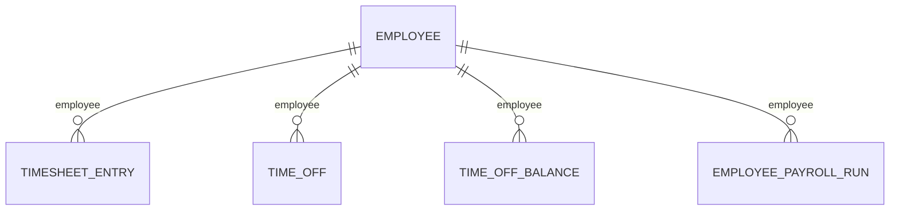

Time and attendance answers what was *worked*. What was paid is a separate set of models - it doesn't come from this data, and it won't add up to match it either. In many companies it even comes from a different system. See [Payroll](/guides/data-models/payroll) for that half.

Three models cover it: hours worked, leave requested, and leave remaining. You read them separately, they answer different questions, and **none of them points at the others.**

## The models

| Model | Holds | Endpoint |
| --- | --- | --- |
| **Timesheet entry** | `date`, `hours_worked`, `start_time`, `end_time`, `break_duration` | [Get Timesheet Entries](/hris/timesheet-entries/get-timesheet-entries-list) |
| **Time off** | `status`, `request_type`, `units`, `amount`, `approver`, start and end times | [Get Time Off](/hris/time-off/get-time-off-list) |
| **Time off balance** | `balance`, `used`, `policy_type` | [Get Time Off Balances](/hris/time-off-balance/get-time-off-balances-list) |

A balance is one record per policy, so an employee with vacation and sick policies has two.

## How they link



**The employee is the only thing these models have in common.** A leave request doesn't point at the balance it draws down, a timesheet entry doesn't point at the payroll run that paid it, and the fourth line above is the entire connection between hours and money.

Anything beyond that one link is math your application does itself - the API doesn't hand you a join for it.

## Leave is a request, not an absence

Time off models the approval process, not the result. A record exists from the moment someone asks, and its `status` is `REQUESTED`, `APPROVED`, `DECLINED`, `CANCELLED` or `DELETED`.

<Warning>
Read time off without filtering on `status`, and you'll count leave that was never actually taken - declined and cancelled requests sit in the same list as approved ones. And `units` is `HOURS` or `DAYS`, so **`amount` means nothing until you check it.**
</Warning>

The unit is whatever the source system uses, so it varies by connector, and sometimes by policy within one connector. Read it on every record - don't assume one.

`request_type` is the cleaned-up leave category - `VACATION`, `SICK`, `PERSONAL`, `MATERNITY`, `PATERNITY`, `BEREAVEMENT`, `FMLA` and a dozen others. Values that don't map pass through as-is, so treat it as an open list. See [Enum values](/guides/reading-writing/enum-values).

## Balances and timesheets are computed upstream

**A balance is the source system's own calculation, not a figure you can move between systems.** How a platform handles accrual, carryover and pending requests is its own logic, so two customers on what looks like the same policy can end up with numbers that mean subtly different things.

It's also a snapshot from the last sync, not a live number. A request approved since then won't show up yet - which matters if you're showing a remaining balance to someone about to book leave.

**Timesheets are the harder problem.** Source systems record time as punches, durations, intervals with breaks inside them, or plain daily totals with no detail. Turning those into one shape loses information, and the original stays available in `raw_data`.

That's why raw entries can be correct while a customer's own reported totals differ - rounding, break deduction and overtime rules are applied by the source system after the entries are recorded. **Compare raw entries against raw entries, never against a computed report.**

## Hours worked and hours paid do not reconcile

The two sides drift apart routinely, and for good reason:

- Overtime follows rules the timesheet doesn't capture.
- Salaried employees get paid with no timesheet at all.
- Corrections land in a later run than the period they fix.
- Time off may or may not show up as a payroll line, depending on policy.
- Approval workflows mean not every logged entry makes it into pay.

**This is the real gap in payroll integrations** - not the code-to-plan link, which the data does supply, but the math between hours and pay. Any reconciliation is something your application does itself, using what you know about the customer's rules.

## Reading time & attendance data

<Info>
  **Before you start**

  - The connector has synced, and the customer's time module is in scope. It's often licensed separately from payroll.
</Info>

### Steps

<Steps>
  <Step title="Read timesheet entries">
    ```bash
    curl --request GET \
      --url 'https://api.bindbee.dev/api/hris/v1/timesheet-entry?employee_id=<EMPLOYEE_ID>&page_size=200' \
      --header 'Authorization: Bearer <BINDBEE_API_KEY>' \
      --header 'X-Connector-Token: <CONNECTOR_TOKEN>'
    ```

    Entries are bounded by time, not date, and the filter pairs match that:

    | Filter pair | Bounds |
    | --- | --- |
    | `start_time_from` / `start_time_to` | When the entry starts |
    | `end_time_from` / `end_time_to` | When it ends |

    **Result:** Time entries for the period you asked for.
  </Step>

  <Step title="Read leave requests, filtered by status">
    ```bash
    curl --request GET \
      --url 'https://api.bindbee.dev/api/hris/v1/time-off?employee_id=<EMPLOYEE_ID>&status=APPROVED&page_size=200' \
      --header 'Authorization: Bearer <BINDBEE_API_KEY>' \
      --header 'X-Connector-Token: <CONNECTOR_TOKEN>'
    ```

    Filter on `status` for anything that acts on leave. Read it without one, and declined and cancelled requests show up alongside approved ones - treat the whole set as booked leave and you'll overstate absence.

    There are no date filters on this endpoint. Scope by employee, and filter the `start_time` and `end_time` you get back yourself.

    **Result:** Leave requests with their approval state.
  </Step>

  <Step title="Read remaining balances">
    ```bash
    curl --request GET \
      --url 'https://api.bindbee.dev/api/hris/v1/time-off-balances?employee_id=<EMPLOYEE_ID>&page_size=200' \
      --header 'Authorization: Bearer <BINDBEE_API_KEY>' \
      --header 'X-Connector-Token: <CONNECTOR_TOKEN>'
    ```

    Each record carries `balance`, `used` and `policy_type`. Read `policy_type` - don't assume one balance per person.

    **Result:** Remaining leave per policy, as of the last sync.
  </Step>
</Steps>

### If this didn't work

<AccordionGroup>
  <Accordion title="Time off or timesheets return nothing">
    Time and attendance is commonly a separately licensed module with its own permission grant, and an empty result is the usual failure here, not an error. See [Origin-system errors](/guides/troubleshooting/errors#origin-system-errors).
  </Accordion>

  <Accordion title="Balances don't match what the employee sees">
    Balances are a point-in-time snapshot from the last sync, and accrual runs on the source system's own schedule. A balance that's stale by one sync interval is expected, not a bug - see [How syncing works](/guides/reading-writing/syncing).
  </Accordion>

  <Accordion title="Leave totals are too high">
    Almost always an unfiltered `status`. Declined and cancelled requests are returned right alongside approved ones.
  </Accordion>

  <Accordion title="Hours don't reconcile with the pay run">
    Expected, and not a bug. Entries can exist for a period whose run hasn't been processed yet, and approval workflows mean not every entry reaches pay. See [Payroll](/guides/data-models/payroll).
  </Accordion>

  <Accordion title="units differs between records">
    Correct, and worth handling. The source system decides whether leave is counted in hours or days, and some platforms vary it by policy. Read the `units` field on each record rather than assuming one.
  </Accordion>

  <Accordion title="One shift spans several timesheet records">
    Some platforms record time as separate punch events rather than one interval, so a break splits a shift into more than one entry. Check `raw_data` to see the original shape before adding them up - see [Inspect raw data](/guides/reading-writing/raw-data).
  </Accordion>
</AccordionGroup>

## Why it works this way

**Time off is a request because the source systems model approval, not the outcome.** Flattening it to "days absent" would lose the pending state, which is exactly what most applications need to act on - an approval queue is a workflow, and a workflow needs its in-between states.

**Balances are carried, not computed**, because accrual is the part of leave policy that varies most between customers. Rebuilding a balance from requests would mean encoding every customer's carryover, accrual and proration rules - and quietly getting some of them wrong. Reporting what the source system says, with a date on it, is the honest option.

**Timesheet entries keep `raw_data` next to the cleaned-up version** because that cleanup genuinely loses information. Punches, intervals and daily totals don't reduce to one shape without dropping something, so the original stays available for when the difference matters.

## What this means for you

- **Filter time off by `status`.** Declined and cancelled requests show up in an unfiltered read.
- **Read `units` before you interpret `amount`.** It varies by connector, and sometimes by policy.
- **Treat balances as a snapshot**, dated to the last sync, not a live number.
- **Read `policy_type`** rather than assuming one balance per employee.
- **Compare raw entries against raw entries**, never against the customer's computed totals.
- **Don't try to reconcile timesheets against payroll by math alone** - you need the customer's overtime and salary rules too.

## Related

- [Time & attendance endpoints](/hris/time-off/get-time-off-list) - the API reference
- [Payroll](/guides/data-models/payroll) - what was paid, as opposed to what was worked
- [Employee & org data](/guides/data-models/employee-data) - who the hours belong to
- [Enum values](/guides/reading-writing/enum-values) - why `request_type` is an open list
