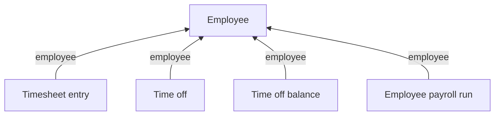

Time and attendance answers what was *worked*. What was paid is a separate set of models that will not add up to match it, and often comes from a different system - see [Payroll](/guides/data-models/payroll). Three models cover it, and **none of them points at the others**.

## The models

| Model | Holds | Endpoint |
| --- | --- | --- |
| **Timesheet entry** | Hours logged: `date`, `hours_worked`, `start_time`, `end_time`, `break_duration` | [Get Timesheet Entries](/hris/timesheet-entries/get-timesheet-entries-list) |
| **Time off** | One leave request and its approval state: `status`, `request_type`, `units`, `amount`, `approver` | [Get Time Off](/hris/time-off/get-time-off-list) |
| **Time off balance** | Leave remaining per policy: `balance`, `used`, `policy_type` | [Get Time Off Balances](/hris/time-off-balance/get-time-off-balances-list) |

<Warning>
Time off models the approval process, not the result. A record exists from the moment someone asks, and `status` is `REQUESTED`, `APPROVED`, `DECLINED`, `CANCELLED` or `DELETED`. **Read it without filtering on `status` and you count leave that was never taken.**
</Warning>

`units` is `HOURS` or `DAYS`, and the source system decides which - sometimes varying by policy within one connector. Read it on every record, because `amount` means nothing without it.

`request_type` and `policy_type` are the cleaned-up leave categories, and a value the connector sends outside the enum passes through unchanged - see [Enum values](/guides/reading-writing/enum-values).

## How they connect

**The employee is the only thing these models share.** A leave request does not point at the balance it draws down, and a timesheet entry does not point at the payroll run that paid it. The fourth edge is the entire connection between hours and money, so anything beyond it is arithmetic your application does itself.

Hours worked and hours paid drift apart routinely: overtime follows rules the timesheet does not capture, salaried employees are paid without timesheets, corrections land in a later run than the period they fix, and approval workflows mean not every logged entry reaches pay.

## How many per employee

| Model | Per employee |
| --- | --- |
| Timesheet entry | One per logged period |
| Time off | One per request, in any status |
| Time off balance | One per policy |

A balance is the source system's own calculation, dated to the last sync rather than live. A request approved since then will not be reflected, which matters when you show someone a remaining balance before they book leave.

Timesheets vary more. Source systems record time as punches, durations, intervals with breaks inside them, or plain daily totals, and flattening those into one shape loses detail that stays available in `raw_data`. **Compare raw entries against raw entries**, never against a customer's computed report, because rounding and overtime rules are applied after the entries are recorded.

## What you can write

**Time off** and **timesheet entry** both accept writes - see [Create a time off request](/get-started/use-cases/create-a-time-off-request). Time off balance is read-only, since the balance is computed upstream.

## Related

- [Read time & attendance](/get-started/use-cases/read-time-and-attendance) - reading hours, leave and balances
- [Payroll](/guides/data-models/payroll) - what was paid, as opposed to what was worked
- [Employee data](/guides/data-models/employee-data) - who the hours belong to
- [Enum values](/guides/reading-writing/enum-values) - why `request_type` is an open list
